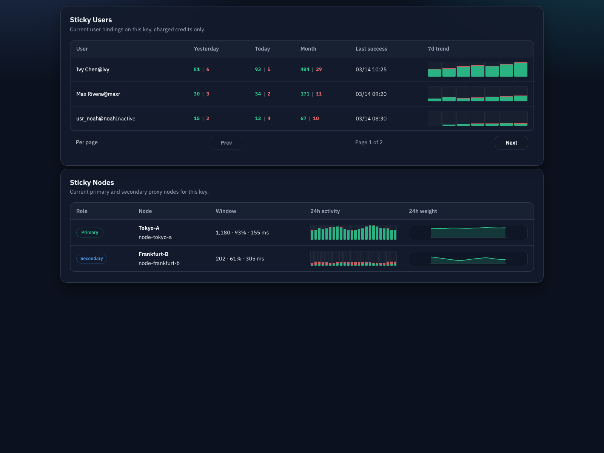
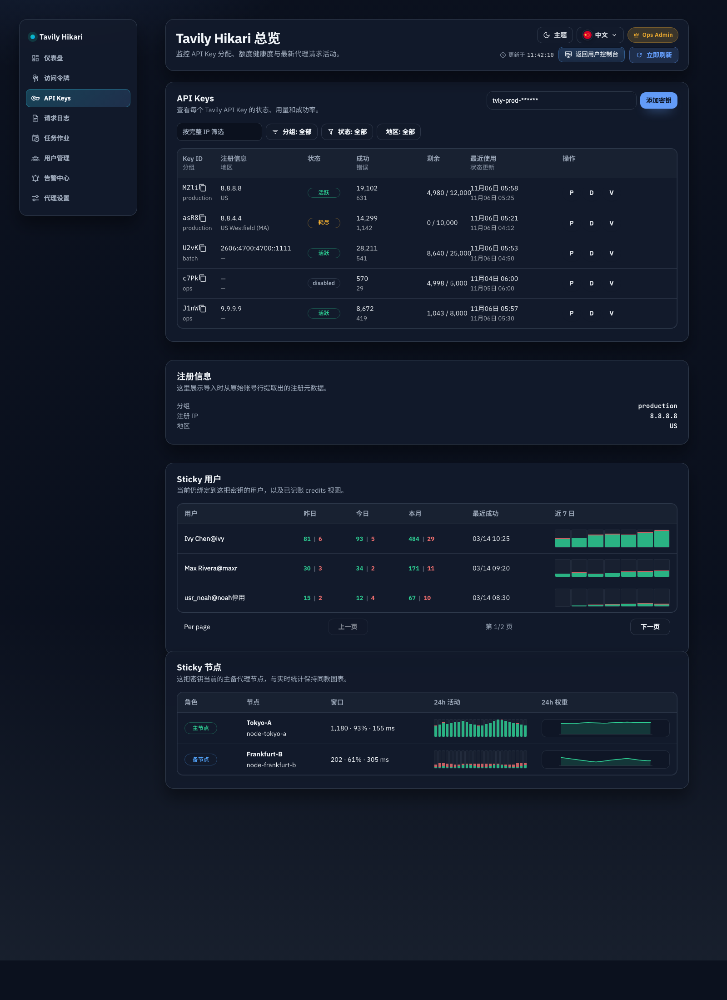

# 上游密钥详情 Sticky 用户/节点列表（#29w25）

## 状态

- Status: 已完成（快车道）
- Created: 2026-03-16
- Last: 2026-03-17

## 背景 / 问题陈述

- `/admin/keys/:id` 当前只展示 key 自身元数据、额度与近期请求，管理员无法直接看到“哪些用户当前 sticky 到这把 key”。
- 正向代理当前已经有 key -> 节点主备粘性，但 key 详情页没有把 sticky 节点显式展示出来，排障时需要在 `/admin/proxy-settings` 与数据库之间来回跳转。
- 现有 token soft-affinity 仅保留 token -> key 的短 TTL 内存亲和，缺少 user -> key 的“最近成功”持久绑定，导致同一用户跨 token 或进程重启后无法优先复用最近成功的 key。
- `auth_token_logs` 虽然记录了 charged credits，但历史表没有 `api_key_id`，因此无法无损回放出 `key + user + credits` 的精确历史统计。

## 目标 / 非目标

### Goals

- 在 `/admin/keys/:id` 新增 `Sticky Users` 与 `Sticky Nodes` 两个独立面板，桌面表格与移动卡片均可用。
- 新增 `user ↔ api_key` 多对多“当前绑定”模型；每个用户只保留最近成功且 charged 的 3 个 key 绑定。
- token 请求调度改为“最近成功优先”：若该 token 所属用户存在当前绑定，则按 `last_success_at DESC` 依次尝试这些 key，再回退现有 token soft-affinity / 全局 LRU。
- 新增 `api_key_user_usage_buckets` 精确记录本功能上线后的 `success_credits` / `failure_credits` 日桶，并在 key 详情页展示 `昨日 / 今日 / 本月` 及近 7 日趋势。
- 新增 `GET /api/keys/:id/sticky-users` 与 `GET /api/keys/:id/sticky-nodes`，并补齐 Rust DTO、TS types、i18n、测试。

### Non-goals

- 不回填历史 `key + user + credits` 数据，也不做近似补算。
- 不提供后台手工编辑 sticky user / sticky node 绑定的入口。
- 不改写现有 key 列表页卡片的请求次数统计口径。
- 不触达生产 Tavily；所有验证都限定在本地或 mock upstream / mock proxy。

## 范围（Scope）

### In scope

- `docs/specs/29w25-admin-key-sticky-users-nodes/**`
  - 冻结当前绑定、调度优先级、统计口径、接口与 UI 合同。
- `src/lib.rs`
  - 新增 `user_api_key_bindings`、`api_key_user_usage_buckets`、`auth_token_logs.api_key_id` schema / migration。
  - 在 pending billing settlement 中写入 key-user credits bucket，并在成功 charged 后刷新 sticky binding 与 top-3 修剪。
  - 调度时对已绑定用户先尝试其最近成功 key 集合。
  - 暴露 sticky users / sticky nodes 查询能力。
- `src/server/dto.rs` / `src/server/proxy.rs` / `src/server/serve.rs`
  - 新增两个 key detail API 路由与 DTO 映射。
- `web/src/api.ts`
  - 新增 sticky users / sticky nodes 类型与 fetch 函数。
- `web/src/AdminDashboard.tsx`
  - key 详情页新增两个面板，展示 charged credits 指标与趋势图。
- `web/src/admin/**`
  - 抽取 forward-proxy 趋势图渲染单元，供 sticky nodes 与 sticky users 共用视觉语言。
- `web/src/i18n.tsx`
  - 新增文案。
- `src/server/tests.rs` / `web/src/**/*.test.tsx` / `web/src/**/*.stories.tsx`
  - 覆盖 binding refresh / prune / routing fallback / API aggregation / UI 空态与响应式布局。

### Out of scope

- 历史 auth/token 绑定模型与 user console 页面布局本身不改。
- forward proxy 配置页的信息架构不重做；仅抽出可复用图表单元。

## 接口契约（Interfaces & Contracts）

### Public / external interfaces

- `GET /api/keys/:id/sticky-users?page=&per_page=`
- `GET /api/keys/:id/sticky-nodes`

`sticky-users` 响应：

```json
{
  "items": [
    {
      "user": {
        "userId": "usr_123",
        "displayName": "Ivan",
        "username": "ivanli",
        "active": true,
        "lastLoginAt": 1773200000,
        "tokenCount": 2
      },
      "lastSuccessAt": 1773280557,
      "windows": {
        "yesterday": { "successCredits": 12, "failureCredits": 1 },
        "today": { "successCredits": 8, "failureCredits": 2 },
        "month": { "successCredits": 42, "failureCredits": 5 }
      },
      "dailyBuckets": [
        {
          "bucketStart": 1772668800,
          "bucketEnd": 1772755200,
          "successCredits": 3,
          "failureCredits": 1
        }
      ]
    }
  ],
  "total": 1,
  "page": 1,
  "perPage": 20
}
```

`sticky-nodes` 响应：

```json
{
  "rangeStart": "2026-03-15T00:00:00Z",
  "rangeEnd": "2026-03-16T00:00:00Z",
  "bucketSeconds": 3600,
  "nodes": [
    {
      "role": "primary",
      "key": "proxy_a",
      "source": "manual",
      "displayName": "Tokyo A",
      "endpointUrl": "socks5://example",
      "weight": 1,
      "available": true,
      "lastError": null,
      "penalized": false,
      "primaryAssignmentCount": 9,
      "secondaryAssignmentCount": 3,
      "stats": {
        "oneMinute": { "attempts": 0, "successRate": null, "avgLatencyMs": null },
        "fifteenMinutes": { "attempts": 3, "successRate": 1, "avgLatencyMs": 328.5 },
        "oneHour": { "attempts": 12, "successRate": 0.91, "avgLatencyMs": 341.2 },
        "oneDay": { "attempts": 96, "successRate": 0.95, "avgLatencyMs": 355.1 },
        "sevenDays": { "attempts": 544, "successRate": 0.97, "avgLatencyMs": 349.8 }
      },
      "last24h": [],
      "weight24h": []
    }
  ]
}
```

### Internal interfaces

- `user_api_key_bindings`
  - `PRIMARY KEY (user_id, api_key_id)`
  - `created_at`, `updated_at`, `last_success_at`
  - 同一用户仅保留 `last_success_at DESC` 最近 3 条。
- `api_key_user_usage_buckets`
  - `PRIMARY KEY (api_key_id, user_id, bucket_start, bucket_secs)`
  - 按 server-local day 聚合 charged credits；仅写本功能上线后的精确数据。
- `auth_token_logs`
  - 新增 nullable `api_key_id`，用于在 pending billing settlement 时把 charged credits 准确归因到选中的 key。

## 验收标准（Acceptance Criteria）

- Given 同一用户首次成功且 charged 到 key A
  When settlement 完成
  Then `user_api_key_bindings` 出现 `(user, A)` 且 `last_success_at` 为该成功请求时间。
- Given 同一用户随后成功且 charged 到 key B / C / D
  When D 成功 settlement 完成
  Then 该用户在 `user_api_key_bindings` 中只保留最近 3 把 key，最旧绑定被裁剪。
- Given 用户已有当前绑定集合
  When 该用户发起新的 token 请求
  Then 调度先按 `last_success_at DESC` 尝试绑定集合中的 key；若都不可选，再回退 token soft-affinity / 全局 LRU。
- Given charged 失败请求
  When settlement 完成
  Then `api_key_user_usage_buckets.failure_credits` 累加，但不刷新 `last_success_at`。
- Given 管理员访问 `/api/keys/:id/sticky-users`
  When 该 key 仍是用户当前绑定集合的一员
  Then 响应包含该用户的 `昨日 / 今日 / 本月` success/failure charged credits 与近 7 日日桶。
- Given 管理员访问 `/api/keys/:id/sticky-nodes`
  When key 存在当前主备 sticky 节点
  Then 响应只返回当前 primary / secondary 节点，图表字段与 `/api/stats/forward-proxy` 同形。
- Given 管理员打开 `/admin/keys/:id`
  When desktop 或 mobile 渲染
  Then 新面板不会横向溢出，且 loading / error / empty state 各自独立。

## 非功能性验收 / 质量门槛（Quality Gates）

### Testing

- `cargo test`
- `cargo clippy -- -D warnings`
- `cd web && bun run build`

### UI / Browser

- sticky nodes 复用 forward proxy live stats 同款 activity / weight 图。
- sticky users 7 日图使用 success/failure stacked bar，与节点 activity 图保持一致视觉语义。
- 浏览器验收只连接本地或 mock upstream / proxy。

## Visual Evidence (PR)

- source_type: storybook_canvas
  story_id_or_title: admin-fragments-keystickypanels--default
  state: default
  target_program: mock-only
  capture_scope: browser-viewport
  sensitive_exclusion: N/A
  submission_gate: approved
  evidence_note: verifies the extracted sticky panels render the charged-credit windows as plain green/red values and reuse the forward-proxy activity and weight charts in one isolated review surface.
  image:
  

- source_type: storybook_canvas
  story_id_or_title: admin-pages--keys-sticky-details
  state: page-context
  target_program: mock-only
  capture_scope: browser-viewport
  sensitive_exclusion: N/A
  submission_gate: approved
  evidence_note: verifies the key detail page places the sticky users and sticky nodes panels under registration metadata without layout overflow in the admin page context.
  image:
  

## 实现里程碑（Milestones / Delivery checklist）

- [x] M1: docs/spec 与 contracts 冻结
- [x] M2: 后端 schema、binding refresh / prune、charged credits rollup 完成
- [x] M3: 最近成功优先调度与 sticky users / nodes API 完成
- [x] M4: key detail Sticky Users / Sticky Nodes UI、共享趋势图与 i18n 完成
- [x] M5: 测试、build、浏览器验收、PR / review-loop 收敛完成

## 风险 / 开放问题 / 假设

- 假设：sticky binding 的“成功”仅指最终 charged 且 `result_status = success` 的请求；未记账与失败 charged 不刷新绑定。
- 假设：当前绑定集合是多对多但仅保留最近 3 个，不按时间窗口额外淘汰。
- 风险：若 billing 记录缺少 `api_key_id`，则 key-user credits 会失真，因此 schema 扩展必须与 settlement 一起上线。
- 风险：同一用户并发请求可能在不同 key 上连续成功，需要用单事务 refresh + prune 保证 top-3 一致性。

## 变更记录（Change log）

- 2026-03-16: 创建快车道 spec，冻结 sticky users / sticky nodes、many-to-many current binding、recent-success-first routing 与 post-launch exact credits 口径。
- 2026-03-17: 同步 Storybook 视觉证据、plain-value sticky usage UI，并收口 spec 索引与交付里程碑状态。
