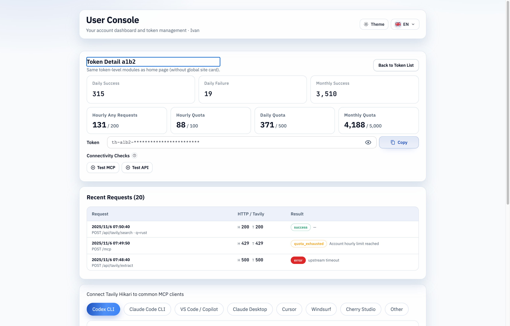
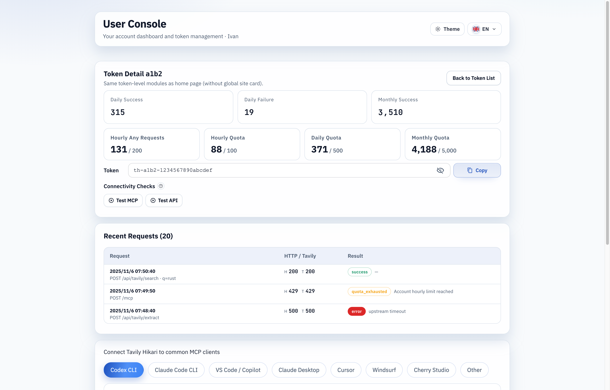

# 用户控制台 Token 明文切换按钮（#2m7yv）

## 状态

- Status: 已完成（快车道）
- Created: 2026-03-12
- Last: 2026-03-12

## 背景 / 问题陈述

- `/console#/tokens/:id` 当前只展示固定的 `th-<id>-********` 占位值，并提供复制按钮，但无法在详情页中按需查看完整明文。
- 公共首页已经有“眼睛按钮 + 复制”这一套 token 输入交互，用户控制台却仍停留在只读占位态，体验不一致。
- 本轮只需要补齐用户控制台 Token Detail 的明文切换能力，不应扩大到首页、管理员页或后端契约变更。

## 目标 / 非目标

### Goals

- 在 `/console#/tokens/:id` 的 Token 输入框右侧增加眼睛按钮。
- 默认继续显示 `th-<id>-********` 形式的字面占位值，而不是统一密码圆点。
- 首次点击“显示”时，按需调用既有 `GET /api/user/tokens/:id/secret` 读取完整 token。
- 明文展示后允许再次切回隐藏态，并在前端内存中清空已读取明文。
- Storybook 提供稳定的 `Token Revealed` 验收态，便于视觉回归与 PR 验收。

### Non-goals

- 不修改 Rust 后端、数据库结构、HTTP 字段或鉴权链路。
- 不扩展 PublicHome、Admin Dashboard、Admin Token Detail 的 token 显隐行为。
- 不新增 token 编辑、轮换、删除或分享能力。

## 范围（Scope）

### In scope

- `web/src/components/TokenSecretField.tsx`
- `web/src/UserConsole.tsx`
- `web/src/UserConsole.stories.tsx`
- `web/src/UserConsole.stories.test.ts`
- `web/src/index.css`
- `docs/specs/README.md`

### Out of scope

- `src/**`
- `web/src/PublicHome.tsx`
- `web/src/AdminDashboard.tsx`
- 任何新的 contracts 文档或 API schema 变更

## 接口契约（Interfaces & Contracts）

- 运行时接口继续复用既有 `GET /api/user/tokens/:id/secret`，响应体结构不变。
- `TokenSecretField` 新增两个可选前端能力：
  - `hiddenDisplayValue`：允许隐藏态显示字面占位值。
  - `visibilityBusy`：允许显隐切换按钮进入 loading/disabled 状态。
- UserConsole Storybook 的 `tokenDetailPreview` 新增 `Token Revealed`，作为验收可见态的一部分。

## 验收标准（Acceptance Criteria）

- Given 用户进入 `/console#/tokens/:id`
  When 页面完成加载
  Then Token 输入框默认仍显示 `th-<id>-********` 的占位值，并在右侧显示眼睛按钮与 Copy 按钮。

- Given 用户首次点击眼睛按钮
  When `/api/user/tokens/:id/secret` 成功返回
  Then 输入框显示完整 `th-<id>-<secret>` 明文，按钮切换为“隐藏”状态。

- Given 用户再次点击眼睛按钮
  When 页面切回隐藏态
  Then 输入框恢复字面占位值，且前端内存不再保留完整明文。

- Given 读取 secret 失败
  When 点击眼睛按钮
  Then 页面保持隐藏态，不显示残缺明文，并给出局部错误提示。

- Given 用户点击 Copy
  When 当前输入框处于隐藏态或显示态
  Then 复制结果都应为完整 token，而不是占位字符串。

- Given 验收者打开 UserConsole Storybook
  When `tokenDetailPreview=Token Revealed`
  Then 可直接看到眼睛按钮已切换到隐藏图标且输入框展示完整 token。

## 非功能性验收 / 质量门槛（Quality Gates）

### Testing

- `cd web && bun test src/UserConsole.stories.test.ts`
- `cd web && bun run build`
- `cd web && bun run build-storybook`

### UI / Browser

- `/console#/tokens/:id` 的 token 行在 desktop 与 mobile 下都不挤压 Copy 按钮。
- 切换显隐时不出现 placeholder 闪烁成空值或残缺字符串。

## 实现里程碑（Milestones / Delivery checklist）

- [x] M1: 新建 follow-up spec 并冻结范围
- [x] M2: TokenSecretField 支持隐藏态字面占位值与显隐 loading
- [x] M3: UserConsole token detail 接入显隐切换与局部文案
- [x] M4: Storybook / tests 覆盖 `Token Revealed` 验收态
- [x] M5: 快车道验证、PR 与 review-loop 收敛

## 风险 / 开放问题 / 假设

- 风险：UserConsole token 行目前是自定义布局，接入复用组件后需要确保 mobile 下不会挤压 Copy 按钮。
- 风险：如果显隐切换请求和路由切换并发发生，需要避免过期请求把旧 token 写回新页面。
- 假设：对用户来说，隐藏态继续展示 `th-<id>-********` 比统一圆点更有辨识度。
- 假设：在隐藏时立即清空明文状态，符合本轮“最小驻留”要求，无需额外持久化缓存。

## Visual Evidence (PR)

Storybook `User Console/UserConsole/Token Detail Overview`: verifies the synced-mainline hidden state keeps the masked placeholder, eye toggle, and copy button aligned on the token row.

Storybook `User Console/UserConsole/Token Revealed`: verifies the synced-mainline revealed state shows the full token while preserving the same token-row layout.

## 变更记录（Change log）

- 2026-03-12: 创建 follow-up spec，冻结用户控制台 Token Detail 的明文切换范围、验收标准与 Storybook 验收态。
- 2026-03-12: 已完成 TokenSecretField 复用扩展与 UserConsole 接入；隐藏态保留 `th-<id>-********` 字面占位值，显示态按需拉取完整 secret，并在再次隐藏或路由切换时清空前端明文状态。
- 2026-03-12: 已通过 `cd web && bun test src/UserConsole.stories.test.ts`、`cd web && bun run build`、`cd web && bun run build-storybook`；并在 Chrome DevTools 中以页面级 fetch mock 验证 `/console#/tokens/a1b2` 的桌面/移动端显隐切换布局。
- 2026-03-12: 同步 `origin/main` 后补充 Storybook `Token Detail Overview` 与 `Token Revealed` 两张视觉验收截图，作为本 spec 当前收口依据。
- 2026-03-12: 根据 PR-stage review follow-up 修复跨 token 详情切换时的 secret 缓存归属问题；明文、loading 与局部错误提示现在都显式绑定当前 `tokenId`，避免旧 secret 被短暂渲染或复制到新详情页。
- 2026-03-12: PR #120 已创建并补齐 `type:patch` + `channel:stable` 标签；最新 CI checks 全绿，`codex review --base origin/main` 无阻塞发现，本 spec 收口为已完成（快车道）。
