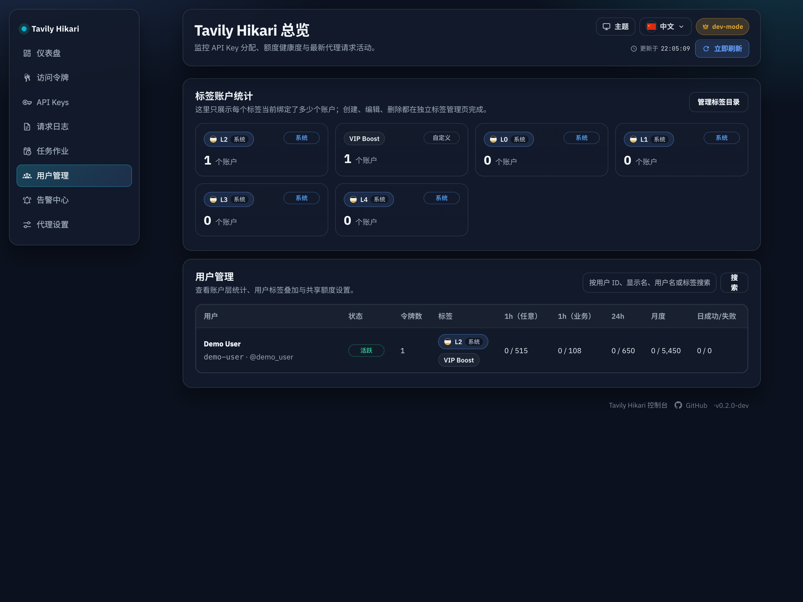
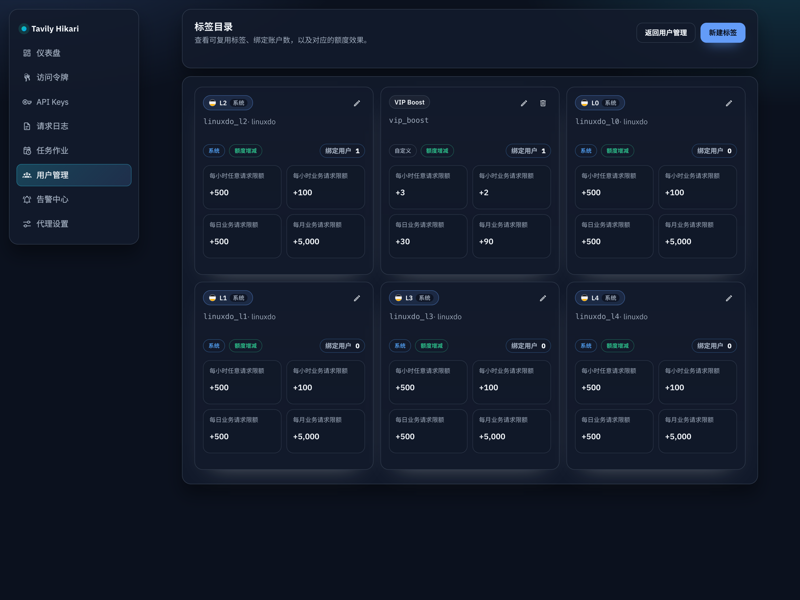
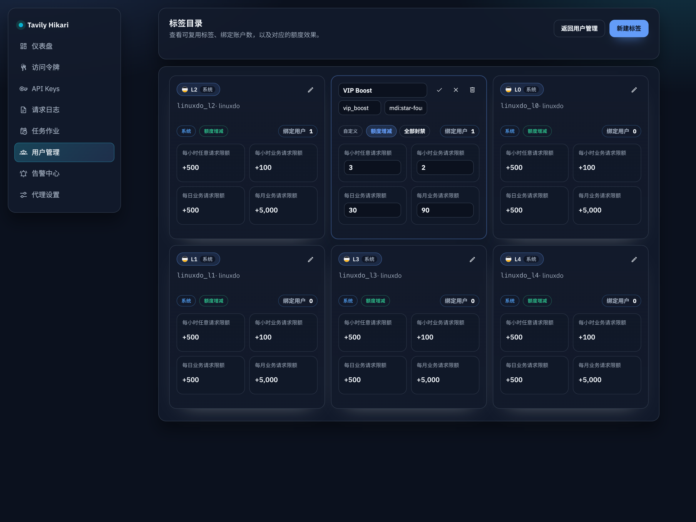
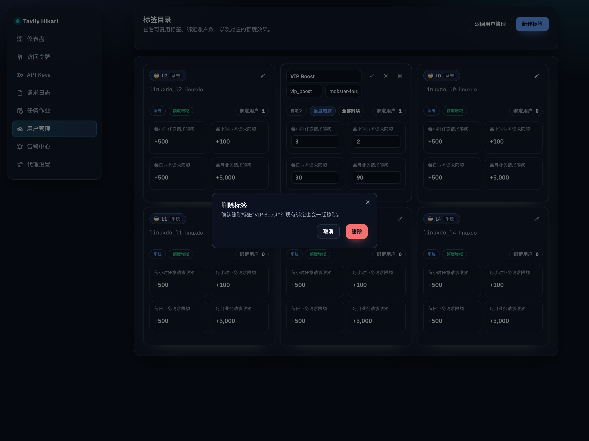
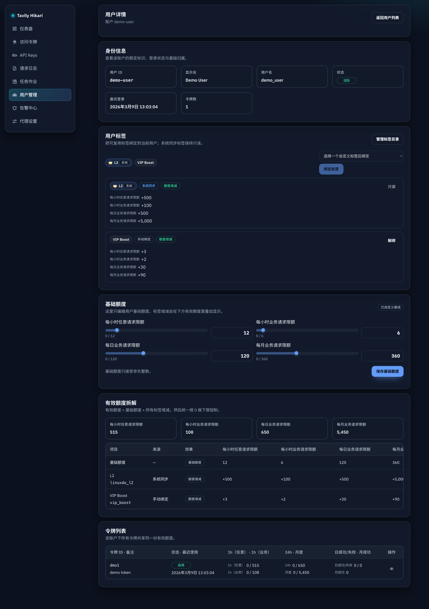

# Admin 用户标签与额度叠加（#2mt2u）

## 状态

- Status: 进行中（快车道）

## 背景 / 问题陈述

- 当前管理端只有用户列表、用户详情与账户级额度编辑，缺少可复用的“用户标签”模型，无法按标签做分组标记与额度叠加。
- LinuxDo OAuth 已持久化 `trust_level`，但当前没有将其映射为稳定的系统标签，也无法在 admin 界面显式展示。
- 账户额度当前直接存储在 `account_quota_limits`，服务重启会整体同步 env 默认值，无法区分“跟随默认”与“管理员自定义基线”。

## 目标 / 非目标

### Goals

- 新增用户标签模型，支持 custom tag 的增删改查与用户绑标/解绑。
- 固定提供 5 个 LinuxDo 系统标签：`linuxdo_l0..linuxdo_l4`，显示名 `L0..L4`，图标键 `linuxdo`，默认 delta 直接镜像旧 token 默认额度（`hourlyAny/hourly/daily/monthly`）。
- 基于 `oauth_accounts.trust_level` 做系统标签同步：初始化回填历史 LinuxDo 用户，后续 LinuxDo 登录时维持“每用户最多一个当前等级标签”。
- 将账户额度改为“用户基线 + 标签叠加”的有效额度模型，并让 `block_all` 标签可同时阻断 hourly-any 与 business quota。
- 在 admin 用户列表与详情页展示标签、基线额度、有效额度与计算明细。

### Non-goals

- 用户侧 `/console` 标签管理。
- 按标签筛选用户、批量绑标、标签排序规则配置。
- LinuxDo 之外的自动系统标签来源。
- 改变“同一用户所有 token 共享账户额度”的现有语义。

## 范围（Scope）

### In scope

- `src/lib.rs`
  - 新增 `user_tags` / `user_tag_bindings` schema 与同步逻辑。
  - 扩展 `account_quota_limits` 基线语义与 `inherits_defaults`。
  - 用户有效额度聚合、`block_all` 判定与 admin 查询 helper。
- `src/server/handlers/admin_resources.rs`
  - 新增标签 CRUD、用户绑标/解绑接口。
  - 扩展 `/api/users` 与 `/api/users/:id` 返回字段。
  - 保留 `/api/users/:id/quota` 路径，但语义改为编辑基线额度。
- `web/src/api.ts`、`web/src/AdminDashboard.tsx`、`web/src/i18n.tsx`
  - 用户列表标签列、Tag Catalog、用户详情标签管理、基线额度编辑、有效额度明细展示。
- `web/src/admin/AdminPages.stories.tsx`
  - 覆盖 LinuxDo 系统标签、自定义标签、`block_all` 与负额度显示钳制场景。

### Out of scope

- 新增独立标签管理路由。
- 管理员手动解绑 LinuxDo 系统标签。
- 将标签效果下沉到 token 级个体额度。

## 接口契约（Interfaces & Contracts）

- [contracts/db.md](./contracts/db.md)
- [contracts/http-apis.md](./contracts/http-apis.md)

## 验收标准（Acceptance Criteria）

- Given 服务初始化完成
  When 数据库为空或重复重启
  Then `linuxdo_l0..linuxdo_l4` 系统标签始终存在且不会重复插入。

- Given 历史 LinuxDo 用户存在且 `trust_level` 位于 `0..4`
  When 服务启动完成标签回填
  Then 每个用户都绑定且仅绑定一个对应等级的 LinuxDo 系统标签，并按该系统标签默认 delta 参与有效额度叠加。

- Given LinuxDo 用户再次登录且 `trust_level` 发生变化
  When OAuth 回调完成
  Then 用户的 LinuxDo 等级标签被切换为新的单一等级；若 `trust_level` 缺失或越界，则不自动删除旧等级标签。

- Given LinuxDo OAuth 回调中系统标签同步暂时失败
  When 用户身份与 OAuth 账户信息已经写入成功
  Then 登录流程仍然成功完成，并通过后续登录或启动期回填补齐 LinuxDo 系统标签绑定。

- Given 用户基线额度仍跟随默认值
  When 服务重启且 env 默认额度变化
  Then 用户基线额度同步到新默认值。

- Given LinuxDo 系统标签仍保持默认 delta
  When 服务重启且 env 默认额度变化
  Then 这些未被管理员改写的 LinuxDo 系统标签 delta 会同步到新的默认额度；管理员手工改写过的系统标签 delta 保持不变。

- Given 管理员手工修改了用户基线额度
  When 服务重启
  Then 该用户基线额度保持不变，不再被默认值覆盖。

- Given 用户绑定多个标签（包含自动同步的 LinuxDo 系统标签）
  When 读取用户列表、用户详情或执行额度判定
  Then 最终有效额度按“用户基线 + 全部标签 delta”汇总，并对每个维度执行 `max(0, value)`。
  And admin 详情中的 `quotaBreakdown` 总是追加一条最终 `effective` 行，明确展示钳制后的最终额度。

- Given 用户绑定 `block_all` 标签
  When 发起 hourly-any 或 business quota 校验
  Then 请求被阻断，admin UI 中对应有效额度展示为 `0`。

- Given custom tag 被删除
  When 再次读取用户详情或标签列表
  Then 标签定义与其用户绑定关系一并消失；系统标签删除请求会被拒绝。

- Given 打开 `/admin/users/tags` 并点击某个标签卡片的“绑定用户”入口
  When 跳转到用户管理列表
  Then 页面会自动带上这个标签对应的筛选条件，并使用该标签的精确绑定过滤结果。

- Given 管理员已经从标签目录跳转到带 `tagId` 的 `/admin/users`
  When 再输入关键字并点击搜索或按回车
  Then 页面仍保留原有 `tagId` 精确过滤，并将关键字查询作为附加条件叠加，不会退化成纯模糊搜索。

- Given 打开 `/admin/users`
  Then 表格中显示用户标签（最多 3 个 badge，超出显示 `+N`），并有 Tag Catalog 面板可管理标签定义。

- Given 打开 `/admin/users/:id`
  Then 页面顺序固定为 `Identity → User Tags → Base Quota → Effective Quota Breakdown → Tokens`，且可即时看到标签变更与基线编辑后的有效额度刷新结果。

- Given 管理员从带有标签筛选的 `/admin/users` 列表进入用户详情
  When 点击详情页返回按钮
  Then 页面恢复到进入详情前的用户列表上下文，包含 `q` / `tagId` 与分页状态，而不是退回默认第一页。

- Given 管理员从带有用户列表上下文的 `/admin/users` 进入标签目录或标签编辑态
  When 点击“Back to users”或完成目录内往返跳转后返回用户列表
  Then 页面仍恢复到进入标签目录前的用户列表上下文，包含 `q` / `tagId` 与分页状态。

## 非功能性验收 / 质量门槛（Quality Gates）

- `cargo fmt`
- `cargo clippy -- -D warnings`
- `cargo test`
- `cd web && bun test`
- `cd web && bun run build`
- `cd web && bun run build-storybook`
- 真实浏览器验收 `/admin/users` 与 `/admin/users/:id`

## 里程碑

- [x] M1: spec 与 DB / HTTP contracts 冻结
- [x] M2: 后端 schema、系统标签 seed / 回填、有效额度聚合完成
- [x] M3: admin API 与 TS contract 完成
- [x] M4: admin UI、i18n、Storybook 完成
- [ ] M5: 验证、快车道 PR、review-loop 收敛完成

## Visual Evidence (PR)

- 用户管理主页
  
- 标签目录页
  
- 标签编辑态（基线对齐后）
  
- 标签删除二次确认
  
- 用户详情页
  

## 风险 / 开放问题 / 假设

- 风险：管理员基线额度输入沿用现有指数滑块 + 文本框组合，浏览器自动化在文本框覆盖时容易出现追加输入，需要以真实人工交互为最终体验确认。
- 假设：系统标签定义允许管理员编辑额度效果，但 `name` / `display_name` / `icon` 仍由服务端保护为只读。
- 假设：`block_all` 标签删除后应立即解除所有关联用户的封禁效果，并让列表/详情额度恢复为剩余标签叠加结果。

## 变更记录（Change log）

- 2026-03-09: 冻结快车道 spec、DB / HTTP contracts，并落地 `user_tags` / `user_tag_bindings`、LinuxDo 系统标签 seed / 回填、基线额度 + 标签叠加、`block_all` 限流语义，以及 admin 列表/详情标签与额度拆解 UI。
- 2026-03-09: 通过 `cargo clippy -- -D warnings`、`cargo test`、`cd web && bun test`、`cd web && bun run build`、`cd web && bun run build-storybook`，并在 `http://127.0.0.1:55173/admin/users` 与 `http://127.0.0.1:55173/admin/users/demo-user` 完成真实浏览器验收。
- 2026-03-10: 根据主人确认补齐 5 张管理端视觉证据，统一归档到 `docs/specs/2mt2u-admin-user-tags-quota/assets/`，并修正标签目录编辑卡片与非编辑卡片的基线对齐。
