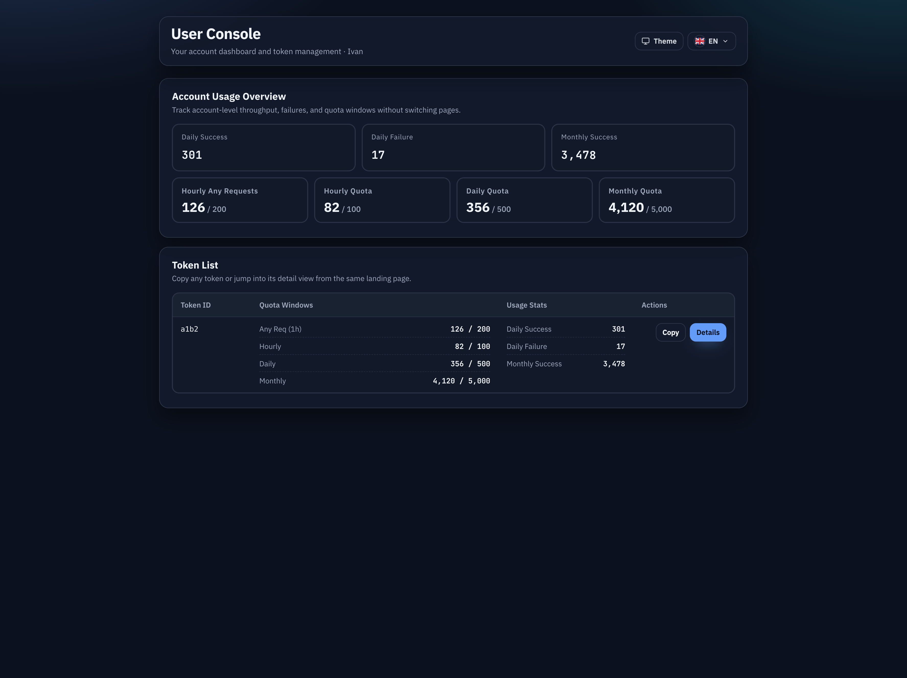

# 用户控制台单页合并（#2nx74）

## 状态

- Status: 已完成（5/5）
- Created: 2026-03-12
- Last: 2026-03-12

## 背景 / 问题陈述

- 当前 `/console` 把“账户仪表盘”和“Token 管理”拆成 `#/dashboard` 与 `#/tokens` 两个落地页。
- 用户进入控制台后需要先切页才能从账户概览跳到 token 列表，中间还残留一块只承载切页按钮的空白容器。
- 旧 hash 已经被分享和记录，若直接删掉 `#/dashboard` / `#/tokens` 会破坏既有入口与回退路径。

## 目标 / 非目标

### Goals

- 将 `/console` 的 landing 体验收敛为一个纵向单页：账户概览在前，Token 列表在后。
- 保留旧 hash 兼容：访问 `#/dashboard` 或 `#/tokens` 时仍进入同一页，但自动定位到对应区块。
- 保留 `#/tokens/:id` 作为独立 token detail 路由，并让 detail 返回操作固定落到单页内的 Token 列表区块。
- 同步更新 Storybook、测试与快车道交付物，使验收口径围绕 merged landing 而不是双页面切换。

### Non-goals

- 不修改 Rust 后端接口、配额计算逻辑或 `/api/user/*` 数据结构。
- 不重做 token detail 的 probe、日志或客户端接入模块。
- 不新增用户侧 token 写操作（创建、删除、轮换、禁用）。

## 范围（Scope）

### In scope

- `web/src/UserConsole.tsx`
- `web/src/lib/userConsoleRoutes.ts`
- `web/src/UserConsole.stories.tsx`
- `web/src/UserConsole.stories.test.ts`
- `web/src/lib/userConsoleRoutes.test.ts`
- `web/src/index.css`
- `docs/specs/2nx74-user-console-single-page-landing/SPEC.md`
- `docs/specs/README.md`

### Out of scope

- `src/**` 后端实现与数据库 schema。
- `/admin` 管理端信息架构。
- Public Home、登录页与管理员入口权限策略。

## 需求（Requirements）

### MUST

- `/console` 首屏同时渲染账户概览区块与 Token 列表区块。
- `#/dashboard` 与 `#/tokens` 保持可访问，并自动定位到 merged landing 的对应区块。
- `#/tokens/:id` 保持 detail 页；点击 detail 返回按钮后进入 merged landing 的 Token 列表区块。
- Storybook 与自动化断言不再把 dashboard/tokens 当成两张独立页面。

### SHOULD

- merged landing 不再保留额外的区块说明/导航条，首屏直接进入账户概览内容。
- 移动端继续沿用现有统计卡片与 token card 结构，不引入新布局分支。

### COULD

- 为 merged landing 补充更清晰的区块说明文案，帮助用户理解“概览 + Token 列表”已经合并。

## 功能与行为规格（Functional/Behavior Spec）

### Core flows

- 用户访问 `/console`
  - 默认进入 merged landing。
  - 账户概览区块位于上方，Token 列表区块位于下方。
- 用户访问 `/console#/dashboard`
  - 进入 merged landing。
  - 页面自动定位到账户概览区块。
- 用户访问 `/console#/tokens`
  - 进入 merged landing。
  - 页面自动定位到 Token 列表区块。
- 用户在 Token 列表点击详情
  - 进入 `/console#/tokens/:id`。
  - detail 页继续保留 token probe、日志与客户端接入模块。
- 用户在 token detail 点击返回
  - 回到 `/console#/tokens`。
  - merged landing 自动定位到 Token 列表区块。

### Edge cases / errors

- 若 hash 无法解析为已知 landing section，则回退到 merged landing 默认视图，不展示空白页。
- 若 token detail hash 中的 token id 解码失败，则回退到 Token 列表区块。
- 用户 OAuth 未启用时，仍显示既有 `/console` 不可用态；不渲染 merged landing 区块。

## 接口契约（Interfaces & Contracts）

### 接口清单（Inventory）

| 接口（Name）              | 类型（Kind） | 范围（Scope） | 变更（Change） | 契约文档（Contract Doc） | 负责人（Owner） | 使用方（Consumers）          | 备注（Notes）                  |
| ------------------------- | ------------ | ------------- | -------------- | ------------------------ | --------------- | ---------------------------- | ------------------------------ |
| `/console` hash semantics | route-state  | internal      | Modify         | None                     | web             | UserConsole, Storybook mocks | 仅前端 hash 解析与滚动语义变化 |
| `/api/user/dashboard`     | http-api     | external      | None           | None                     | server          | UserConsole                  | 数据契约保持不变               |
| `/api/user/tokens*`       | http-api     | external      | None           | None                     | server          | UserConsole                  | 数据契约保持不变               |

### 契约文档（按 Kind 拆分）

None

## 验收标准（Acceptance Criteria）

- Given 用户访问 `/console`
  When 页面完成首屏渲染
  Then 账户概览区块与 Token 列表区块同时存在，且不再只能显示其中一个页面状态。

- Given 用户访问 `/console#/dashboard`
  When 页面渲染完成
  Then merged landing 自动定位到账户概览区块。

- Given 用户访问 `/console#/tokens`
  When 页面渲染完成
  Then merged landing 自动定位到 Token 列表区块。

- Given 用户从 merged landing 的 Token 列表进入 `/console#/tokens/:id`
  When 点击返回按钮
  Then 返回 `/console#/tokens`，并回到 Token 列表区块而不是页面顶部。

- Given Token 列表为空
  When 用户停留在 merged landing
  Then Token 区块展示既有空态，同时账户概览区块仍保持可见。

- Given 本轮实现完成
  When 运行前端质量门槛
  Then `cd web && bun test` 与 `cd web && bun run build` 通过。

## 实现前置条件（Definition of Ready / Preconditions）

- 旧 hash 兼容策略已冻结为“保留并自动定位”。
- token detail 继续独立存在的边界已确认。
- Storybook 验收口径已接受从“双页面”变为“merged landing + detail”。

## 非功能性验收 / 质量门槛（Quality Gates）

### Testing

- Unit tests: `cd web && bun test`

### UI / Storybook (if applicable)

- Stories to add/update: merged landing、token focus、empty tokens、token detail 特殊态

### Quality checks

- Build: `cd web && bun run build`

## 文档更新（Docs to Update）

- `docs/specs/README.md`: 新增本 spec 索引并在完成后写回状态

## 计划资产（Plan assets）

- Directory: `docs/specs/2nx74-user-console-single-page-landing/assets/`
- In-plan references: ``
- PR visual evidence source: maintain `## Visual Evidence (PR)` in this spec when PR screenshots are needed.
- If an asset must be used in impl (runtime/test/official docs), list it in `资产晋升（Asset promotion）` and promote it to a stable project path during implementation.

## Visual Evidence (PR)

- Chrome DevTools 实测 `/console`、`#/dashboard`、`#/tokens` 与 `#/tokens/tmK4`：
  - `/console` 与 `#/dashboard` 同页同时展示 `账户用量概览` 和 `Token 列表`，首屏不再插入额外说明/导航条。
  - `#/tokens` 仍进入同一落地页，并自动滚动到 Token 列表区块。
  - `#/tokens/tmK4` 保持独立 detail 页，点击 `返回 Token 列表` 后回到 `#/tokens` 并重新聚焦 Token 区块。
  - 从 `#/dashboard` 手动滚到 Token 区块进入 detail 后，浏览器 Back 会回到原始 `#/dashboard` 入口并保留滚动位置。
- source_type=storybook_canvas
  - story_id_or_title: `User Console/UserConsole / Console Home Root`
  - state: `default`
  - target_program: `mock-only`
  - capture_scope: `browser-viewport`
  - sensitive_exclusion: `N/A`
  - submission_gate: `pending-owner-approval`
  - evidence_note: 证明 merged landing 已直接进入账户概览与 Token 列表内容，不再保留额外区块导航条
  - image:
    

## 资产晋升（Asset promotion）

None

## 实现里程碑（Milestones / Delivery checklist）

- [x] M1: 新建 follow-up spec 并冻结单页合并边界
- [x] M2: `/console` landing 重构为账户概览 + Token 列表单页
- [x] M3: 旧 `#/dashboard` / `#/tokens` hash 收敛为同页自动定位
- [x] M4: Storybook 与自动化测试更新到 merged landing 验收口径
- [x] M5: fast-track 验证、PR 与 review-loop 收敛

## 方案概述（Approach, high-level）

- 抽离一层轻量的 user-console hash route helper，统一运行时与 Storybook 对 legacy hash 的解释。
- landing 路由不再控制“挂载哪一个页面”，而是只控制“同一页里默认聚焦哪个区块”。
- detail 页继续沿用现有数据请求与 probe 行为，减少变更半径。

## 风险 / 开放问题 / 假设（Risks, Open Questions, Assumptions）

- 风险：hash 更新与自动滚动若处理不当，可能出现双滚动或定位失效。
- 风险：Storybook 控件与 preset stories 若未同步收口，仍会泄露旧的双页面语义。
- 假设：当前用户控制台 landing 无需新增后端字段即可支撑单页合并。

## 变更记录（Change log）

- 2026-03-12: 创建 follow-up spec，冻结 `/console` landing 由双页面切换收敛为单页定位的实现边界。
- 2026-03-12: 完成 `/console` merged landing 改造、legacy hash route helper、Storybook story/test 收口，以及 `cd web && bun test`、`cd web && bun run build`、`cd web && bun run build-storybook` 本地验证。
- 2026-03-12: 完成快车道验证、浏览器复核与 review-loop 收敛，spec 收口为完成态。

## 参考（References）

- `docs/specs/45squ-account-quota-user-console/SPEC.md`
- `docs/specs/7hs2d-user-console-storybook-acceptance-controls/SPEC.md`
