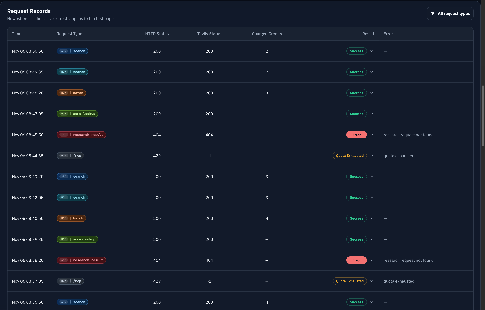

# Admin Token Request Type 列与多选精确筛选（#2p965）

## 状态

- Status: 进行中（快车道）
- Created: 2026-03-12
- Last: 2026-03-12

## 背景 / 问题陈述

- `/admin/tokens/:id` 的 `Request Records` 目前只能看到时间、状态与 credits，看不出一条请求到底走的是 Tavily HTTP API 还是 `/mcp`，也看不出具体功能。
- token 日志当前只持久化 `method/path/query/http_status/mcp_status/...`，MCP 场景没有稳定落下 JSON-RPC method / tool name，前端无法可靠地仅靠表格行数据推断 `API | search`、`MCP | search` 这类人类可读请求类型。
- 管理员排查账单、限额命中或协议混用问题时，只能展开日志或查库，缺少能直接筛选“某几类功能”的入口。

## 目标 / 非目标

### Goals

- 为 `/admin/tokens/:id` 的 `Request Records` 新增 `Request Type` 列，统一显示 `API | <feature>` 或 `MCP | <feature>`。
- 为 token 日志分页接口新增基于稳定 key 的多选精确筛选，支持同时选中多个 request type。
- 让分页接口、SSE snapshot、桌面表格、移动卡片与展开详情对同一条日志展示一致的 request kind 信息。
- 新写入日志在后端稳定落盘 request kind；旧日志在缺少细节时仍能 best-effort 回退成可读 raw label，而不是空白。

### Non-goals

- 不改 `/admin/requests` 全局请求页与 API key 详情页。
- 不引入新的前端筛选依赖或通用 MultiSelect 组件。
- 不回补历史日志内容到“完全精确”；无法恢复的 legacy MCP 日志允许回退成 `MCP | /mcp` 之类的 raw label。
- 不改现有计费、分页、时间窗、SSE 节奏与 quota 逻辑。

## 范围（Scope）

### In scope

- `docs/specs/README.md`
  - 新增 `2p965-admin-token-request-kind-filter` 索引行。
- `src/lib.rs`
  - 扩展 `auth_token_logs` schema、`TokenLogRecord`、token log insert/query 路径与 legacy fallback 派生逻辑。
- `src/server/proxy.rs` / `src/server/handlers/tavily.rs`
  - 在 MCP 与 Tavily HTTP token log 写入点生成稳定 request kind 元数据。
- `src/server/dto.rs` / `src/server/proxy.rs`
  - 让 `/api/tokens/:id/logs/page` 与 `/api/tokens/:id/events` snapshot 返回同一 request kind 字段；分页接口支持多选过滤并返回当前时间窗可选项。
- `src/server/tests.rs`
  - 增加 HTTP/MCP 分类、mixed batch fallback、分页多选过滤与 snapshot 合同回归。
- `web/src/pages/TokenDetail.tsx`
  - 增加 `Request Type` 列、多选筛选菜单、移动/详情展示与筛选态 SSE 刷新。
- `web/src/pages/TokenDetail.stories.tsx`
  - 补齐 API、MCP、mixed batch、legacy fallback 与多选选项样例。
- `web/src/index.css`
  - 调整 token detail 请求记录 header / filter / 列宽样式，避免新增列后挤爆布局。

### Out of scope

- `/api/tokens/:id/logs` 非分页接口增加新的筛选参数。
- public / user token logs 接口额外暴露 request kind 字段。
- 将 request type 筛选同步到 URL query、浏览器历史记录或全局 admin 状态。

## 接口契约（Interfaces & Contracts）

### Public / external interfaces

- [contracts/http-apis.md](./contracts/http-apis.md)
- [contracts/events.md](./contracts/events.md)

### Internal interfaces

- [contracts/db.md](./contracts/db.md)

## 验收标准（Acceptance Criteria）

- Given 管理员打开 `/admin/tokens/:id`
  When 请求记录表格渲染完成
  Then 每条日志都显示 `Request Type`，格式为 `API | search`、`MCP | tools/list`、`MCP | batch` 这一类人类可读文本。
- Given 某条日志是 Tavily HTTP `/api/tavily/research/:request_id`
  When 表格与展开详情渲染
  Then 该日志显示 `API | research result`。
- Given 某条日志是 MCP `tools/call` 调用 `tavily-search`
  When 页面渲染
  Then 该日志显示 `MCP | search`，而不是原始 `tavily-search`。
- Given 某条 MCP batch 同时包含 `tools/list` 与 `tavily-search`
  When 页面渲染
  Then 主列显示 `MCP | batch`，展开详情能看到批次内的实际功能列表。
- Given 管理员在筛选菜单里同时选择 `API | search` 与 `MCP | search`
  When 日志重新拉取
  Then 仅展示命中任一已选 type 的行，`total` 正确、页码重置为 1、时间窗保持不变。
- Given 某条旧日志缺少新落盘字段且无法可靠识别具体功能
  When 页面渲染
  Then 使用 raw fallback（例如 `API | /api/...`、`MCP | /mcp`），不显示 `—`。

## 非功能性验收 / 质量门槛（Quality Gates）

- `cargo fmt --all`
- `cargo test`
- `cargo clippy -- -D warnings`
- `cd web && bun test`
- `cd web && bun run build`
- 开发环境手工验收 `/admin/tokens/:id` 的筛选菜单、分页切换、SSE 首屏刷新与移动布局。

## 实现里程碑（Milestones / Delivery checklist）

- [x] M1: Spec 与 contracts 落地，冻结 request kind taxonomy、多选筛选规则与 fallback 边界
- [x] M2: 后端持久化 / 派生 request kind，分页接口支持多选过滤并返回 options
- [x] M3: Token detail 页面新增 `Request Type` 列、多选筛选与 mixed batch 详情展示
- [ ] M4: Storybook / 测试 / 本地验证 / PR / review-loop 收敛完成

## 风险 / 开放问题 / 假设

- 风险：legacy `/mcp` 日志缺少请求体时无法恢复 JSON-RPC method，只能回退到较粗粒度 raw label。
- 风险：新增一列和筛选控件后，token detail panel header 在窄桌面宽度下可能需要重新排版，否则会与分页或长错误文案互相挤压。
- 假设：多选筛选采用 OR 语义，即命中任一已选 request kind 即保留该日志。
- 假设：`request_kind_options` 返回当前 token + 时间窗下的全部可选类型，不受当前筛选值二次收窄。

## Visual Evidence (PR)

- source_type: storybook_canvas
  story_id_or_title: Admin/Pages/TokenDetail/Dense Request Records
  state: dense-request-records (dark theme)
  evidence_note: 验证 Request Records 在高密度数据下的 Request Type 列、着色 badge 与收紧后的多选筛选头部布局。
  image:
  
- 本地浏览器验收已完成：在 `http://127.0.0.1:58097/admin/tokens/497Q` 验证了 `Request Type` 列、多选 OR 语义筛选，以及 `MCP | batch` 展开后的 detail。
- PR `#119` 已创建，`type:minor` / `channel:stable` 标签已补齐，CI checks 已转绿。
- review-loop 首轮指出了 raw MCP 子路径折叠、legacy backfill 方式，以及多选筛选在跨时间窗 / 非第一页 SSE 下的状态问题；对应修复已在当前分支落地并重新回归。

## 变更记录（Change log）

- 2026-03-12: 初始化 spec，冻结 `Request Type` 列、多选精确筛选、legacy raw fallback 与 mixed MCP batch 展示规则。
- 2026-03-12: 实现后端 request kind 持久化与多选过滤、TokenDetail 多选下拉筛选、Storybook mock 与本地回归验证。
- 2026-03-12: 根据 review-loop 修复 `/mcp/*path` raw fallback 折叠与旧错误落库值回补，legacy request kind backfill 收敛为单次集合式更新，并补齐多选筛选在时间窗切换 / 非第一页 SSE 下的 request type 可见性。

## 参考（References）

- `docs/specs/jewvm-token-request-cost-visibility/SPEC.md`
- `web/src/pages/TokenDetail.tsx`
- `src/server/proxy.rs`
- `src/server/handlers/tavily.rs`
