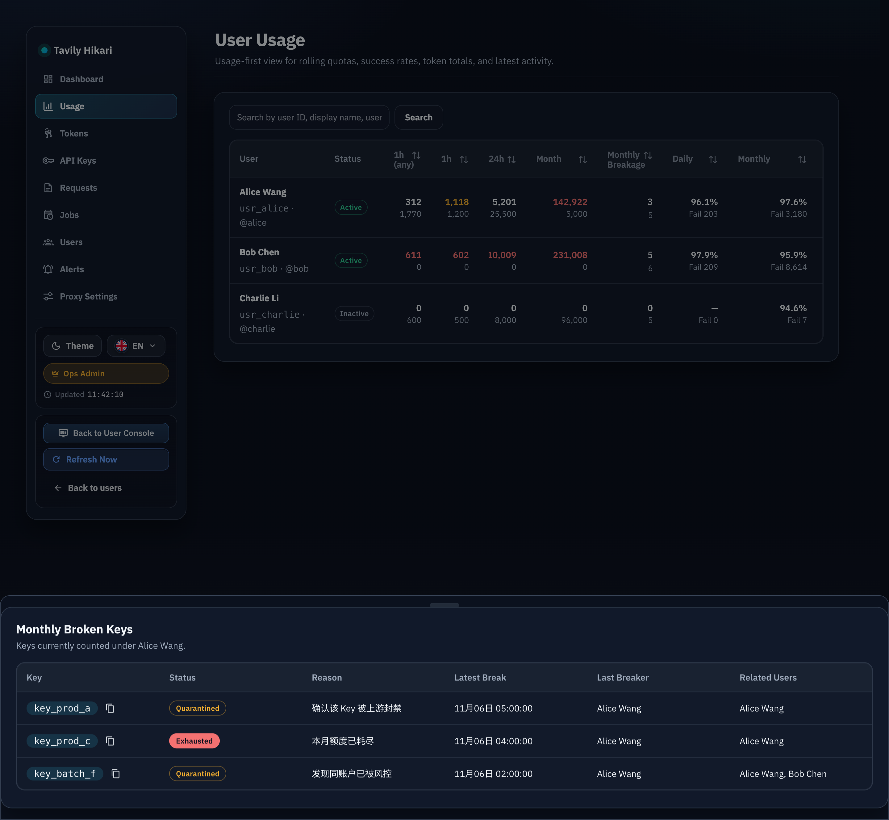
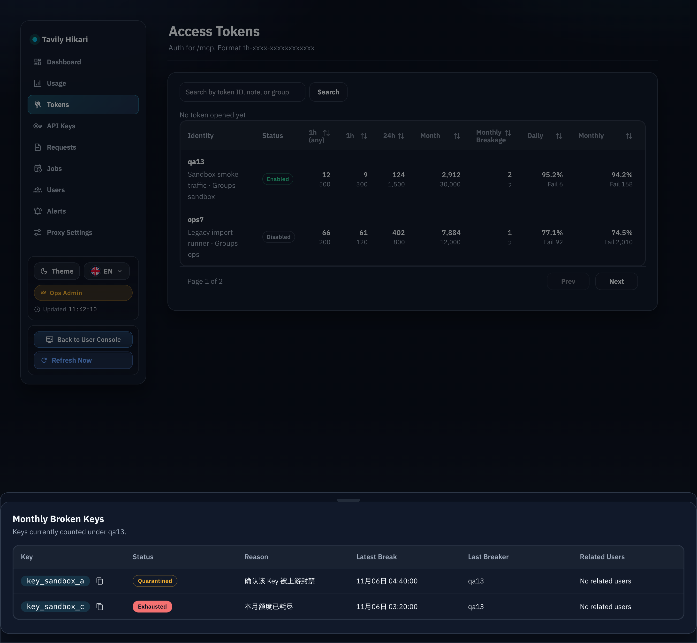
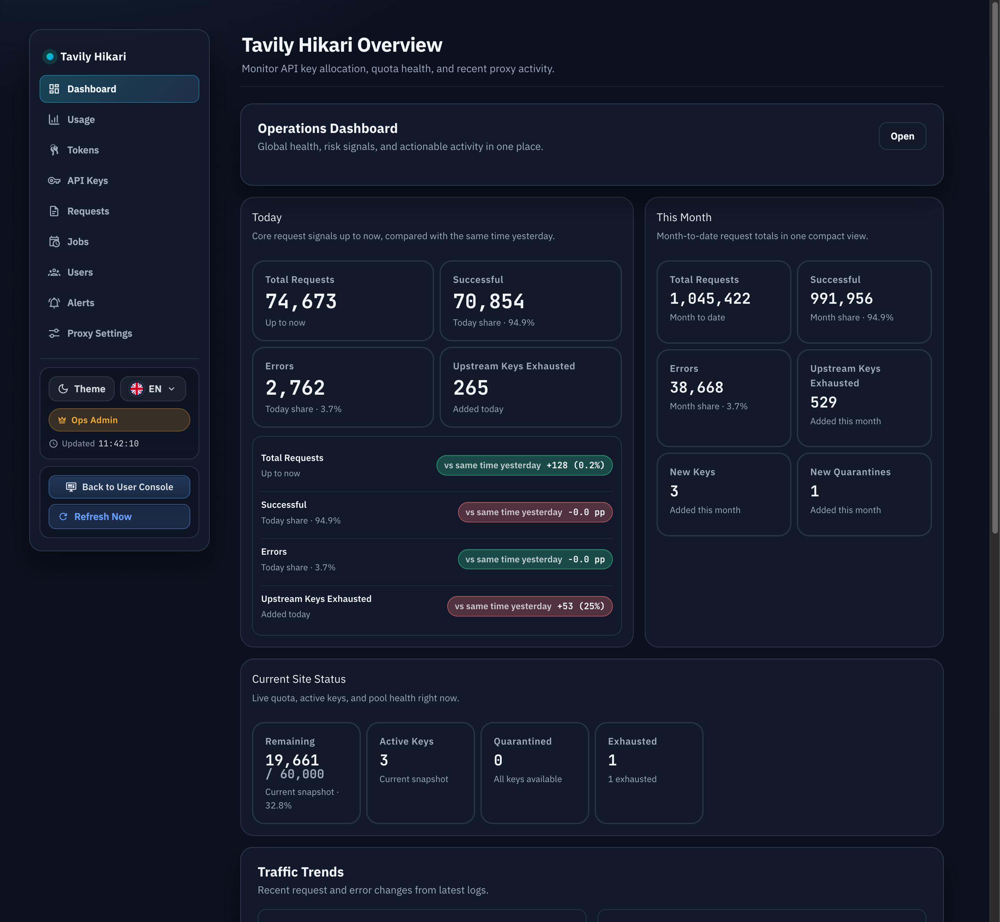

# Admin 路由共享抽屉宿主持久化修复（#2pyzb）

## 状态

- Status: 部分完成（3/4）
- Created: 2026-04-02
- Last: 2026-04-02

## 背景 / 问题陈述

- `web/src/AdminDashboard.tsx` 当前把 `monthlyBrokenDrawer`、`requestEntityDrawer` 与若干共享 dialogs/drawers 挂在默认返回路径的底部；但 `/admin/users/usage`、`/admin/users/:id`、`/admin/tokens/leaderboard` 会提前 `return`，导致这些路由在状态已切换为 open 时并没有实际渲染宿主。
- 因此管理员点击 `月蹬坏` 数字后不会在当前页面立刻看到抽屉，只有回到仪表盘等走到底部默认分支时，残留的 open 状态才会让抽屉“迟到出现”。
- 现有 `web/src/admin/AdminPages.stories.tsx` 把抽屉 proof 内联在页面 canvas 里，没有复用生产级宿主结构，因此没能提前暴露这个结构性问题。
- `#ksbxf` 已经引入月蹬坏抽屉与详情交互，`#frpeh` 已经把管理端页面进一步拆成多路由壳层；本次 hotfix 需要在这两个已完成工作之上补齐“共享 overlay host 必须跨路由持续挂载”的组合约束。

## 目标 / 非目标

### Goals

- 把 `AdminDashboard` 改为“先决定 route 内容，再统一返回共享 overlay host”的结构，确保任何管理端路由都不会绕过抽屉/弹层宿主。
- 让 `/admin/users/usage`、`/admin/users/:id`、`/admin/tokens/leaderboard` 点击月蹬坏入口后，抽屉在当前页面立即出现。
- 保持 `requestEntityDrawer` 与现有共享 dialogs/drawers 的行为不变，但移除它们依赖默认分支尾部挂载的偶然性。
- 让 Storybook proof 复用生产级宿主结构，避免局部内联 story 再次掩盖同类问题。
- 增加一条自动化回归守卫，至少能证明“页面壳层 + 共享宿主”组合不会被 route-specific return 绕开。

### Non-goals

- 不修改 Rust handler、HTTP API、SQL、排序口径或业务文案。
- 不为单个页面做临时 JSX 补丁后继续保留共享宿主结构隐患。
- 不扩散到用户控制台或非 admin 路由。

## 范围（Scope）

### In scope

- `web/src/AdminDashboard.tsx`
  - 提炼稳定的 admin global overlay host。
  - 移除各路由提前 return 对共享 overlays 的绕过。
  - 保持 keys batch portal 与原有业务状态/handler 语义不变。
- `web/src/admin/AdminOverlayHost.tsx`
  - 新增轻量宿主组件，承担“页面内容 + 共享 overlays”的组合约束。
- `web/src/admin/AdminOverlayHost.test.tsx`
  - 新增组合层回归断言。
- `web/src/admin/AdminPages.stories.tsx`
  - users usage、user detail、unbound token usage 与 sandbox proof 改用生产级 overlay host。
- `docs/specs/README.md`
- 本 spec 的 `## Visual Evidence`

### Out of scope

- `src/**`
- `web/src/api.ts`
- 任何网络请求、数据口径或后端路由行为

## 核心约束（Key Constraints）

- 共享 admin overlay host 必须与当前 route 的页面壳层解耦，并在所有 admin 路由下持续挂载。
- route-specific 内容可以提前决定，但最终返回值只能有一条稳定的共享宿主路径。
- 打开过抽屉后切换页面时，不能因为宿主重新出现而把旧的 open 状态“补弹出”。
- Storybook proof 必须使用与生产一致的宿主组合，而不是单独把 drawer 直接塞进 page canvas。

## 验收标准（Acceptance Criteria）

- Given 管理员位于 `/admin/users/usage`
  When 点击 `月蹬坏` 数字
  Then 抽屉在当前页面立即出现，不需要切回仪表盘。

- Given 管理员位于 `/admin/users/:id`
  When 点击月蹬坏详情入口
  Then 抽屉在当前页面立即出现，并且关闭后状态被清理。

- Given 管理员位于 `/admin/tokens/leaderboard`
  When 点击 `月蹬坏` 数字
  Then 抽屉在当前页面立即出现，排序/分页与当前页面内容保持不变。

- Given 管理员先在上述任一路由打开过月蹬坏抽屉
  When 切回 dashboard
  Then 不会再因为残留状态触发迟到显示。

- Given `requestEntityDrawer` 或其他共享 admin dialogs/drawers 需要打开
  When 当前路由不是 dashboard 默认分支
  Then 这些 overlays 仍然能正常渲染。

- Given Storybook 打开 users usage / user detail / unbound token usage 的 drawer proof
  When 查看 open 状态
  Then proof 经过共享 overlay host 渲染，而不是局部内联宿主。

## 非功能性验收 / 质量门槛（Quality Gates）

### Testing

- `cd web && bun test`
- `cd web && bun run build`
- `cd web && bun run build-storybook`

### UI / Storybook

- Storybook 至少覆盖 users usage、user detail、unbound token usage 三个路由壳层在 open drawer 状态下的共享宿主行为。
- 视觉证据只能使用 mock / Storybook 渲染，不触达真实上游。

## Visual Evidence

- source_type: storybook_canvas
  story_id_or_title: admin-pages--users-usage-breakage-drawer-proof
  state: users usage drawer opens on the current route shell
  target_program: mock-only
  capture_scope: browser-viewport
  sensitive_exclusion: N/A
  submission_gate: pending-owner-approval
  evidence_note: 证明 `/admin/users/usage` 直接在当前页面壳层里渲染月蹬坏抽屉，而不是切回 dashboard 后才迟到出现。
  image:
  

- source_type: storybook_canvas
  story_id_or_title: admin-pages--unbound-token-usage-breakage-drawer-proof
  state: unbound token usage drawer opens on the current route shell
  target_program: mock-only
  capture_scope: browser-viewport
  sensitive_exclusion: N/A
  submission_gate: pending-owner-approval
  evidence_note: 证明 `/admin/tokens/leaderboard` 的未关联 token 用量页在当前页面壳层内立即渲染月蹬坏抽屉。
  image:
  

- source_type: storybook_canvas
  story_id_or_title: admin-pages--dashboard
  state: dashboard stays clean with the shared overlay host mounted
  target_program: mock-only
  capture_scope: browser-viewport
  sensitive_exclusion: N/A
  submission_gate: pending-owner-approval
  evidence_note: 证明共享 admin overlay host 已经与 route shell 解耦并常驻；dashboard 仍保留宿主，但不会凭空补弹出旧抽屉。
  image:
  

## 实现里程碑（Milestones / Delivery checklist）

- [x] M1: 冻结根因、影响路由、宿主约束与验收口径。
- [x] M2: 完成 `AdminDashboard` 共享 overlay host 重构并清理重复宿主。
- [x] M3: 完成 Storybook 生产级宿主 proof 与组合层回归守卫。
- [ ] M4: 完成 checks、视觉证据与 merge-ready 收口。

## 风险 / 开放问题 / 假设

- 风险：`AdminDashboard` 当前文件很大，路由壳层与共享 overlay 的抽取若边界不清晰，容易引入重复渲染或 JSX 闭合错误。
- 风险：Storybook 若继续直接渲染局部抽屉，会让后续 overlay 宿主回归再次漏检。
- 假设：keys batch floating portal 仍可保留在默认返回路径外层，只要共享 overlays 本体被统一收口即可。

## 变更记录（Change log）

- 2026-04-02: 创建 hotfix spec，冻结 route-specific early return 绕过共享 overlay host 的根因、影响面与修复门槛。
