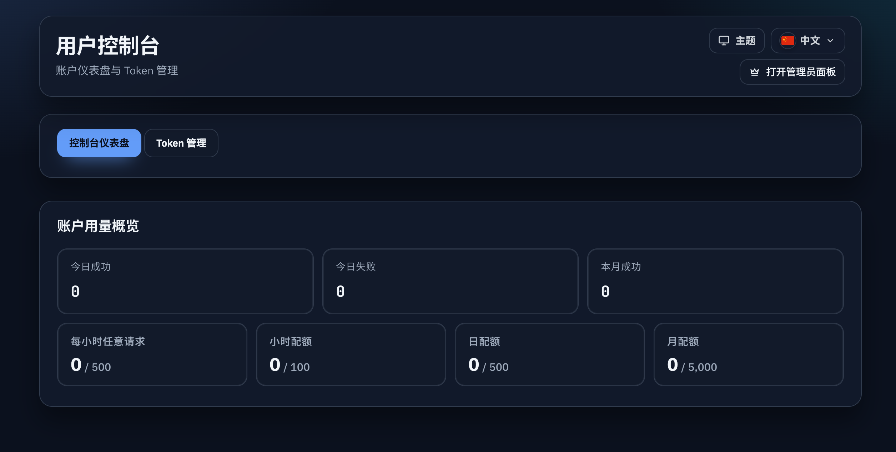

# 用户控制台管理员入口（#2uv3g）

## 状态

- Status: 已完成
- Created: 2026-03-08
- Last: 2026-03-08

## 背景 / 问题陈述

- 首页 `/` 已有管理员入口，但管理员登录后默认落到 `/console`，控制台页头没有对应入口。
- 这会导致管理员会话进入用户控制台后，还得手工输入 `/admin` 才能进入后台。
- 当服务未启用用户 OAuth 登录时，真实 `/console` 会暴露裸 `404`，缺少产品级兜底。
- 当前 UserConsole Storybook 已完成验收参数重构，因此本轮只补产品入口与管理员可见态覆盖，不回退到旧 `scenario`。

## 目标 / 非目标

### Goals

- 在 `/console` 共享页头增加管理员专属 CTA。
- 仅对 `GET /api/profile` 返回 `isAdmin=true` 的会话展示该 CTA。
- CTA 固定跳转 `/admin`，不改变管理员登录后先落到 `/console` 的既有策略。
- 当用户 OAuth 未启用时，`/console` 改为展示友好的不可用态，而不是裸 `404`。
- Storybook 提供管理员态入口预览，便于验收显示/隐藏差异。

### Non-goals

- 不修改 `/auth/linuxdo/callback`、`/` 到 `/console` 的自动跳转、或 `/admin` 鉴权链路。
- 不新增后端接口、角色能力 API、数据库结构或 Rust handler。
- 不回退 UserConsole Storybook 已移除的 `scenario` 聚合参数。

## 范围（Scope）

### In scope

- `web/src/UserConsole.tsx`
- `web/src/index.css`
- `web/src/lib/userConsoleAdminEntry.ts`
- `web/src/lib/userConsoleAdminEntry.test.js`
- `web/src/lib/userConsoleAvailability.ts`
- `web/src/lib/userConsoleAvailability.test.js`
- `web/src/UserConsole.stories.tsx`
- `web/src/UserConsole.stories.test.ts`
- `src/server/spa.rs`
- `src/server/tests.rs`
- `docs/specs/README.md`

### Out of scope

- `GET /api/profile` 与 `/api/user/*` 的现有 HTTP 契约。
- PublicHome 与 Admin 页面现有入口行为。

## 接口契约（Interfaces & Contracts）

- 入口显隐仅依赖现有 `Profile.isAdmin`。
- 管理员入口目标固定为 `/admin`。

## 验收标准（Acceptance Criteria）

- Given 管理员会话访问 `/console`
  When 用户停留在 dashboard、tokens 或 token detail
  Then 页头显示“打开管理员面板”入口，点击后进入 `/admin`。

- Given 非管理员会话访问 `/console`
  When 页面加载完成
  Then 该入口不显示，原有控制台交互保持不变。

- Given UserConsole Storybook
  When 验收者切换 `Admin session` 控件
  Then 可直接看到管理员入口显示/隐藏差异，而无需依赖内部场景名。

- Given 服务未启用用户 OAuth 登录
  When 用户访问 `/console` 或 `/console#/tokens`
  Then 页面展示友好的不可用说明，不出现裸 `404` 或页面内接口 `404` 报错。

## 非功能性验收 / 质量门槛（Quality Gates）

### Testing

- `cd web && bun test`
- `cd web && bun run build`
- `cd web && bun run build-storybook`

### UI / Storybook

- 管理员入口在 desktop 与 mobile 管理员态下可见。
- Storybook Controls 暴露 `Admin session` 布尔开关。

## Visual Evidence (PR)

- 证据类型：真实应用预览态 `/console` 页面截图。
- 证明点：管理员会话进入 `/console` 后，页头显示唯一且清晰的“打开管理员面板”入口。
- 证明点：控制台主体正常渲染，不出现用户接口 `404` 提示。

- 证据类型：真实应用预览态 `/console#/tokens` 页面截图。
- 证明点：用户 OAuth 未启用时，真实 `/console` 仍返回 SPA 并展示友好的不可用说明。
- 证明点：管理员入口仍可见，页面不再暴露裸 `404`。

## 实现里程碑（Milestones / Delivery checklist）

- [x] M1: `/console` 页头增加管理员专属入口
- [x] M2: Storybook 增加管理员态验收入口
- [x] M3: 用户 OAuth 未启用时，真实 `/console` 改为展示不可用态而非裸 `404`
- [x] M4: 单测、构建与 Storybook 构建通过

## 风险 / 开放问题 / 假设

- 风险：页头空间在窄屏下较紧，需要保持入口不挤压现有主题/语言切换控件。
- 假设：`Profile.isAdmin` 足以代表允许进入 `/admin` 的管理员态。

## 变更记录（Change log）

- 2026-03-08: 在最新 `main` 基线上补齐 `/console` 管理员入口，并同步 Storybook 管理员验收控件与自动化断言。
- 2026-03-08: 为未启用用户 OAuth 的真实 `/console` 增加前后端兜底，避免裸 `404` 并补充第二张真实页面证据图。
