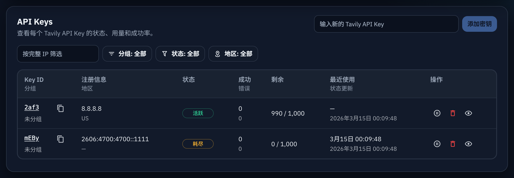
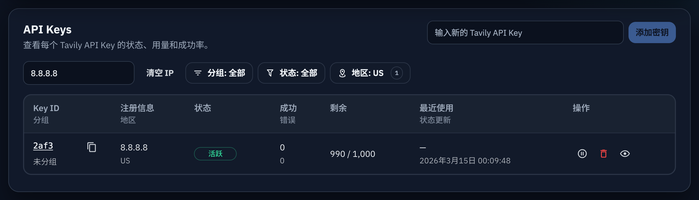
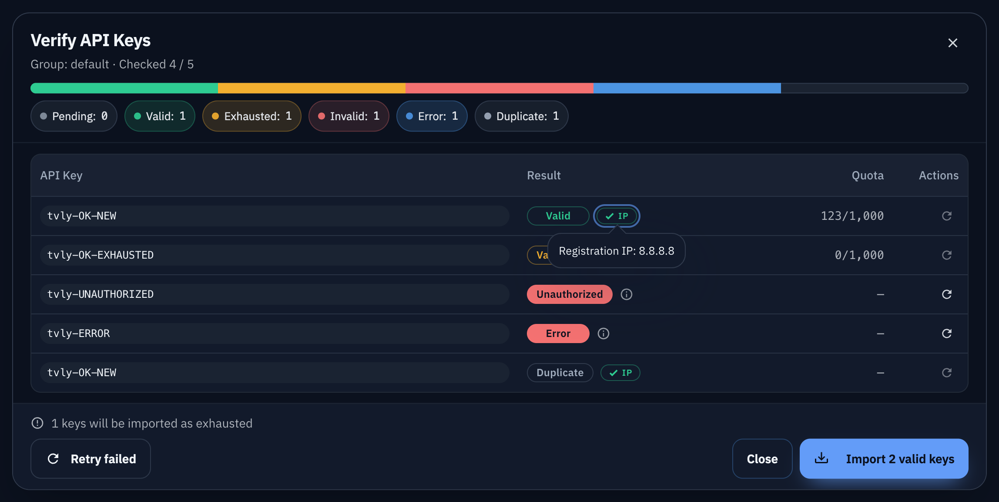

# Admin API Keys 注册 IP 与地区增强（#3v7ip）

## 状态

- Status: 进行中（快车道）
- Created: 2026-03-14
- Last: 2026-03-14

## 背景 / 问题陈述

- 当前 `/admin/keys` 导入链路只会从文本里提取 `tvly-dev-*` key，不会保存账号来源中的注册 IP。
- 管理端列表与详情缺少“注册 IP / 注册地区”上下文，不利于账号排查、地域归属判断和筛选。
- 主人要求地区解析方式参考本机开源项目 `xp`：使用 `country.is` 兼容批量接口、仅处理公网 IP，并按 xp 的地区格式展示结果。

## 目标 / 非目标

### Goals

- 批量导入时按行智能提取首个 `tvly-dev-*` key 与首个公网 IP，兼容空格、`|`、`;`、`,` 等混合文本。
- 在 `api_keys` 中持久化 `registration_ip` 与 `registration_region`，并在 key 列表 / 详情返回。
- 列表支持 `registration_ip` 精确筛选与 `registration_region` 多选 facets 筛选，且保持 URL / 分页上下文。
- 地区解析遵循 `xp` 的 `country.is` 思路：批量解析、短暂失败回退、不阻断导入。
- 导入校验弹窗中的映射节点名称按匹配来源着色：注册 IP=`success`、同地区=`info`、其他=`warning`。

### Non-goals

- 不做历史 key 全量回填任务。
- 不新增手工编辑注册 IP / 地区的后台入口。
- 不支持 CIDR、模糊 IP 搜索或自定义 geo provider 配置页。
- 不扩展校验对话框为 metadata 检查器；校验流程仍只验证 key 可用性。
- 不改动代理选点优先级，也不把匹配来源持久化到数据库。

## 范围（Scope）

### In scope

- `src/lib.rs`
  - `api_keys` schema 增加 `registration_ip` / `registration_region`
  - API key upsert / metrics / filters / facets 支持新字段
- `src/server/handlers/admin_resources.rs`
  - `/api/keys` 新增 `registration_ip` / `region` 查询参数
  - `/api/keys/batch` 支持结构化导入项并在导入时解析地区
- `src/main.rs` / `src/server/state.rs`
  - 新增 `API_KEY_IP_GEO_ORIGIN` 配置并注入 server state
- `web/src/lib/api-key-extract.ts`
  - 新增逐行提取 key + 首个公网 IP 的 structured parser
- `web/src/AdminDashboard.tsx` / `web/src/admin/routes.ts` / `web/src/api.ts`
  - 列表展示、详情展示、IP/地区筛选与 URL 状态同步
- `web/src/i18n.tsx`
  - 新增注册信息、筛选与隐私提示文案
- `src/server/tests.rs` / `web/src/**/*.test.ts`
  - 覆盖新合同与解析规则

### Out of scope

- Dashboard 总览卡片结构调整
- 用户控制台或公开页面显示注册 IP / 地区
- Geo lookup 后台常驻任务或单独管理页

## 接口契约（Interfaces & Contracts）

### HTTP: `GET /api/keys`

- 新增查询参数：
  - `registration_ip`: optional，按 trim 后的完整 IP 精确匹配
  - `region`: optional，可重复；按 trim 后字符串做精确多选过滤
- 响应新增：
  - `items[*].registration_ip: string | null`
  - `items[*].registration_region: string | null`
  - `facets.regions[]: { value: string, count: number }`

### HTTP: `GET /api/keys/:id`

- 响应新增：
  - `registration_ip: string | null`
  - `registration_region: string | null`

### HTTP: `POST /api/keys/batch`

- 兼容旧请求：
  - `api_keys: string[]`
- 新增结构化请求：
  - `items: Array<{ api_key: string, registration_ip?: string | null }>`
- 导入语义：
  - 同一批次内按首次出现的 key 决定其 registration metadata
  - 对已存在 key，仅当目标字段为空时才补写，不覆盖已有值
  - geo lookup 失败不影响该 key 的创建/恢复/已存在结果

### HTTP: `POST /api/keys/validate`

- 响应新增可选字段：
  - `results[*].assigned_proxy_match_kind: "registration_ip" | "same_region" | "other" | null`
- 语义固定：
  - `registration_ip`：当前选中的主代理节点直接命中注册 IP
  - `same_region`：未命中注册 IP，但节点地区命中 `registration_region`
  - `other`：其余 fallback/direct/preferred-hint 命中

### Browser URL contract

- `/admin/keys` 新增：
  - `registrationIp=<ip>`
  - `region=<value>`（可重复）
- 详情页返回列表时，必须保留 `page / perPage / group / status / registrationIp / region` 全部上下文。

## 实现约束（Implementation Notes）

- 地区解析参考 `xp`：
  - `country.is` 默认 origin：`https://api.country.is`
  - 请求路径使用批量字段 `?fields=city,subdivision,asn`
  - 请求体为 IP 数组 POST
  - 只对公网 IPv4/IPv6 发起查询
  - 429 / 网络错误使用短暂 retry-after / backoff，避免同批次重复打爆上游
  - 地区展示格式按 xp 的 `format_region` 语义：优先 `country + region`，若 region 像 subdivision code 且 city 存在，则显示 `country city (code)`
- 本项目数据库只保存最终 `registration_region` 字符串，不额外拆分存 `country/region/city/operator`。
- UI 需提示注册地区解析会访问 configured `country.is`-compatible 服务。
- 校验弹窗只给“分配代理”值文本着色；IP badge、状态 badge、地区文案与列表/详情页现有展示保持不变。

## 验收标准（Acceptance Criteria）

- Given 文本行 `foo@example.com | tvly-dev-a | 8.8.8.8`
  When 进入导入流程
  Then 前端提取出 `api_key=tvly-dev-a` 与 `registration_ip=8.8.8.8`，后端保存地区并在列表/详情显示。

- Given 文本行只包含私网 IP、保留地址或没有 IP
  When 导入
  Then key 仍可正常入库，`registration_ip` / `registration_region` 保持为空。

- Given `country.is` 返回 429、网络错误或空 geo 字段
  When 导入
  Then key 导入不失败；region 为空；同一批次不会对同一 IP 无限制重试。

- Given `GET /api/keys?registration_ip=8.8.8.8&region=US`
  When 打开列表
  Then 只返回完全匹配该 IP 且地区属于所选 region facets 的 key，并返回全量 region facets 计数。

- Given 校验结果返回 `assigned_proxy_match_kind=registration_ip`
  When 打开导入校验弹窗的注册信息 bubble
  Then 节点名称文本使用成功色，且不影响其它字段颜色。

- Given 校验结果返回 `assigned_proxy_match_kind=same_region`
  When 打开导入校验弹窗的注册信息 bubble
  Then 节点名称文本使用信息色。

- Given 校验结果返回 `assigned_proxy_match_kind=other` 或缺失
  When 打开导入校验弹窗的注册信息 bubble
  Then 节点名称文本分别使用警告色或保持默认色。

- Given 管理员从带 query 的 `/admin/keys` 进入 `/admin/keys/:id`
  When 点击返回
  Then 原分页、分组、状态、IP、region 筛选全部恢复。

## 界面截图（Screenshots）

### 管理端 API Keys 主列表

展示新增后的头部快速添加区、注册信息列以及默认列表状态。

### 管理端 API Keys 筛选态

展示 `registrationIp=8.8.8.8` 与 `region=US` 的真实筛选结果，以及筛选控件的组合状态。

### 管理端 Key 详情注册信息区

展示详情页中的注册 IP / 地区元数据区块。

### 导入校验弹窗

展示批量导入后的校验结果弹窗，包括 valid / exhausted / unauthorized / error / duplicate 等状态。

## 质量门槛（Quality Gates）

- `cargo fmt --all`
- `cargo clippy --all-targets --all-features -- -D warnings`
- `cargo test --locked --all-features`
- `cd web && bun test`
- `cd web && bun run build`
- 浏览器手工验证 `/admin/keys` 导入、展示、筛选、详情与 URL 恢复

## 里程碑（Milestones）

- [ ] M1: 规格冻结与 contracts 落盘
- [ ] M2: 后端 schema / geo resolver / list+detail contract 落地
- [ ] M3: 前端导入 parser / 展示 / 筛选 / URL 同步落地
- [ ] M4: 测试、浏览器验证、review-loop 与 spec-sync 收敛
