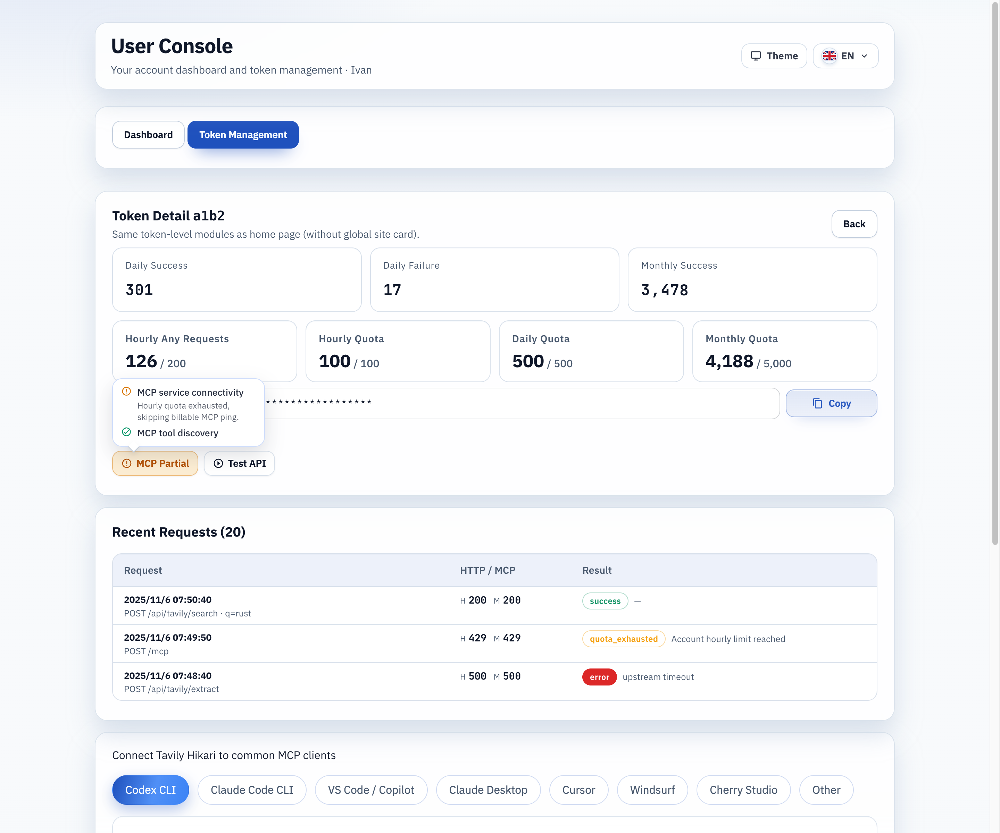

# 账户级配额迁移与登录后用户控制台（#45squ）

## 状态

- Status: 已完成（fast-track）
- Created: 2026-03-02
- Last: 2026-03-07

## 背景 / 问题陈述

- 当前配额判定与展示主要基于 access token 维度，无法沉淀到账户层。
- LinuxDo 登录后仍停留在公共首页，缺少“我的控制台”入口与账户视角指标。
- 用户端需要最小可用的控制台：账户仪表盘 + token 管理（当前每账户仅 1 个 token，只读）。

## 目标 / 非目标

### Goals

- 新增账户级配额模型（业务配额 hour/day/month + 任意请求 hourly-any）。
- 对历史绑定账户执行一次性回填：把 token 维度已用量/限额迁移到账户维度。
- 已绑定账户 token 请求改为账户级配额判定；未绑定 token 继续 token 级判定。
- 登录后统一进入 `/console`，并在访问 `/` 时对已登录用户自动跳转。
- 新增用户控制台页面：`#/dashboard` 与 `#/tokens` + `#/tokens/:id`。

### Non-goals

- 用户侧 token 轮换/禁用/删除（保持只读）。
- 多账户、多角色 RBAC。
- 未绑定 token 强制纳入账户级配额。

## 范围（Scope）

### In scope

- `src/lib.rs`
  - 账户级配额表、回填迁移、判定逻辑。
  - 用户控制台所需查询能力（dashboard/tokens/detail/secret/logs）。
- `src/server.rs`
  - 新增 `/api/user/dashboard`、`/api/user/tokens*`。
  - 登录后 `/console` 路由与重定向策略。
- `web/`
  - 新入口 `console.html` + `console-main.tsx`。
  - 用户控制台页面（仪表盘、token 管理、token 详情）。

### Out of scope

- 管理员 `/admin` 的功能改造。
- 生产配额参数配置中心化改造。

## 接口契约（Interfaces & Contracts）

- [contracts/http-apis.md](./contracts/http-apis.md)
- [contracts/db.md](./contracts/db.md)

## 验收标准（Acceptance Criteria）

- Given 账户已绑定 token 且 token 维度已有配额数据
  When 服务启动并执行一次性回填
  Then 账户级配额已用量与 token 级历史口径一致（允许窗口边界误差 ±1 bucket）。

- Given 已绑定账户 token 达到账户小时/日/月上限
  When 调用 `/mcp` 或 `/api/tavily/*`
  Then 返回 429 且按账户级限额判定。

- Given 未绑定 token
  When 调用 `/mcp` 或 `/api/tavily/*`
  Then 继续走原 token 级判定。

- Given OAuth 登录成功
  When 回调结束
  Then 跳转 `/console`；且已登录用户访问 `/` 自动跳转 `/console`。

- Given 进入 `/console#/dashboard`
  Then 能看到账户维度用量与限额（hourly-any/hour/day/month）。

- Given 进入 `/console#/tokens`
  Then 能看到 token 列表列（token id、统计与限额、复制、详情入口）。

- Given 用户在 `/console#/tokens/:id` 点击 `检测 MCP`
  When 浏览器发起 `tools/list` 探测
  Then 请求必须显式声明 `Accept: application/json, text/event-stream`，且前端可同时解析 JSON 与 SSE `data:` 响应体、从 SSE 中提取真正的 JSON-RPC response envelope，并把格式损坏的 2xx 响应判为失败。

- Given token 已达业务配额上限（hour/day/month 任一窗口）
  When 用户在 `/console#/tokens/:id` 点击 `检测 MCP`
  Then UI 先用详情页 quota snapshot 做前置判定；若缓存命中 blocked，会先复核最新 token detail 再决定是否跳过 billable `ping`；若现场 `ping` 返回 `quota_exceeded`，也会立即刷新 detail 供后续点击复用 blocked 状态，并继续执行 `tools/list` 做非计费连通验证，最终给出部分通过或受阻状态。

## 质量门槛（Quality Gates）

- `cargo fmt`
- `cargo clippy -- -D warnings`
- `cargo test`
- `cd web && bun run build`

## 里程碑

- [x] M1: Spec 与 contracts 建立
- [x] M2: 账户级配额存储与回填迁移落地
- [x] M3: 用户控制台 API 与路由落地
- [x] M4: 前端 `/console` 仪表盘 + token 管理落地
- [x] M5: fast-track 交付（push + PR + checks + review-loop）

## Visual Evidence (PR)

Storybook `User Console/UserConsole/Quota Blocked`: proves quota-blocked `ping` is shown as blocked while `tools/list` still succeeds and the UI settles on `MCP Partial`.

## 变更记录

- 2026-03-07: 补充 Storybook 视觉证据，固定 `Quota Blocked` 场景截图到 spec 资产，用于 PR 合并前验收。
- 2026-03-06: 修复用户控制台 MCP 探测合同：浏览器 probe 显式发送双 Accept，兼容 SSE `tools/list`（含通知夹杂场景）并拒绝格式损坏的 2xx 成功体，同时在 token 配额耗尽时前置标记为受阻而非误报全失败，并在缓存配额可能过期时先复核最新 detail。
- 2026-03-02: 初始化规格，冻结范围、接口与验收口径。
- 2026-03-02: 完成账户级配额迁移与用户控制台交付，补齐登录跳转与用户接口链路。
- 2026-03-02: 完成 review-loop 收敛，修复快照查询批量化、详情页切换闪旧数据与登录回退边界。
