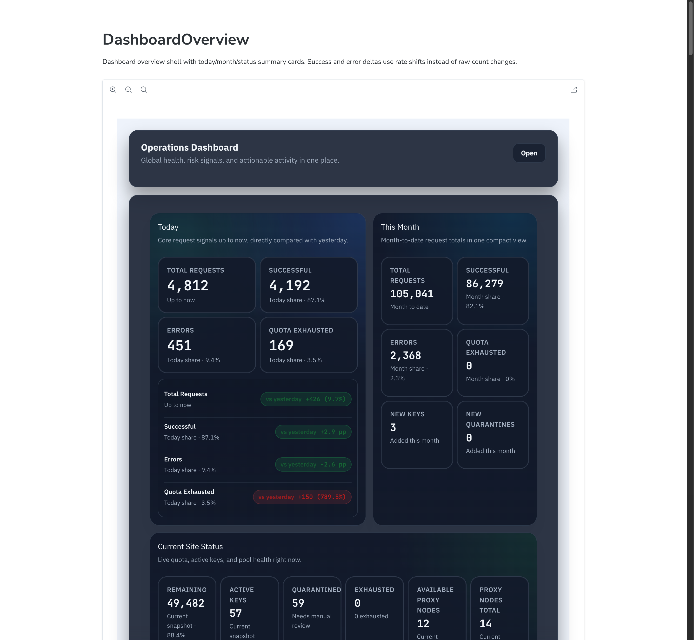
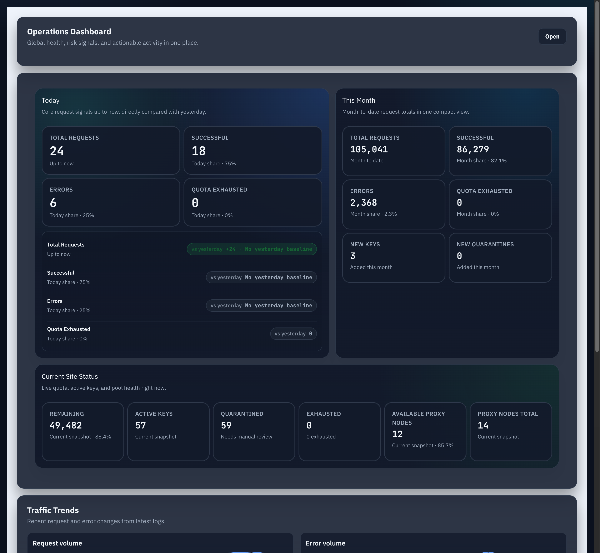

# Admin：仪表盘摘要区重构为“今日对比 + 本月 + 当前状态”（#6p4xz）

## 状态

- Status: 已完成（快车道）

## 背景

- 现有管理仪表盘摘要区把请求窗口指标和站点当前状态混在同一组等权卡片里，阅读优先级不清晰。
- 运营视角更关心“今天相对昨天发生了什么”，其次才是“本月累计如何”，实时站点状态则应作为独立快照展示。
- 当前后端只提供全站即时摘要，缺少可直接驱动“今日对比昨日 / 本月累计”的聚合接口。

## Goals

- 将 `/admin/dashboard` 顶部摘要区重构为三个信息块：`今日`、`本月`、`站点当前状态`。
- `今日` 块展示 `总请求数 / 成功 / 错误 / 额度耗尽`，并为每项显示“较昨日同一时刻”的增减信息。
- `本月` 块展示同一组月累计指标，但不混入昨日比较文案。
- `站点当前状态` 块继续显示实时快照：`剩余可用`、`活跃密钥`、`隔离中`、`已耗尽`。
- 新增管理端期间摘要接口，保持现有 `/api/summary` 向后兼容。

## Non-goals

- 不为 `活跃密钥 / 隔离中 / 剩余可用` 增加历史快照能力。
- 不调整趋势图、风险看板、行动中心的数据口径。
- 不修改用户控制台或公开首页的统计展示。

## 接口契约

- 保持 `GET /api/summary` 不变，继续返回当前全站快照。
- 新增 `GET /api/summary/windows`，仅管理员可访问，固定返回：
  - `today`: `{ total_requests, success_count, error_count, quota_exhausted_count }`
  - `yesterday`: `{ total_requests, success_count, error_count, quota_exhausted_count }`，表示“昨日截至当前同一时刻”的对比窗口
  - `month`: `{ total_requests, success_count, error_count, quota_exhausted_count }`
- 时间窗口边界统一使用服务端本地时区的日/月 bucket 口径，而不是浏览器时区。

## 交互与展示约束

- 摘要区使用三块式层级布局：桌面端突出 `今日` 主块，`本月` 与 `站点当前状态` 作为次级块；窄屏按 `今日 -> 本月 -> 站点当前状态` 顺序纵向堆叠。
- `今日` 指标卡必须同时显示当前值；其中 `总请求数` 与 `额度耗尽` 的“较昨日同刻”继续按次数差值展示，`成功` 与 `错误` 改为分别比较成功率/错误率的百分点差。
- `成功` 的“较昨日同刻”按 `success_count / total_requests` 计算；`错误` 按 `error_count / total_requests` 计算；两者都保留当前次数主值与 `今日占比` 副标题。
- 当 `yesterday.total_requests = 0` 且 `today.total_requests > 0` 时，`成功` / `错误` 不伪造百分点差，改为“昨日无基线”兜底文案并使用中性态。
- 当 `today.total_requests = 0` 且 `yesterday.total_requests = 0` 时，`成功` / `错误` 的“较昨日同刻”显示 `0.0` 个百分点（或对应语言单位）并保持 `flat`。
- `本月` 指标卡只显示月累计值与本月占比，不显示昨日比较。
- `站点当前状态` 必须明确标注为当前快照，避免与期间窗口混淆。
- 任意断点下都不得引入横向滚动。

## 验收标准

- `/admin/dashboard` 顶部摘要区不再是 7 张等权卡片，而是 `今日`、`本月`、`站点当前状态` 三块结构。
- `今日` 的 `成功` 与 `错误` 指标能正确显示相对昨日同一时刻的成功率/错误率百分点差，而不是原始次数差。
- `今日` 的 `总请求数` 与 `额度耗尽` 继续显示较昨日同一时刻的次数差与方向。
- `本月` 的四项指标能正确显示月累计值，并保持与今日块相同的指标口径。
- `站点当前状态` 保留 `剩余可用`、`活跃密钥`、`隔离中`、`已耗尽` 四项实时快照。
- `GET /api/summary/windows` 在空窗口时返回 `0`，昨日对比窗口不会混入昨日稍后时段的数据，本月窗口累计到当前时刻。
- `cargo test`、`cargo clippy -- -D warnings`、`cd web && bun run build`、`cd web && bun run build-storybook` 全部通过。

## 成果展示

- 当前实现将摘要区重构为“左侧今日主块 + 右侧本月/站点当前状态侧栏”，并在今日块内补入较昨日变化清单，避免桌面端出现大面积空白。
- 后续口径修正将 `成功` / `错误` 的昨日对比改为成功率/错误率的百分点比较，以避免高流量日把单纯次数变化误读为质量波动。

## Visual Evidence

- source_type: `storybook_docs`; docs_entry_or_title: `Admin/Components/DashboardOverview`; scenario: `rate delta overview`; evidence_note: 验证默认 docs 场景里 `成功` / `错误` 已显示为 `pp` 比较，而 `总请求数` / `额度耗尽` 仍保留次数差。
  

- source_type: `storybook_canvas`; story_id_or_title: `Admin/Components/DashboardOverview/ZeroBaseline`; state: `zero baseline`; evidence_note: 验证昨日窗口无请求时，`成功` / `错误` 使用 `昨日无基线` 兜底而不是伪造百分点差。
  
