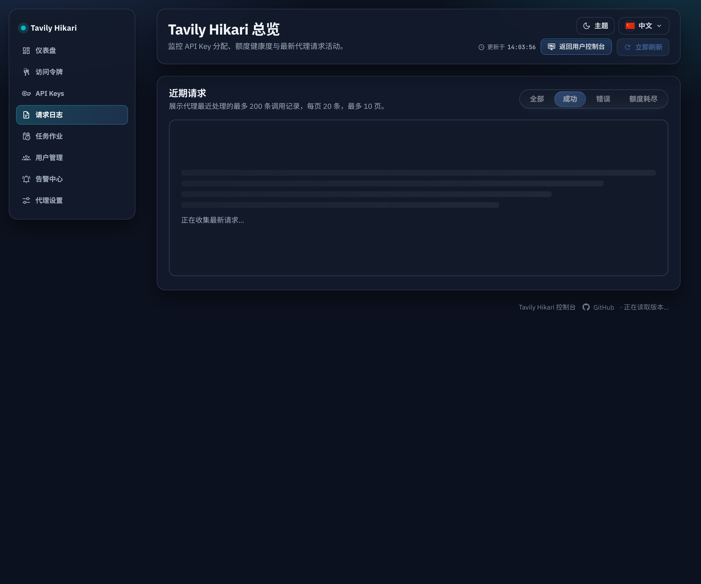
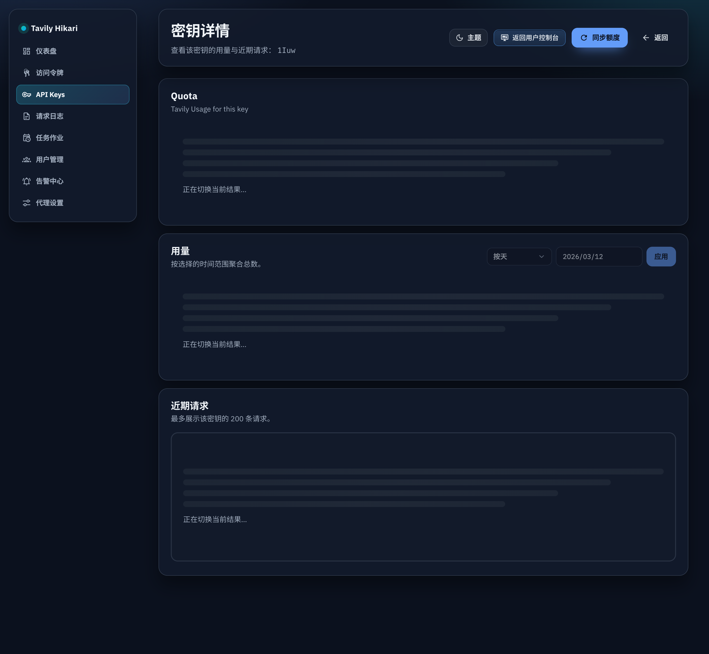

# Admin 查询切换防旧数据误导（#d2g2y）

## 状态

- Status: 已完成（5/5）
- Created: 2026-03-12
- Last: 2026-03-12

## 背景 / 问题陈述

- `/admin/requests`、`/admin/tokens`、`/admin/jobs`、`/admin/users`、`/admin/tokens/leaderboard`、`/admin/tokens/:id`、`/admin/keys/:id` 在分页、筛选、分组或时间范围切换时，会在新请求返回前继续停留上一批结果。
- 当网络较慢时，控件状态已经切到“新查询”，但表格或日志区域仍展示“旧查询”的数据，容易让管理员误判当前页或当前筛选下的真实结果。
- 现有实现把多处 admin 列表的空态 / 加载态绑定到过宽的共享 `loading` 布尔值，缺少“查询切换中”和“同查询刷新中”的显式语义。

## 目标 / 非目标

### Goals

- 为 admin 列表与详情日志区引入统一的前端查询加载阶段：`initial_loading`、`switch_loading`、`refreshing`、`ready`、`error`。
- 在 query-key 切换（分页 / 筛选 / 搜索 / 分组 / 时间范围）期间，立即更新控件选中态并禁用相关交互，同时用局部 skeleton / busy 区域替代旧结果。
- 在 same-query refresh（手动刷新 / SSE / polling）期间保留当前结果，只显示轻量 refreshing affordance，不把整块区域清空。
- 把 `AdminDashboard` 中影响多个模块的共享 `loading` 拆成按资源管理，至少覆盖 tokens / requests / jobs / users / token leaderboard / key detail / token detail。
- 补齐 Storybook 和前端测试，使“查询切换”和“同查询刷新”可以被独立验证。

### Non-goals

- 不修改后端 HTTP 接口、数据库结构或公共 API 合同。
- 不处理 `/admin/alerts`、`/admin/proxy-settings`、`/console` 或公开首页的交互模型。
- 不顺带重构 admin 所有表格布局，仅针对 stale-data 误导问题做最小必要收敛。

## 范围（Scope）

### In scope

- `web/src/AdminDashboard.tsx`
  - tokens / requests / jobs / users / token leaderboard / key detail 的 query-state 管理与区域过渡。
- `web/src/pages/TokenDetail.tsx`
  - token detail 的窗口切换、分页切换与 SSE 刷新过渡。
- `web/src/components/AdminTableShell.tsx`
  - 共享 table shell 的 blocking / refreshing 视觉承载能力。
- `web/src/components/AdminLoadingRegion.tsx`
  - 非表格区域与移动端列表的共享 loading region。
- `web/src/components/AdminTablePagination.tsx`
  - 切换期间统一禁用分页与每页条数控件。
- `web/src/components/TokenUsageHeader.tsx`
  - leaderboard 筛选器在切换期间禁用。
- `web/src/components/ui/SegmentedTabs.tsx`
  - 支持整体禁用。
- `web/src/i18n.tsx`
  - 新增通用 loading state 文案。
- Storybook / frontend tests
  - 覆盖共享 loading primitive 与 token detail 转场场景。

### Out of scope

- 后端请求聚合策略与缓存策略调整。
- 管理端权限模型、表格字段与排序逻辑改造。
- 任何生产上游联调；所有验证仍限定本地 / mock upstream。

## 实现合同（Implementation Contract）

- `switch_loading`：进入 query-key 新结果前，旧 rows / logs 立即退出当前渲染语义，显示 skeleton / busy region，并禁用对应筛选、分页和详情展开交互。
- `refreshing`：保留当前数据，仅显示非阻塞刷新提示；当前区域允许继续阅读，但避免再次触发同类并发切换。
- `initial_loading`：首屏或首次进入详情时显示局部 loading region，不退化为整页白屏。
- tokens / requests / jobs / users / leaderboard 的桌面表格与移动端列表都必须遵守同一 loading 合同。
- token detail 与 key detail 的日志区必须保证：页码或时间范围一旦改变，旧日志不再以“当前页/当前窗口”的身份停留在界面上。
- 快速重复切换时，旧请求不得回写覆盖最新查询结果；新实现必须依赖 `AbortController` 或同等 latest-only 机制保护写入顺序。

## 验收标准（Acceptance Criteria）

- Given 慢请求（3–5 秒）下切换 `/admin/requests` 的结果筛选
  When 控件已切换到目标筛选
  Then 页面不能继续把上一次筛选的日志作为当前结果展示。

- Given 慢请求下切换 `/admin/tokens`、`/admin/jobs`、`/admin/users`、`/admin/tokens/leaderboard`
  When 页码、分组、搜索或时间范围发生变化
  Then 桌面表格与移动端列表都应显示局部 loading region，并禁用对应交互，直到新结果返回。

- Given `/admin/tokens/:id` 或 `/admin/keys/:id` 的详情页在慢请求下切换日志页码或时间范围
  When 新请求尚未完成
  Then 旧日志不得继续伪装成新页或新窗口的结果。

- Given same-query refresh（手动刷新、SSE 或 polling）
  When 当前查询未变化
  Then 页面保留现有结果，仅显示轻量 refreshing 提示。

- Given 本次改动完成
  Then `cd web && bun test`、`cd web && bun run build`、`cd web && bun run build-storybook` 必须通过。

## 质量门槛（Quality Gates）

- `cd web && bun test`
- `cd web && bun run build`
- `cd web && bun run build-storybook`
- 本地慢请求浏览器回归：覆盖 requests / tokens / jobs / users / leaderboard / token detail / key detail

## 当前验证记录

- `2026-03-12`：`cd web && bun test` 通过。
- `2026-03-12`：`cd web && bun run build` 通过。
- `2026-03-12`：`cd web && bun run build-storybook` 通过。
- `2026-03-12`：在本地 dev server 上通过浏览器注入 4s `fetch` 延迟，验证 requests / jobs / users / leaderboard / token detail / key detail 的 query-switch 期间均进入局部 blocking loading，并禁用相关控件；tokens 列表与其余列表共享同一 loading primitive 与分页禁用合同。

## Visual Evidence (PR)

## 里程碑

- [x] M1: 规格冻结与受影响界面盘点
- [x] M2: 共享 query load state 与 loading region primitive 落地
- [x] M3: admin 列表 / 排行页接入 `switch_loading` / `refreshing`
- [x] M4: token detail / key detail 接入 stale-safe 过渡 + Storybook / tests 更新
- [x] M5: fast-track 远端交付（browser 回归、PR、checks、review-loop）
