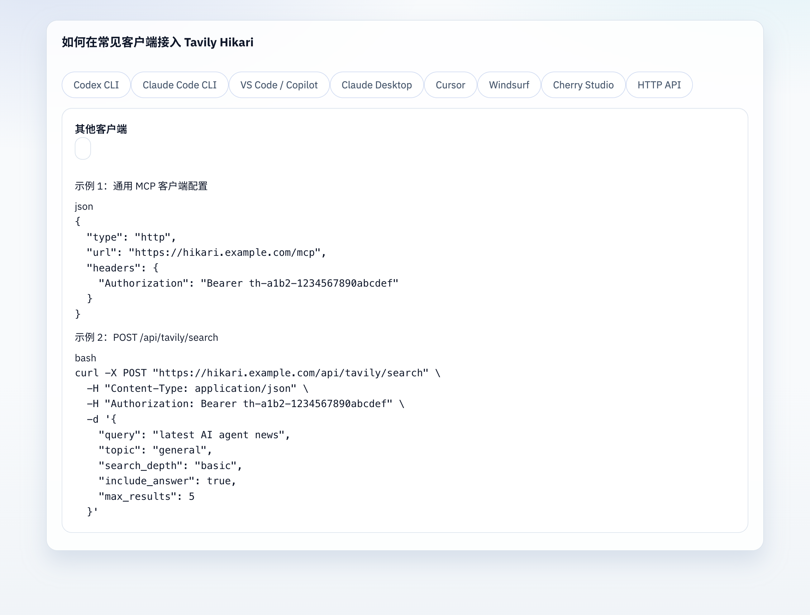
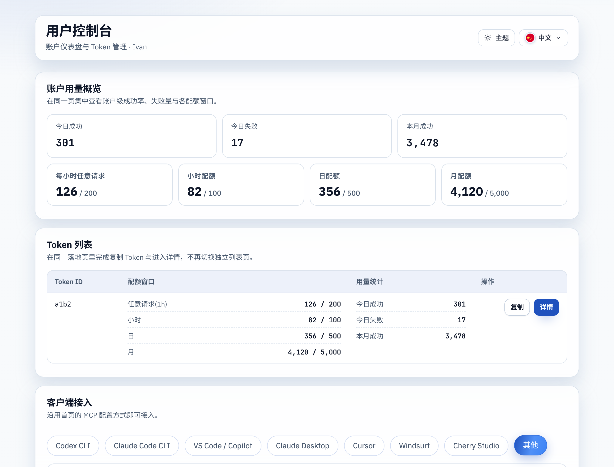
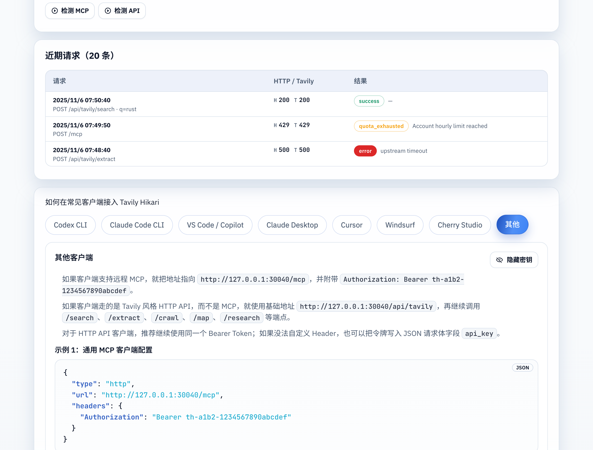

# 导览区显示密钥按钮（#f3g8q）

## 状态

- Status: 已完成（快车道）
- Created: 2026-03-23
- Last: 2026-03-24

## 背景 / 问题陈述

- PublicHome 与 UserConsole 的客户端接入导览都在步骤文案、代码片段与 Cherry Studio mock 中内嵌 token 示例。
- UserConsole 目前只显示 `th-<id>-********` 掩码，无法在导览区按需切换到完整明文；PublicHome 则没有显式的导览级 reveal 控件。
- 本轮需要把“显示密钥 / 隐藏密钥”能力收敛到导览卡片自身，不扩大为新的后端接口、持久化策略或全局 token 可见性重构。

## 目标 / 非目标

### Goals

- 在 PublicHome 与 UserConsole 的导览卡片头部增加“显示密钥 / 隐藏密钥”按钮。
- 按钮切换的是当前导览面板使用的 token 示例值，而不只是代码块：步骤文案、snippet 与 Cherry Studio mock 都要同步显隐。
- PublicHome 仅基于当前页面已持有的完整 token 做 reveal；没有合法 token 时按钮仍展示但禁用。
- UserConsole 复用既有 `GET /api/user/tokens/:id/secret`、短时缓存与 detail secret 复用逻辑，避免新增后端契约。

### Non-goals

- 不修改 Rust 后端、数据库 schema、HTTP 响应字段或鉴权链路。
- 不把 landing guide 扩展到多 token 场景，也不新增 token 编辑、轮换或分享能力。
- 不把 PublicHome / UserConsole 的 guide 抽成一次性大重构组件。

## 范围（Scope）

### In scope

- `web/src/PublicHome.tsx`
- `web/src/UserConsole.tsx`
- `web/src/UserConsole.stories.tsx`
- `web/src/UserConsole.stories.test.ts`
- `web/src/UserConsole.test.ts`
- `web/src/PublicHome.test.ts`
- `web/src/i18n.tsx`
- `web/src/index.css`
- `docs/specs/f3g8q-guide-token-reveal-toggle/SPEC.md`
- `docs/specs/README.md`

### Out of scope

- `src/**`
- 新的用户/管理员 token 接口
- 多 token landing 导览信息架构调整

## 功能与行为规格（Functional / Behavior Spec）

### PublicHome

- 导览卡片头部始终显示 reveal 按钮。
- 默认隐藏态使用占位 token `th-xxxx-xxxxxxxxxxxx`；即使当前页面已经持有完整 token，也不自动展示明文。
- 只有当前页面 token 满足完整格式时，按钮才可点击；点击后当前导览中的所有 token 示例切换为完整明文，再次点击恢复占位值。

### UserConsole

- 单 token landing 与 token detail 的导览卡片头部都显示 reveal 按钮。
- 默认隐藏态继续使用现有 masked token（`th-<id>-********` 或 generic placeholder）。
- 点击 reveal 时按需读取当前 guide 对应 token 的 secret：
  - token detail 若上方 `TokenSecretField` 已 reveal，则直接复用当前明文。
  - 其他情况复用现有 `resolveTokenSecret` / cache 逻辑，避免重复实现请求与缓存。
- reveal 失败时 guide 继续保持隐藏态，并在导览区内展示局部错误文案。
- route、guide token source 或可见 token 集合变化时，guide reveal 状态必须重置，避免旧 secret 泄漏到新上下文。

## 验收标准（Acceptance Criteria）

- Given PublicHome 当前没有合法完整 token
  When 页面渲染导览卡片
  Then reveal 按钮可见但禁用，步骤/代码/Cherry mock 继续显示占位 token。

- Given PublicHome 当前已有合法完整 token
  When 用户点击 reveal 按钮
  Then 当前激活导览中的 token 示例全部显示完整明文；再次点击后恢复占位 token。

- Given UserConsole landing 只有一个 token
  When 用户点击导览 reveal 按钮
  Then guide 区块中的 token 示例全部显示完整 secret，而 landing token 列表布局保持不变。

- Given UserConsole token detail 页面上方 token 已 reveal
  When 用户点击底部导览 reveal 按钮
  Then guide 直接显示同一完整 token，且不额外触发新的 `/secret` 请求。

- Given UserConsole 导览 secret 请求失败
  When 用户点击 reveal 按钮
  Then guide 仍保持掩码状态，并显示局部错误提示，不渲染残缺明文。

## 非功能性验收 / 质量门槛（Quality Gates）

### Testing

- `cd web && bun test`

### Build

- `cd web && bun run build`

## 实现里程碑（Milestones / Delivery checklist）

- [x] M1: PublicHome / UserConsole 导览卡片头部接入 reveal 按钮与显隐状态
- [x] M2: UserConsole 复用现有 secret cache / detail reveal 逻辑
- [x] M3: 文案、样式、测试与 Storybook proof 更新
- [x] M4: 快车道收敛到 merge-ready PR

## 风险 / 假设（Risks / Assumptions）

- 假设：PublicHome 隐藏态统一回落到 generic placeholder，比展示真实 token 的局部掩码更安全且更符合本轮目标。
- 风险：guide reveal 与 detail token reveal 共存时，若状态归属不清晰，可能把旧 token 写回新 route；本轮以独立 guide state + 既有 secret resolver 规避该问题。

## 变更记录（Change log）

- 2026-03-23: 创建 follow-up spec，冻结 PublicHome + UserConsole 导览区 reveal 按钮的范围、行为与质量门槛。
- 2026-03-24: 补充 PublicHome / UserConsole 的 Storybook visual evidence，并将“其他”页签统一为通用 MCP + HTTP API 双示例。

## Visual Evidence (PR)

- source_type: storybook_canvas
  target_program: mock-only
  capture_scope: element
  sensitive_exclusion: N/A
  submission_gate: pending-owner-approval
  story_id_or_title: Public/PublicHome/Guide Token Revealed
  state: other tab with revealed token
  evidence_note: 验证 PublicHome 导览在显示密钥后，其他页签同时展示通用 MCP 与 HTTP API 两种接入示例。
  image:
  

- source_type: storybook_canvas
  target_program: mock-only
  capture_scope: element
  sensitive_exclusion: N/A
  submission_gate: pending-owner-approval
  story_id_or_title: UserConsole/UserConsole/Console Home Guide Token Revealed
  state: other tab with revealed token
  evidence_note: 验证单 token landing 导览在显示密钥后，其他页签同时展示通用 MCP 与 HTTP API 两种接入示例。
  image:
  

- source_type: storybook_canvas
  target_program: mock-only
  capture_scope: element
  sensitive_exclusion: N/A
  submission_gate: pending-owner-approval
  story_id_or_title: UserConsole/UserConsole/Token Detail Guide Token Revealed
  state: other tab with revealed token
  evidence_note: 验证 token detail 导览在显示密钥后，其他页签同步展示通用 MCP 与 HTTP API 两种接入示例。
  image:
  
