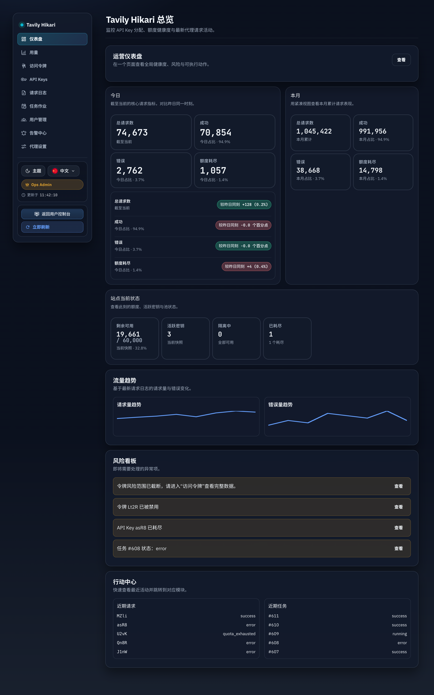
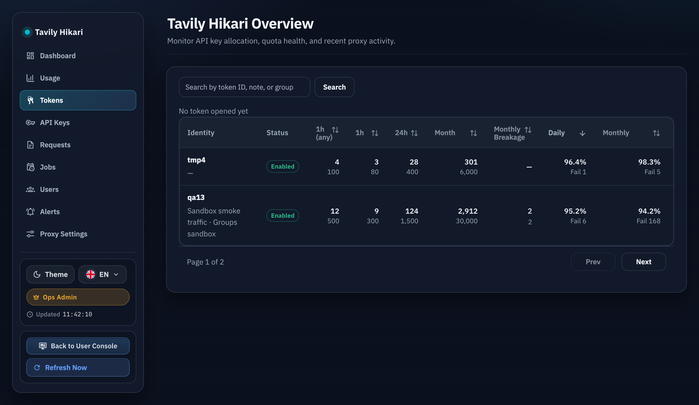
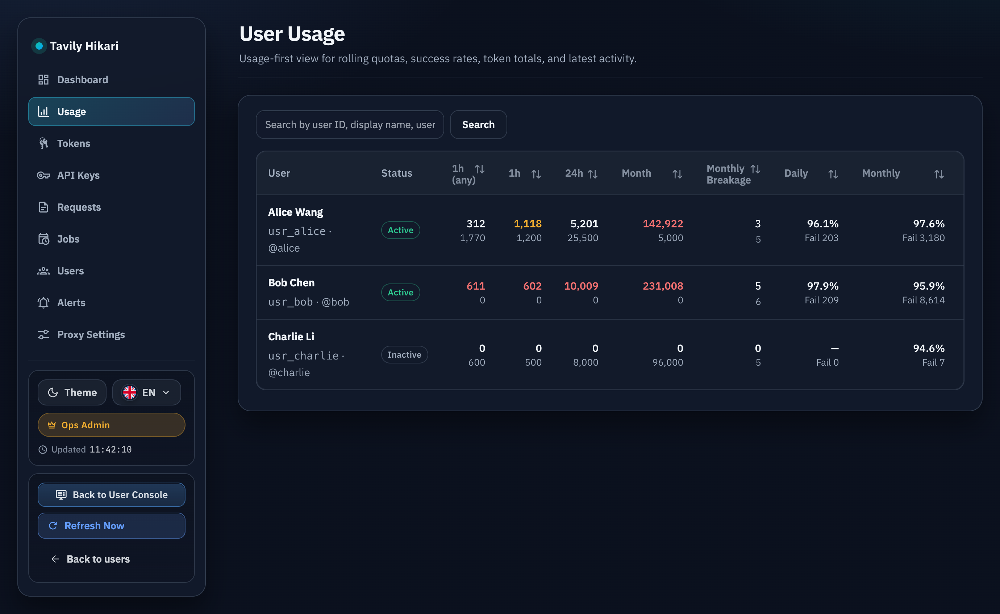
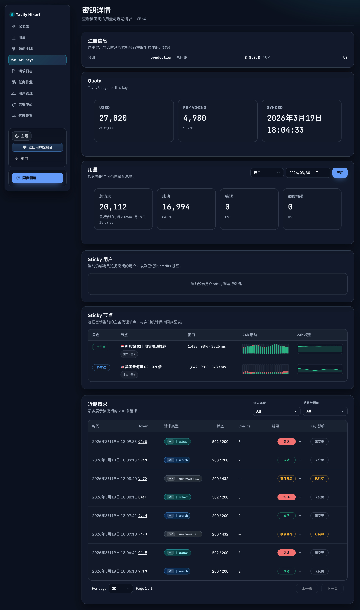
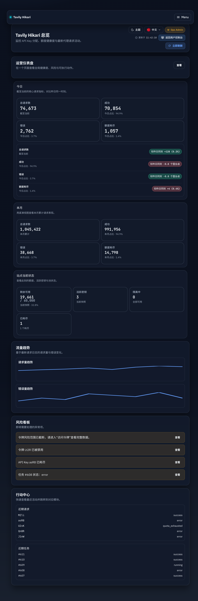

# Admin 桌面页头收纳到侧栏（#frpeh）

## 状态

- Status: 已完成
- Created: 2026-03-30
- Last: 2026-03-30

## 背景 / 问题陈述

- 当前 `/admin` 在桌面非堆叠侧栏布局下，内容区顶部仍保留一层 `surface app-header` / `AdminPanelHeader` chrome，标题、说明、全局工具与页面动作同时堆在首屏上方，信息密度过高。
- 管理端已经有稳定的左侧导航，但右上角的主题、语言、返回控制台、刷新，以及 detail 页的 back / sync / regenerate 等动作并未利用侧栏空间。
- `<=1100px` 的堆叠侧栏与 menu 行为已较稳定，本轮不应破坏移动端信息架构。

## 目标 / 非目标

### Goals

- 在 `>1100px` 的非堆叠侧栏布局下，为 `AdminShell` 增加稳定的桌面 utility 区，并把全局工具与页面动作迁移到左侧导航下方。
- 为内容区提供统一的 compact intro，让页面标题与说明继续留在内容区，但不再承担重型 header chrome。
- 覆盖模块页、Token 榜单页，以及 key / token detail 这类当前依赖顶栏动作的管理端页面。
- 同步 Storybook shell/page stories，并提供 1440px 与 1100px 的稳定视觉证据。

### Non-goals

- 不改任何后台 API、权限逻辑、按钮文案语义或页面行为结果。
- 不重做 `<=1100px` 的堆叠侧栏、menu 抽屉或移动端内容组织。
- 不扩散到用户控制台或公共页面。

## 范围（Scope）

### In scope

- `web/src/admin/AdminShell.tsx`
  - 增加桌面 utility slot host，并用 CSS 显隐类切换桌面/堆叠内容。
- `web/src/AdminDashboard.tsx`
  - 模块页桌面态移除顶部 `AdminPanelHeader` chrome，改为左侧 utility + 内容区 compact intro。
  - `unbound-token-usage` 页桌面态移除重复页头信息，保留搜索/筛选行。
  - `KeyDetails` 桌面态移除顶部 detail header，把 back / sync / return / theme 收纳到侧栏 utility。
- `web/src/pages/TokenDetail.tsx`
  - 桌面态移除顶部 detail header，把 back / regenerate / return / theme / live 状态收纳到侧栏 utility。
- `web/src/index.css`
  - 增加桌面/堆叠显隐样式、sidebar utility、compact intro 样式，以及桌面 utility 与现有按钮的整合规则。
- `web/src/admin/AdminShell.stories.tsx`
- `web/src/admin/AdminPages.stories.tsx`
- `web/src/pages/KeyDetailRoute.stories.tsx`
- `web/src/pages/TokenDetail.stories.tsx`

### Out of scope

- `src/**`、`web/src/api.ts`、任何网络/数据库行为。
- 用户控制台、公共首页、登录页与注册暂停页。

## 需求（Requirements）

### MUST

- `>1100px` 时，管理端相关页面首屏不再出现顶层 `app-header` 工具条 chrome。
- `>1100px` 时，侧栏导航下方出现当前页面对应的 utility 区。
- `<=1100px` 时，继续显示原有 stacked header/menu 行为，不出现桌面 utility 区。
- compact intro 必须保留标题与说明，但视觉上明显轻于原顶栏。

### SHOULD

- Storybook 至少提供 shell 级与 page 级的 1440px / 1100px 对照入口。
- detail 页 utility 区与模块页 utility 区在样式语言上保持一致。

## 功能与行为规格（Functional/Behavior Spec）

### Core flows

- 管理员在桌面宽度打开模块页时：
  - 侧栏底部显示 workspace / action utility；
  - 内容区顶部显示 compact intro；
  - 原 `AdminPanelHeader` 只在 stacked 宽度下继续显示。
- 管理员在桌面宽度打开 key / token detail 时：
  - side utility 承接 theme、return、back、sync / regenerate、live 状态；
  - 内容区只保留 detail intro，不再保留通栏按钮区。
- `unbound-token-usage` 页桌面态保留搜索与排序交互，但标题与返回动作不再重复占据 panel header 首屏。

### Edge cases / errors

- 若 desktop utility host 尚未挂载，页面仍应正常渲染，随后在客户端挂载后显示 utility，不影响内容区。
- 若 detail 页运行在非 `AdminShell` 容器中（例如请求日志实体 drawer），桌面态仍必须以内联 fallback 保留 utility 与关键 CTA，不得因为缺少 sidebar host 而直接丢失操作区。
- stacked header 继续承担移动端按钮入口，不能因为桌面 utility 存在而丢失关键 CTA。

## 验收标准（Acceptance Criteria）

- Given `viewport > 1100px`
  When 打开任一 in-scope 管理端页面
  Then 顶部不再出现重型 header chrome，utility 区显示在左侧导航下方，标题与说明显示为 compact intro。

- Given `viewport = 1100px`
  When 打开 shell/page stories 或真实管理端页面
  Then stacked header 继续存在，desktop utility 被隐藏，menu 行为不变。

- Given Key detail / Token detail
  When 查看桌面态
  Then back / sync / regenerate / return / theme 等动作位于侧栏 utility，并保持原有行为语义。

- Given Storybook
  When 打开 shell/page/detail 对照 stories
  Then 能稳定验证 1440px 与 1100px 两类布局，不依赖浏览器手工拼图。

## 非功能性验收 / 质量门槛（Quality Gates）

### Testing

- `cd web && bun run build`
- `cd web && bun run build-storybook`

### UI / Storybook

- 更新 shell/page/detail 相关 stories 与至少一条 `play` 断言。
- 回传 1440px 与 1100px 视觉证据，再进入 PR 收敛。

## 文档更新（Docs to Update）

- `docs/specs/README.md`
- 本 spec 的 `## Visual Evidence`

## 计划资产（Plan assets）

- Directory: `docs/specs/frpeh-admin-desktop-sidebar-utility-relayout/assets/`

## Visual Evidence

- Storybook 证据来源：`storybook_canvas`
- 证据资产：
  - `docs/specs/frpeh-admin-desktop-sidebar-utility-relayout/assets/dashboard-desktop-1440.png`
  - `docs/specs/frpeh-admin-desktop-sidebar-utility-relayout/assets/token-usage-desktop-1440.png`
  - `docs/specs/frpeh-admin-desktop-sidebar-utility-relayout/assets/users-usage-desktop-1440.png`
  - `docs/specs/frpeh-admin-desktop-sidebar-utility-relayout/assets/key-detail-desktop-1440.png`
  - `docs/specs/frpeh-admin-desktop-sidebar-utility-relayout/assets/dashboard-stacked-1100.png`

- 1440px 仪表盘：桌面态工具区已下沉到左侧导航下方，内容区顶部只保留 compact intro。

- 1440px Token 榜单：桌面态不再保留重型页头，侧栏 utility 承接 theme / language / identity / 更新时间 / 返回 / 刷新。

- 1440px 用户用量：补回和其他后台页一致的 compact intro，侧栏 utility 同时承接返回用户管理动作。

- 1440px Key detail：detail 动作收纳到侧栏 utility，内容区只保留标题与说明。

- 1100px 仪表盘 stacked：原顶部 header 与 menu 行为仍保留，未引入桌面 utility。

## 实现里程碑（Milestones / Delivery checklist）

- [x] M1: 冻结“桌面 utility + compact intro + stacked header 保持”的范围
- [x] M2: 完成 AdminShell / 页面 / detail 实现
- [x] M3: 完成 Storybook、构建、视觉证据与收口

## 风险 / 开放问题 / 假设（Risks, Open Questions, Assumptions）

- 风险：detail 页 utility 若只能从父级注入，会迫使状态上提，增加改动面。
- 风险：若仅用 JS 状态传递桌面/堆叠信息，容易把 `isStackedSidebar` 泄漏到页面层，造成耦合。
- 假设：`unbound-token-usage` 是当前实际在用的 Token 榜单页；旧 `TokenUsageHeader` 主要用于 stacked shell/story coverage。

## 变更记录（Change log）

- 2026-03-30: 创建 spec，冻结“桌面 utility + compact intro + stacked header 保持”的范围、边界与视觉验收口径。
- 2026-03-30: 完成 `AdminShell` 桌面 utility host、通用 compact intro、模块页 / Token 榜单 / key detail / token detail 的桌面收纳改造。
- 2026-03-30: 同步 shell/page/detail Storybook stories，完成 `bun run build`、`bun run build-storybook`、`bun test`，并补齐 1440px / 1100px 视觉证据。
- 2026-03-30: 根据验收反馈补回 `user-usage` 页的桌面 compact intro 与侧栏 utility，对齐后台统一页头结构，并追加 `UsersUsage` Storybook 证据与 stacked coverage。
- 2026-03-30: 修正通用模块页 desktop intro 的标题来源，改为按当前模块读取 `logs/jobs/users/tokens/keys/proxySettings/...` 文案，避免请求日志等页面误显示为全局“总览”。
- 2026-03-30: 根据 merge-proof review follow-up，为非 `AdminShell` 上下文的 detail 页补上 desktop utility fallback，并新增请求日志 token drawer 的 Storybook 回归断言，确保桌面态 `Back` / `Regenerate secret` 等 CTA 不会丢失。
- 2026-03-30: 创建 PR #200，并在合并前完成 spec/Storybook/browser 门禁收口。

## 参考（References）

- `web/src/admin/AdminShell.tsx`
- `web/src/AdminDashboard.tsx`
- `web/src/pages/TokenDetail.tsx`
- `web/src/admin/AdminShell.stories.tsx`
- `web/src/admin/AdminPages.stories.tsx`
- `web/src/pages/KeyDetailRoute.stories.tsx`
- `web/src/pages/TokenDetail.stories.tsx`
