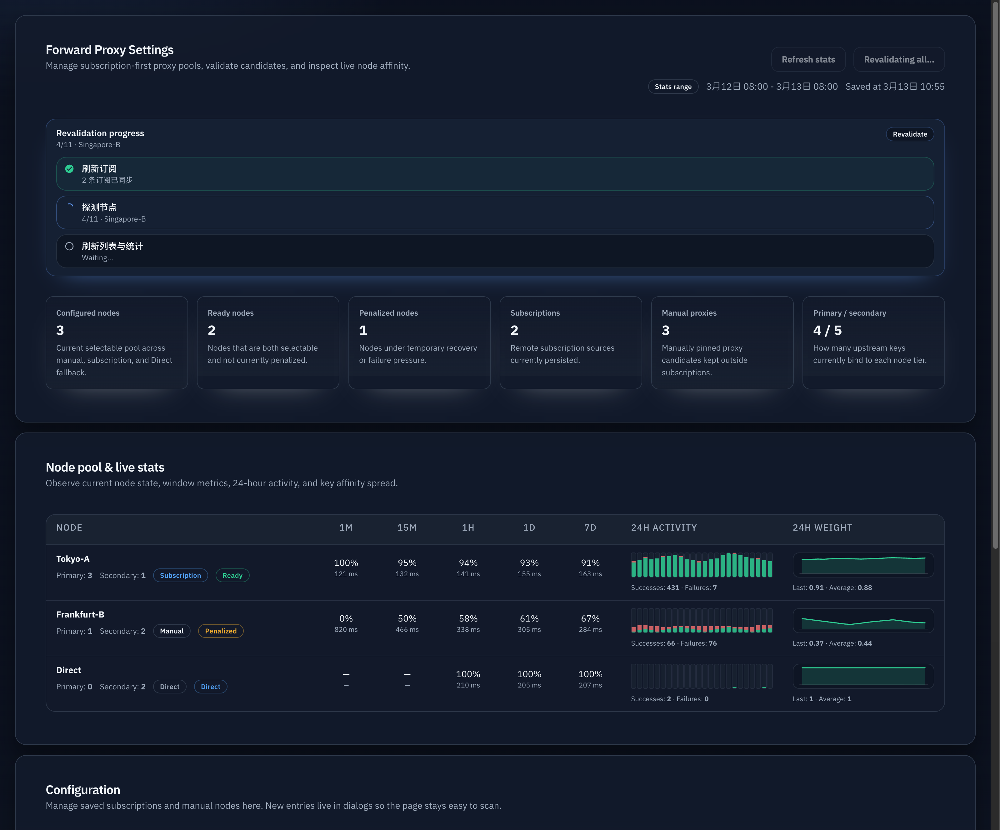

# h8m2q · Forward Proxy 增量订阅保存与全量验证拆分

## Summary

- 将 `/admin/proxy-settings` 的订阅保存从“全量刷新所有订阅 + 全量 bootstrap probe”改为“仅对新增/变更项增量生效”。
- 新增页面级“全量验证”动作，显式承担“刷新全部订阅并重探测全部已生效节点”的重操作。
- 为订阅派生节点补充内部来源追踪，确保删除/替换订阅时只移除受影响节点，未变化节点保留现有运行时状态与亲和。

## Functional/Behavior Spec

### Save behavior

- `PUT /api/settings/forward-proxy`
  - 仍然负责持久化 `proxyUrls` / `subscriptionUrls` / `subscriptionUpdateIntervalSecs` / `insertDirect`。
  - 当新增 subscription URL 时，只拉取新增 URL，并把解析出的新节点并入当前代理池。
  - 仅对新增节点执行 bootstrap probe；既有订阅节点与既有手工节点不得被重复 probe。
  - 删除或替换 subscription URL 时，只移除来源于被删除 subscription 的节点；未变化订阅对应节点保持现状。
  - 仅修改 interval 或 `insertDirect` 时，不得触发 subscription refresh 或旧节点 probe。

### Revalidate behavior

- 新增 `POST /api/settings/forward-proxy/revalidate`
  - admin only。
  - 先刷新全部已保存 subscription URL。
  - 再探测当前全部非 Direct 的已生效节点，包含 subscription 派生节点与 manual 节点。
  - 通过 SSE 返回 `refresh_subscription` → `probe_nodes` 阶段进度，前端在 stats/settings 刷新期间补本地 `refresh_ui` 阶段。

### UI behavior

- `/admin/proxy-settings` 顶部工具栏新增“全量验证”按钮，与“刷新统计”并列。
- 添加订阅弹窗的保存进度继续展示 `save_settings` / `refresh_subscription` / `bootstrap_probe` / `refresh_ui`，但其中 `refresh_subscription` 仅针对本次新增/变更订阅，`bootstrap_probe` 仅针对新增节点。
- 页面级全量验证期间展示独立进度气泡；失败时保留当前列表并显示错误，不清空已展示数据。

## Acceptance

- 新增订阅后，旧订阅 URL 不会被再次请求，旧节点不会被再次 probe。
- 删除订阅后，仅该订阅派生节点从当前池中消失，未变化节点继续保留。
- interval-only 保存不会触发 subscription refresh。
- 点击“全量验证”后，才会执行全量 subscription refresh 与全量节点 probe。

## Verification

- `cargo test -q admin_forward_proxy_ -- --nocapture`
- `bun test web/src/admin/ForwardProxySettingsModule.test.ts web/src/admin/ForwardProxySettingsModule.render.test.ts`
- `cd web && bun run build`

## Visual Evidence (PR)

- source_type: `storybook_canvas`
  target_program: `mock-only`
  capture_scope: `browser-viewport`
  sensitive_exclusion: `N/A`
  submission_gate: `pending-owner-approval`
  story_id_or_title: `Admin/ForwardProxySettingsModule/Revalidate Progress Bubble`
  state: `running`
  evidence_note: 验证页面级全量验证气泡、按钮禁用态，以及 `refresh_subscription -> probe_nodes -> refresh_ui` 的阶段可见性。
  image:
  
