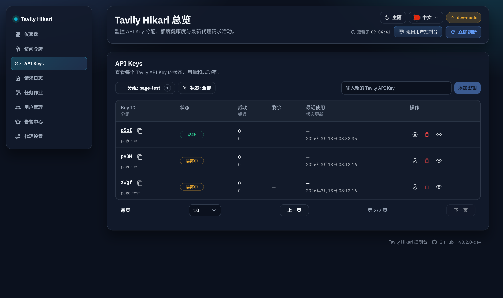

# Admin API Keys 后端分页与 URL 状态同步（#km4gk）

## 状态

- Status: 已完成（快车道）
- Created: 2026-03-13
- Last: 2026-03-13

## 背景 / 问题陈述

- `/admin/keys` 当前通过 `GET /api/keys` 一次性拉取全部未删除 key，再由前端本地排序、分组筛选和状态筛选。
- 真实页面已出现数十条 key，桌面表格和移动卡片会同时渲染整批数据，首屏负担和滚动排查成本都在上升。
- 现有 keys 列表状态没有同步到地址栏；刷新页面、从 `/admin/keys/:id` 返回列表、或分享当前筛选结果时，都会丢失页码、每页条数和筛选上下文。
- `Admin` 其他模块（requests / jobs / users / tokens）已经具备明确分页语义，本次需要把 API Keys 列表也收敛到同类交互合同。

## 目标 / 非目标

### Goals

- 把 `/api/keys` 升级为服务端分页接口，支持页码、每页条数、分组多选和状态多选过滤。
- 让 `/admin/keys` 的桌面表格与移动卡片只渲染当前页结果，并复用统一分页控件支持 `perPage` 切换。
- 将 keys 列表状态同步到浏览器地址栏：`page`、`perPage`、重复 `group`、重复 `status`。
- 从带 query 的 `/admin/keys` 列表进入 `/admin/keys/:id` 后，详情页返回列表时恢复原分页与筛选上下文。
- 保留当前分组/状态筛选菜单的全量 facet 计数能力，不因为当前页截断而失真。

### Non-goals

- 不调整 `/admin/keys/:id` 的详情字段、日志区、quarantine 展示或详情接口结构。
- 不改变 key 的启用 / 禁用 / 删除 / 解除隔离语义。
- 不新增 key 分组编辑、排序器 UI 或额外搜索框。
- 不修改 dashboard summary、tokens、requests、jobs、users 的既有分页协议。

## 范围（Scope）

### In scope

- `src/lib.rs`
  - API keys 查询从“全量列表”扩展为“分页 + facet 计数”结果。
- `src/server/handlers/admin_resources.rs`
  - `/api/keys` 解析 `page`、`per_page`、重复 `group`、重复 `status` 查询参数，并返回分页对象。
- `web/src/api.ts`
  - `fetchApiKeys` 改为分页请求；新增 keys facets / pagination 类型。
- `web/src/AdminDashboard.tsx`
  - keys 模块接入分页状态、URL 状态同步、详情返回上下文与 loading/empty 态。
- `web/src/admin/routes.ts`
  - 新增 keys 列表 query 的构造与解析 helper；key detail path 支持保留列表上下文。
- `web/src/i18n.tsx`
  - 新增 keys 分页摘要、每页条数和 URL 恢复相关文案。
- `web/src/admin/AdminPages.stories.tsx` / tests
  - 覆盖多页 keys 列表与 query 恢复行为。
- `docs/specs/km4gk-admin-api-keys-pagination-url-sync/contracts/http-apis.md`
  - 固化 `/api/keys` 新合同与 URL query 语义。

### Out of scope

- key 详情页的请求日志分页合同。
- 公开首页或用户控制台的任何改动。
- 生产上游联调；验证继续限制在本地 / mock upstream。

## 实现合同（Implementation Contract）

### HTTP: `GET /api/keys`

- 请求参数：
  - `page`: optional，默认 `1`，最小为 `1`。
  - `per_page`: optional，默认 `20`，允许值按实现钳制到 `1..100`。
  - `group`: optional，可重复；每个值 trim 后按精确匹配过滤；`group=` 代表“未分组”，仅 `null` / 未提供时不参与过滤。
  - `status`: optional，可重复；每个值 trim + lowercase 后过滤；支持当前列表可见的 badge status（如 `active`、`disabled`、`quarantined`）。
- 响应结构改为分页对象，而不是数组：
  - `items: ApiKeyView[]`
  - `total: number`（过滤后的总数）
  - `page: number`（服务端归一化后的实际页码）
  - `perPage: number`（服务端归一化后的实际每页条数）
  - `facets.groups[]: { value: string, count: number }`
  - `facets.statuses[]: { value: string, count: number }`
- `facets` 的计数基于“当前筛选条件中除本 facet 自身外的结果集”计算并保持全量，不受当前页 `items` 截断影响；至少不能退化为“只统计当前页”。
- 删除态 key 继续从列表排除，不进入 `items` 或 facets。

### Browser URL contract

- `/admin/keys` 列表地址栏使用：
  - `page=<n>`
  - `perPage=<n>`
  - `group=<value>`（可重复）
  - `status=<value>`（可重复）
- 默认值省略：
  - `page=1` 时可省略。
  - `perPage=20` 时可省略。
  - 空筛选时不写 `group` / `status`。
- 前端刷新页面时必须从 URL 还原 keys 列表状态。
- 当筛选或 `perPage` 变化时，前端必须重置到第 `1` 页并同步更新 URL。

### Detail back-navigation contract

- 从 `/admin/keys?...` 进入 `/admin/keys/:id` 时，详情页返回按钮目标必须保留原列表 query。
- 若详情页直接冷启动且没有列表 query，上述返回按钮退回裸 `/admin/keys`。

## 验收标准（Acceptance Criteria）

- Given `/api/keys?page=2&per_page=20&group=2026-03-12&status=quarantined&status=disabled`
  When 管理端请求该接口
  Then 响应返回分页对象，`items` 仅包含匹配的 key，`total` 为过滤后的全量总数，`page/perPage` 为服务端归一化值。

- Given 管理员访问 `/admin/keys?page=2&perPage=50&group=foo&group=bar&status=active`
  When 页面刷新
  Then keys 模块恢复同一页、同一每页条数和同一筛选条件。

- Given 管理员已在 `/admin/keys` 选择分组/状态筛选并停留在第 3 页
  When 再切换任一筛选条件或每页条数
  Then 页面立即回到第 1 页，并把最新地址栏同步为新的 query 状态。

- Given keys 总数大于当前 `perPage`
  When 打开 `/admin/keys`
  Then 桌面表格与移动卡片仅渲染当前页结果，并显示分页摘要与每页条数控件。

- Given keys 总数小于等于当前 `perPage`
  When 打开 `/admin/keys`
  Then 页面不显示分页条。

- Given 管理员从 `/admin/keys?page=2&perPage=50&group=ops&status=quarantined` 进入某个 `/admin/keys/:id`
  When 点击详情页返回
  Then 页面回到带原 query 的 keys 列表，而不是默认 `/admin/keys`。

## 质量门槛（Quality Gates）

- `cargo test`
- `cd web && bun test`
- `cd web && bun run build`
- 浏览器验证 `/admin/keys` 分页、筛选、刷新恢复与详情返回上下文。

## 当前验证记录

- `2026-03-13`：`cargo test` 通过。
- `2026-03-13`：`cd web && bun test` 通过。
- `2026-03-13`：`cd web && bun run build` 通过。
- `2026-03-13`：浏览器验证 `/admin/keys` 的分页、`perPage` URL 同步、刷新恢复、详情返回上下文通过。
- `2026-03-13`：PR `#126` 已创建；review-loop 修复 facet 计数、keys 手动刷新与 dashboard exhausted keys fallback。

## 视觉证据

- 证据类型：真实开发环境 `/admin/keys?page=2&perPage=10&group=page-test` 页面截图。
- 证据覆盖：分页条、每页条数控件、分组筛选 URL 恢复，以及当前页仅渲染分页结果。

## 里程碑

- [x] M1: 规格冻结与 `/api/keys` 分页合同落盘
- [x] M2: 后端 `/api/keys` 分页与 facets 计数落地
- [x] M3: 前端 keys 分页、URL 状态同步与详情返回上下文落地
- [x] M4: 测试、浏览器验证与快车道收敛
