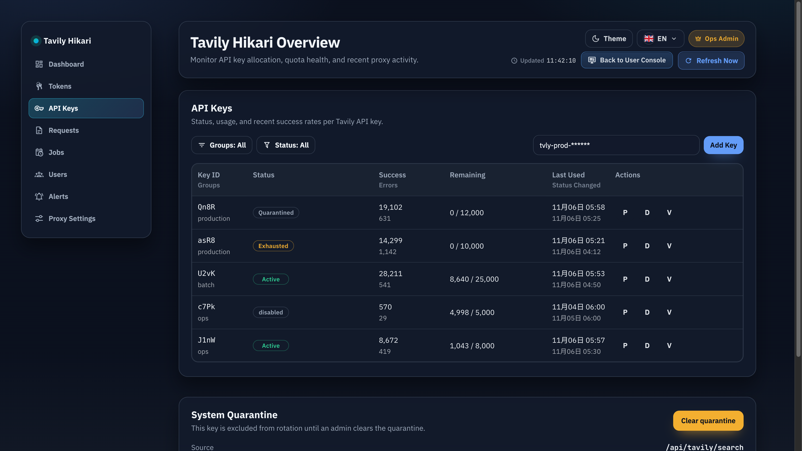

# Admin：URL Path 路由与模块化仪表盘重构（#m4n7x）

## 状态

- Status: 进行中（快车道）
- Created: 2026-03-02
- Last: 2026-03-13

## 背景 / 问题陈述

- 现有 `/admin` 为一页式结构，随着模块扩展（用户、告警、代理设置）将难以维护。
- 管理端目前依赖 hash 子路由（`#/keys/:id`、`#/tokens/:id`），不符合 path 路由需求。
- 需要在模块拆分后保持首页信息丰富度，不降级运维视角的信息可见性。

## 目标 / 非目标

### Goals

- 将管理端路由升级为 URL path（非 hash）。
- 建立模块化 Admin Shell（侧栏导航 + 内容区）。
- 按运营视角拆分模块：Dashboard / Tokens / API Keys / Requests / Jobs。
- 新增可访问骨架页：Users / Alerts / Proxy Settings。
- Dashboard 首页保留并增强总览信息（总览 + 趋势 + 风险 + 行动）。

### Non-goals

- 不调整后端业务 API 语义与权限口径。
- 不新增数据库迁移。
- 不兼容旧 hash 深链（显式决策）。

## 范围（Scope）

### In scope

- `web/src/AdminDashboard.tsx` 模块化重构。
- `web/src/admin/*` 新增 Admin Shell、路由解析、仪表盘聚合视图与骨架页组件。
- `web/vite.config.ts` 开发态 `/admin/*` 重写到 `admin.html`。
- `src/server.rs` 生产态 `GET /admin/*path -> serve_admin_index`。
- `web/src/i18n.tsx` 新增管理端导航、仪表盘与骨架页文案键。

### Out of scope

- Rust API handler 行为变更（`/api/*`）。
- 登录/鉴权逻辑重构。

## 路由契约

- 新增：
  - `/admin/dashboard`
  - `/admin/tokens`
  - `/admin/tokens/:id`
  - `/admin/tokens/leaderboard`
  - `/admin/keys`
  - `/admin/keys/:id`
  - `/admin/requests`
  - `/admin/jobs`
  - `/admin/users`
  - `/admin/alerts`
  - `/admin/proxy-settings`
- 保留：`/admin`（默认进入 dashboard）。
- 移除：`#/keys/:id`、`#/tokens/:id`、`#/token-usage`。

## 验收标准（Acceptance Criteria）

- 直接访问 `/admin/tokens`、`/admin/keys/:id`、`/admin/jobs` 不出现 404。
- 浏览器前进/后退可在模块和详情页间正确切换。
- `/admin` 可稳定进入 dashboard。
- Dashboard 首页至少覆盖全局指标、趋势、风险、近期动作四层信息。
- Tokens/API Keys/Requests/Jobs 核心交互行为与重构前保持一致。

## 非功能性验收 / 质量门槛

- `cd web && bun run build`
- `cd web && bun run build-storybook`
- `cargo test`

## 实现里程碑（Milestones）

- [x] M1: 路由契约升级为 path + 解析器落地
- [x] M2: Admin Shell 与导航模块化
- [x] M3: Tokens/API Keys/Requests/Jobs 页面拆分
- [x] M4: Dashboard 聚合增强（趋势/风险/行动）
- [x] M5: Users/Alerts/Proxy Settings 骨架页接入
- [x] M6: Vite + Server `/admin/*` 承载支持

## 视觉证据（Visual Evidence）

Admin / API Keys 页面当前成果图：

## 变更记录（Change log）

- 2026-03-13: 补充 `Admin / API Keys` 页面成果截图到 spec 资产，固定当前双行表头、分组/状态筛选与布局收口效果。
