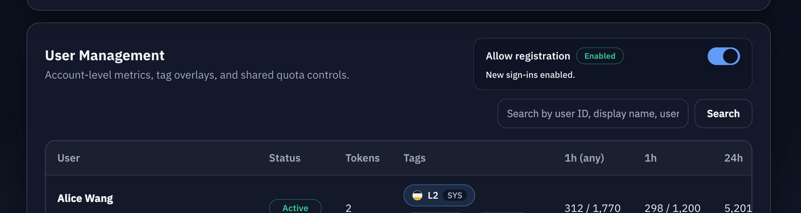
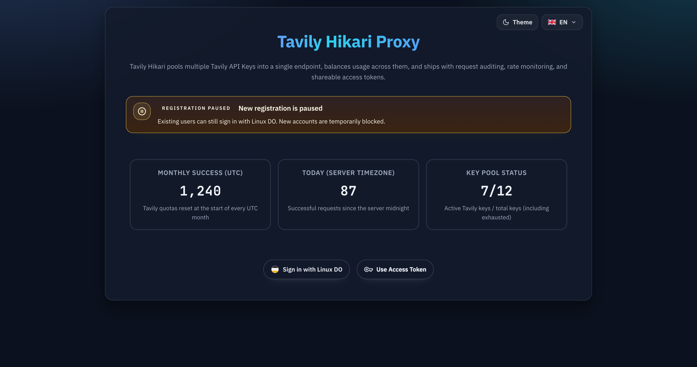
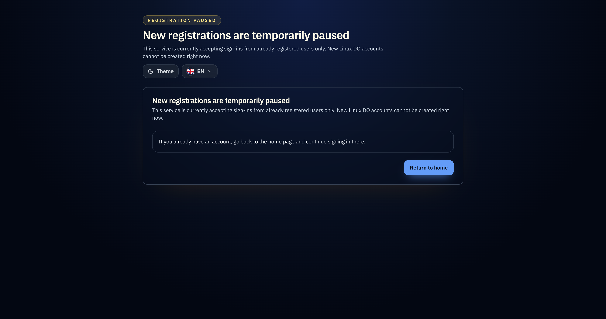

# 用户管理注册开关与暂停注册页（#r835w）

## 状态

- Status: 已完成（快车道）
- Created: 2026-03-13
- Last: 2026-03-13

## 背景 / 问题陈述

- 当前 LinuxDo OAuth 登录默认会为首次第三方用户创建本地账户、token 绑定与 user session，管理员无法在活动暂停或容量紧张时临时关闭新注册入口。
- 现有 admin `/admin/users` 已经承载用户侧管理动作，但缺少“是否允许新用户注册”的全局控制位。
- 当新用户被拒绝时，当前系统没有专门的解释页，直接返回错误状态会让公开首页与 OAuth 回调体验割裂。

## 目标 / 非目标

### Goals

- 在 `/admin/users` 顶部提供“允许注册”开关，并将状态持久化到现有 SQLite `meta` 表，默认开启。
- 当开关关闭时，仅阻止“首次” LinuxDo OAuth 登录用户落库；已存在本地 OAuth 绑定的老用户继续正常登录。
- 公开首页在匿名态保留 Linux DO 登录按钮，但明确展示“暂停新注册，仅限已注册用户继续登录”的提示。
- 新用户被拒绝时统一跳转到独立 `/registration-paused` 页面，提供说明与返回首页入口。

### Non-goals

- 不做邀请码、白名单、候补名单、可编辑暂停原因或定时开关。
- 不泛化到 LinuxDo 之外的 provider。
- 不修改管理员登录、已登录用户 session、用户标签、额度、token 绑定等既有语义。

## 范围（Scope）

### In scope

- `src/lib.rs`：新增 `allowRegistration` 读写 helper，并复用现有 `meta` 持久化。
- `src/server/handlers/admin_auth.rs` / `src/server/handlers/user.rs` / `src/server/handlers/admin_resources.rs` / `src/server/serve.rs`：补 admin 设置接口、profile 字段、OAuth 回调新用户拦截与 `/registration-paused` 承载路由。
- `web/src/api.ts`、`web/src/AdminDashboard.tsx`、`web/src/PublicHome.tsx`、`web/src/i18n.tsx`：admin 开关 UI、首页暂停提示与接口消费。
- 新增 `web/registration-paused.html`、`web/src/registration-paused-main.tsx`、`web/src/pages/RegistrationPaused.tsx`：独立暂停注册页。
- Rust/Web 自动化验证、浏览器验收与文档同步。

### Out of scope

- 对关闭注册原因进行可配置 CMS 化。
- 将首页匿名态细分为“老用户未登录”和“新用户未登录”两套不同入口。
- 任何生产 OAuth/Tavily 线上依赖的真实联调。

## 功能与行为规格（Functional/Behavior Spec）

### Core flows

- 管理员进入 `/admin/users`，可立即切换“允许注册”开关；保存成功后刷新页面仍展示最新状态。
- 匿名访客访问 `/` 时，首页继续显示 Linux DO 登录按钮；若 `allowRegistration=false`，同时显示“暂停新注册，仅限已注册用户继续登录”的提示。
- LinuxDo OAuth callback 在换 token / 拉 userinfo 成功后、写入本地账户之前，先检查当前 `allowRegistration` 与本地 `(provider, provider_user_id)` 绑定是否已存在。
- 若 `allowRegistration=false` 且该用户为首次登录，则不创建用户、不创建/复用 token 绑定、不写 user session，清理临时 OAuth binding cookie 并 `307` 跳转 `/registration-paused`。
- 若 `allowRegistration=false` 但该用户已存在本地 OAuth 绑定，则沿用当前登录成功路径，继续创建/刷新 user session 并跳转既有目标（通常 `/console`）。

### Edge cases / errors

- 开关在 OAuth authorize 发起后、callback 到达前被关闭时，以 callback 执行时读取到的持久化值为准；首次登录用户仍需被拦截。
- admin 设置接口仅允许管理员访问；非管理员请求返回 `403`。
- 当读取设置失败时，后端默认按安全优先处理：admin API 返回 `500`；公开 profile 不吞掉错误；OAuth callback 不在读配置失败时偷偷放行未确认的新用户。
- `/registration-paused` 为公开页面，不依赖管理员或用户 session。

## 接口契约（Interfaces & Contracts）

### 接口清单（Inventory）

| 接口（Name）              | 类型（Kind） | 范围（Scope） | 变更（Change） | 契约文档（Contract Doc） | 负责人（Owner） | 使用方（Consumers） | 备注（Notes）                       |
| ------------------------- | ------------ | ------------- | -------------- | ------------------------ | --------------- | ------------------- | ----------------------------------- |
| Registration Setting      | HTTP         | external      | New            | ./contracts/http-apis.md | Backend         | Admin Web           | `GET/PATCH /api/admin/registration` |
| Profile allowRegistration | HTTP         | external      | Modify         | ./contracts/http-apis.md | Backend         | PublicHome          | 向后兼容新增可选字段                |
| LinuxDo OAuth Callback    | HTTP         | external      | Modify         | ./contracts/http-apis.md | Backend         | Browser             | 新增暂停注册跳转语义                |
| Registration Paused Page  | Page Route   | external      | New            | ./contracts/http-apis.md | Web             | Browser             | `GET /registration-paused`          |

### 契约文档（按 Kind 拆分）

- [contracts/README.md](./contracts/README.md)
- [contracts/http-apis.md](./contracts/http-apis.md)

## 验收标准（Acceptance Criteria）

- Given 管理员打开 `/admin/users`
  When 页面加载完成
  Then 顶部可见“允许注册”开关，并展示当前全局状态。

- Given 管理员关闭“允许注册”开关
  When 刷新 `/admin/users`
  Then 开关仍保持关闭状态。

- Given 非管理员请求 `GET /api/admin/registration` 或 `PATCH /api/admin/registration`
  When 请求被处理
  Then 返回 `403`。

- Given 匿名访客访问 `/`
  When `allowRegistration=true`
  Then 首页显示正常 Linux DO 登录入口且不显示暂停注册提示。

- Given 匿名访客访问 `/`
  When `allowRegistration=false`
  Then 首页仍显示 Linux DO 登录按钮，并额外显示“暂停新注册，仅限已注册用户继续登录”的提示。

- Given `allowRegistration=false` 且 LinuxDo callback 对应用户本地不存在既有 `oauth_accounts` 记录
  When callback 成功拿到上游用户信息
  Then 返回 `307 /registration-paused`，同时不写入用户、OAuth 账户、token 绑定或 user session，并清理 OAuth binding cookie。

- Given `allowRegistration=false` 且 LinuxDo callback 对应用户本地已存在既有 `oauth_accounts` 记录
  When callback 成功拿到上游用户信息
  Then 登录流程继续成功并按既有逻辑跳转 `/console`（或 state 中指定的既有目标）。

- Given 新用户被拒绝后访问 `/registration-paused`
  When 页面渲染
  Then 可见固定说明文案、返回首页 CTA，且页面在独立入口下可直接打开。

## 非功能性验收 / 质量门槛（Quality Gates）

- `cargo fmt`
- `cargo clippy -- -D warnings`
- `cargo test`
- `cd web && bun test`
- `cd web && bun run build`
- 浏览器验收 `/admin/users`、`/`、`/registration-paused`、LinuxDo 新/老用户 callback 分流

## 里程碑

- [x] M1: 规格与 HTTP/page contracts 冻结
- [x] M2: 后端 `allowRegistration` 持久化、admin API、profile 字段与 OAuth 拦截完成
- [x] M3: admin 用户页开关与首页暂停提示完成
- [x] M4: `/registration-paused` 独立页面与静态入口完成
- [x] M5: 测试、浏览器验收、快车道 PR 与 review-loop 收敛完成

## Visual Evidence (PR)

- Admin 用户管理页中的注册开关（Storybook）
  
- 公开首页的暂停注册提示条（暗色 Storybook）
  
- 独立暂停注册页（暗色 Storybook）
  

## 风险 / 开放问题 / 假设

- 风险：首页匿名态无法预先区分“老用户未登录”和“新用户未登录”，因此前端只能统一展示登录按钮；真正的老/新用户分流必须以后端 callback 判定为准。
- 风险：如果在 OAuth callback 阶段读取设置失败，安全优先会使首次登录流程失败，需要通过测试确保错误路径可诊断。
- 假设：首次登录用户的判定标准固定为“本地不存在相同 `(provider, provider_user_id)` 的 `oauth_accounts` 记录”。
- 假设：暂停注册页文案固定，不要求管理员自定义原因或恢复时间。

## 变更记录（Change log）

- 2026-03-13: 初版规格建立，冻结 admin 开关、公开首页提示、OAuth callback 拒绝与 `/registration-paused` 页面验收口径。
- 2026-03-13: 已完成后端/前端实现、自动化测试、mock OAuth 浏览器验收与本地 review-loop；进入快车道 PR 收口阶段。
- 2026-03-13: 补充 3 张 Storybook 视觉证据，覆盖 admin 注册开关、首页暂停注册提示条与独立暂停注册页。
- 2026-03-13: 完成 UI 收口、review 修复、checks 收敛与 PR merge-ready 验证，规格状态切换为已完成（快车道）。

## 参考（References）

- 既有 LinuxDo OAuth 基线：`docs/specs/rg5ju-linuxdo-login-token-autofill/SPEC.md`
- 既有 admin 用户管理基线：`docs/specs/2mt2u-admin-user-tags-quota/SPEC.md`
