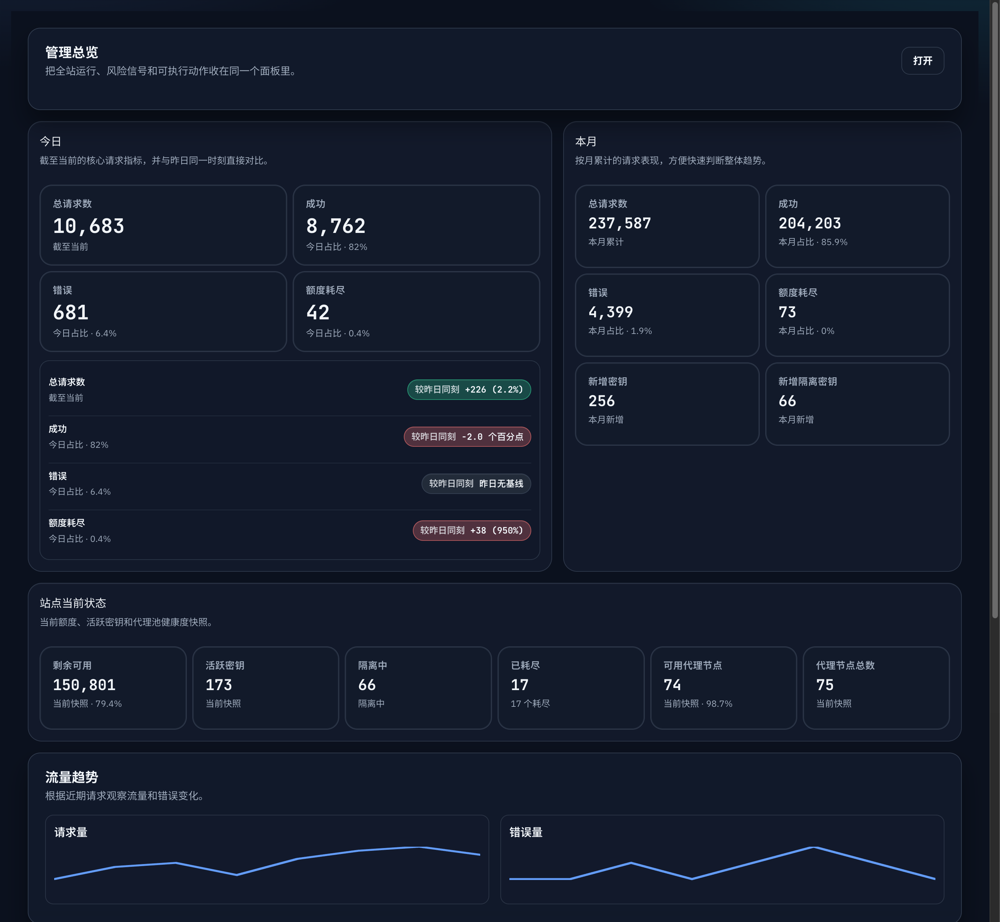

# Admin Dashboard 总览去壳与对比度收口（#ud3ru）

## 状态

- Status: 已完成（merge-ready）
- Created: 2026-03-30
- Last: 2026-03-30

## 背景 / 问题陈述

- `/admin/dashboard` 顶部总览已经完成“今日 / 本月 / 当前状态”的信息分层，但当前实现仍保留一层额外 summary 外壳，视觉上重复包裹。
- `DashboardOverview` 内部的 hero、summary block、summary metric card 和今日对比托盘仍叠加了渐变/光晕背景，和现有 dashboard 其余区域相比显得过重。
- “较昨日同刻”胶囊在暗色主题下使用固定红绿文字配半透明底色，对比度不足，读数不够稳定。

## 目标 / 非目标

### Goals

- 去掉 summary aggregate 的冗余外层卡片壳，只保留三块真正承载信息的总览结构。
- 去掉 `DashboardOverview` 内自定义的渐变背景，让总览和当前 admin 面板语言更统一。
- 将 delta 胶囊改为基于现有 theme token 的高对比度样式，修正暗色主题下的可读性。
- 补一条稳定的 Storybook 中文暗色证据 story，专门覆盖这次视觉收口。

### Non-goals

- 不改 `/api/summary`、`/api/summary/windows`、admin SSE snapshot 或指标计算逻辑。
- 不调整 dashboard 趋势图、风险区、行动中心的数据契约与排序。
- 不改全局 `.surface`、页面背景或其他管理模块的卡片主题。

## 范围（Scope）

### In scope

- `web/src/admin/DashboardOverview.tsx`
  - 移除 summary 区外层 `surface/panel` 包裹。
- `web/src/index.css`
  - 收掉 `DashboardOverview` 范围内的渐变/radial 背景。
  - 提升 `metric-delta-*` 的明度与边框对比。
- `web/src/admin/DashboardOverview.stories.tsx`
  - 新增稳定 `zh + dark` 证据 story，并对去壳结构做 `play` 断言。

### Out of scope

- `src/**`、`web/src/api.ts`、后台接口测试、SSE payload 或任何 Rust 逻辑。
- `/admin` 下其他页面或组件的卡片视觉。

## 需求（Requirements）

### MUST

- 总览主区域不再出现额外的外层 summary 卡片壳。
- `DashboardOverview` 内部不再保留当前自定义渐变背景。
- 正向、负向、中性 delta 胶囊在暗色主题下都能清楚读出 label 和 value。

### SHOULD

- Storybook 继续作为该区域的第一视觉证据来源，并能稳定复现中文暗色验收场景。

### COULD

- None.

## 功能与行为规格（Functional/Behavior Spec）

### Core flows

- 管理员打开 `/admin/dashboard` 时，顶部总览直接呈现三块主内容层级，而不是先进入一层大卡片再看内部块。
- 今日对比条目的胶囊仍保留 `positive / negative / neutral` 语义，但主要通过 theme token 的底色、边框与高对比正文表达，而不是靠低对比彩色文字硬撑。
- Storybook 的中文暗色画布能同时展示正向、负向、中性三类胶囊，并验证 summary 外层壳已经被移除。

### Edge cases / errors

- 当 overview 仍在 loading 或 summary 不可用时，仍保留 fallback alert，但不恢复旧的 summary 外壳结构。
- 本次只改变展示层；任何指标为空、昨日无基线、百分比/百分点逻辑都沿用现有实现。

## 接口契约（Interfaces & Contracts）

- None.

## 验收标准（Acceptance Criteria）

- Given 管理员进入 `/admin/dashboard`
  When 顶部总览渲染
  Then `今日 / 本月 / 站点当前状态` 直接作为主视觉层级展示，不再出现额外外层 summary 壳。

- Given 仪表盘运行在亮色或暗色主题
  When 查看 `DashboardOverview`
  Then hero、summary block、summary card 与 today comparison tray 不再显示当前自定义渐变背景。

- Given 暗色主题下存在正向、负向与中性 delta 胶囊
  When 查看“较昨日同刻”行
  Then label 与 value 文本都能稳定辨识，不再出现低对比难读问题。

- Given Storybook 打开 `Admin/Components/DashboardOverview/ZhDarkEvidence`
  When 画布渲染并执行 `play`
  Then 能验证中文暗色文案、三种胶囊状态，以及 legacy summary 外壳已移除。

## 非功能性验收 / 质量门槛（Quality Gates）

### Testing

- `cd web && bun run build`
- `cd web && bun run build-storybook`

### UI / Storybook (if applicable)

- 更新 `web/src/admin/DashboardOverview.stories.tsx`
- 通过 Storybook 中文暗色 evidence 画布与实际 `/admin/dashboard` 浏览器复核

## 文档更新（Docs to Update）

- `docs/specs/README.md`: 新增该 spec 索引，并在交付收口时同步状态与备注。

## 计划资产（Plan assets）

- Directory: `docs/specs/ud3ru-admin-dashboard-overview-chrome-simplify/assets/`
- In-plan references: `assets/dashboard-overview-zh-dark-evidence.png`

## Visual Evidence

- Storybook 证据画布：`Admin/Components/DashboardOverview/ZhDarkEvidence`
- 证据目标源：`storybook_canvas`
- 证据绑定 SHA：`9d52eafa9e91b5551f5768bb0f15a79a0575279b`
- 证据绑定说明：证据图已在聊天回图完成验收；本次与 `main` 的同步未改动 `DashboardOverview.tsx`、`DashboardOverview.stories.tsx` 或 dashboard-overview 相关样式选择器，因此沿用已审阅的 spec 证据资产并重新绑定到当前快车道收口版本。
- 证据资产：`docs/specs/ud3ru-admin-dashboard-overview-chrome-simplify/assets/dashboard-overview-zh-dark-evidence.png`

- 浏览器复核：
  - `dashboard-summary-panel` 已不再携带 `surface` / `panel` 类名。
  - summary block、summary card、today comparison tray 的 `background-image` 均为 `none`。
  - 实际 `/admin` 页面桌面断点无横向滚动：`body/doc scrollWidth = 1425`，`viewportWidth = 1440`。
  - 实际 `/admin` 页面移动断点无横向滚动：`body/doc scrollWidth = 485`，`viewportWidth = 500`。

## 实现里程碑（Milestones / Delivery checklist）

- [x] M1: 冻结“去壳 + 去渐变 + 胶囊对比度收口”的范围
- [x] M2: 完成 DashboardOverview / CSS / Storybook 实现
- [x] M3: 完成构建、视觉证据与 PR merge-ready 收口

## 方案概述（Approach, high-level）

- 仅收口总览容器与视觉样式，不触碰指标计算与接口层。
- 保留现有块级布局和 loading/empty state，只把 summary 外壳从常态渲染路径里移除。
- 胶囊统一收敛到 theme token 语义，优先保证暗色主题下的对比度和读数稳定性。

## 风险 / 开放问题 / 假设（Risks, Open Questions, Assumptions）

- 风险：如果只移除外层容器，不给 loading/empty state 补 fallback 间距，会造成空态贴边。
- 风险：若直接沿用现有半透明红绿文字方案，暗色主题下仍会读不清。
- 假设：主人所说“整个 dashboard”仅指 `/admin/dashboard` 的 `DashboardOverview` 视图，不扩散到其他 admin 模块。

## 变更记录（Change log）

- 2026-03-30: 创建 spec，冻结本次 dashboard overview chrome simplification 的范围、验收口径与视觉证据目标。
- 2026-03-30: 完成 `DashboardOverview` 去壳、dashboard-local 渐变收口、delta 胶囊对比度提升，并补齐 `ZhDarkEvidence` Storybook 证据与浏览器断点复核。
- 2026-03-30: 创建 PR #197，并将该项状态收口为 merge-ready。
- 2026-03-30: review-loop follow-up 补回 summary 区在 admin shell 窄屏断点下的共享 gutter，并清理 specs index 的重复 `yc6pp` 行。
- 2026-03-30: 按快车道收口要求将最终 Storybook 证据图落盘到 spec `assets/`，移除该 spec 的 PR-only 证据块表述，并补上 `.codex-artifacts/` 忽略规则。
- 2026-03-30: 与 `main` 完成 base sync 后，移除仓库内已追踪的 `.codex-artifacts/*` 遗留文件，并确认 `DashboardOverview` 渲染输入未变，因此将已审阅的 spec 证据图重新绑定到同步后的最新 head。

## 参考（References）

- `web/src/admin/DashboardOverview.tsx`
- `web/src/admin/DashboardOverview.stories.tsx`
- `web/src/index.css`
