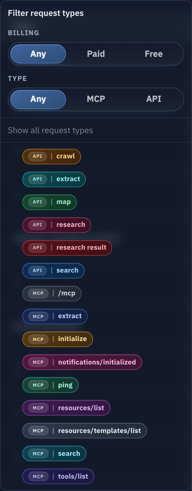

# Admin Token Request Type 快捷三态筛选（#uj9hb）

## 状态

- Status: 已完成（快车道）
- Created: 2026-03-18
- Last: 2026-03-18

## 背景 / 问题陈述

- `/admin/tokens/:id` 的 `Request Records` 已支持按具体 `request_kind` 多选，但管理员在排查“哪些是付费请求”“哪些走 MCP / API”时仍需要逐个 badge 心算组合。
- 现有前端只能看到 `request_kind_options[].key/label`，如果在页面里再按 key 前缀或 `Charged Credits` 反推“付费/免费”，会复制后端计费语义并在 legacy/raw 记录上出现误判。
- 管理员需要在同一个下拉面板里快速切换“付费 / 免费 / 不限”与“API / MCP / 不限”，并在需要时继续手动微调单个 request type。

## 目标 / 非目标

### Goals

- 为 `/api/tokens/:id/logs/page` 的 `request_kind_options[]` 增加 canonical `protocol_group` 与 `billing_group` 元数据，由后端统一定义“类型 / 付费”语义。
- 在 token detail 的 request type dropdown 顶部加入两组三态快捷筛选：`Billing = Any / Paid / Free`、`Type = Any / MCP / API`。
- 快捷筛选按交集一键生成当前选中的 request kinds，同时保留原有 checkbox 多选微调能力。
- 当手动微调结果不再等于当前快捷组合时，快捷筛选显示态回退到 `Any / Any`，避免 UI 误报预设状态。

### Non-goals

- 不新增新的分页 query 参数；日志请求仍只使用重复 `request_kind=` 参数提交精确筛选。
- 不修改 `Charged Credits` 展示含义或任何 quota / billing 计算逻辑。
- 不把同类快捷筛选扩散到 `/admin/requests`、public logs 或其它详情页。
- 不把快捷筛选状态同步到 URL query、浏览器历史或全局 store。

## 范围（Scope）

### In scope

- `docs/specs/README.md`
  - 新增 `uj9hb-admin-token-request-kind-quick-filters` 索引行。
- `src/lib.rs` / `src/server/dto.rs` / `src/server/tests.rs`
  - `TokenRequestKindOption` 与 `/api/tokens/:id/logs/page` 返回 `protocol_group`、`billing_group`。
  - 后端使用 request-kind canonical 规则区分 `billable` / `non_billable`、`api` / `mcp`，并覆盖 legacy raw MCP 子路径与 root `/mcp` control-plane 流量。
- `web/src/tokenLogRequestKinds.ts` / `web/src/tokenLogRequestKinds.test.ts`
  - 扩展 option 类型、缓存和 tri-state helper，提供快捷组合生成、手动微调回退与展示摘要能力。
- `web/src/pages/TokenDetail.tsx` / `web/src/index.css`
  - 在 dropdown 中加入快捷三态分组，接入现有分页 / SSE / 多选筛选生命周期，并调稳面板布局。
- `web/src/pages/TokenDetail.stories.tsx`
  - 为 `Paid/Free + API/MCP` 四类组合准备 mock options / logs，保证 Storybook 验收可见。

### Out of scope

- `/api/tokens/:id/logs` 非分页接口增加 `request_kind_options` 或新的快捷筛选元数据。
- token log 行对象新增 `protocol_group` / `billing_group` 字段。
- 新建通用 filter bar 组件或通用多态 query builder。

## 接口契约（Interfaces & Contracts）

### Public / external interfaces

`GET /api/tokens/:id/logs/page` 的 `request_kind_options[]` 结构扩展为：

```json
{
  "key": "mcp:search",
  "label": "MCP | search",
  "protocol_group": "mcp",
  "billing_group": "billable"
}
```

契约约束：

- `protocol_group` 只允许 `api | mcp`。
- `billing_group` 只允许 `billable | non_billable`。
- `request_kind_options` 继续表示“当前 token + 当前时间窗下可选的 request kinds”，不受当前已选筛选二次收窄。
- 仍以重复 `request_kind=` query 参数作为唯一过滤输入；快捷三态只在前端映射成 key 列表。

### Internal interfaces

- canonical 分组必须由后端按 request-kind 规则提供，前端只消费，不再按 `request_kind_key` 或 `business_credits` 本地重算。
- `mcp:initialize`、`mcp:ping`、`mcp:tools/list`、`mcp:resources/*`、`mcp:prompts/*`、`mcp:notifications/*` 视为 `non_billable`；raw `mcp:raw:/mcp*` fallback 维持 billable safe-default。
- `api:research-result` 与 `api:usage` 视为 `non_billable`；其余现有 API request kinds 维持 billable safe-default。

## 验收标准（Acceptance Criteria）

- Given 管理员打开 `/admin/tokens/:id` 并展开 `Filter request types`
  When dropdown 渲染完成
  Then 顶部先显示 `Billing` 和 `Type` 两组三态快捷筛选，再显示 `Show all request types` 与 request-kind checkbox 列表。
- Given 当前时间窗存在 `MCP | search`、`MCP | tools/list`、`API | search`、`API | research result`
  When 管理员选择 `Billing=Paid` 且 `Type=MCP`
  Then 当前勾选集合只包含 billable MCP request kinds，并触发同一套精确 `request_kind=` 拉取。
- Given 快捷筛选已经生成一组勾选
  When 管理员再手动勾选或取消单个 request kind
  Then 若结果不再等于当前快捷组合，`Billing` 与 `Type` 的显示态回退为 `Any`，但手动勾选保持有效。
- Given 管理员点击 `Show all request types`
  When 页面重置筛选
  Then request-kind 勾选清空，两个快捷三态同时回到 `Any`。
- Given 时间窗切换、SSE snapshot 刷新或翻页请求返回新的 `request_kind_options`
  When 当前仍处于某个快捷组合
  Then 前端按新的 canonical option 分组重新生成该快捷组合的 key 集合，而不是保留陈旧 key 列表。

## 非功能性验收 / 质量门槛（Quality Gates）

- `cargo test token_log_filters_and_options_use_backfilled_request_kind_columns`
- `cargo test admin_token_log_views_include_business_credits`
- `cd web && bun test src/tokenLogRequestKinds.test.ts`
- `cd web && bun run build`
- 浏览器手工验收 `/admin/tokens/:id` 的 dropdown：快捷组合、手动微调回退、时间窗切换与首屏刷新都保持一致

## 风险 / 开放问题 / 假设

- 风险：若当前时间窗某个快捷组合没有任何 options，按钮仍需保留当前组合显示，不能误报成“全部类型”。
- 风险：dropdown 内嵌 segmented controls 后，窄桌面宽度与小屏 fallback select 需要避免挤压原有 checkbox 列表。
- 假设：快捷三态仍使用英文 UI 文案，与当前 token detail 英文界面保持一致。
- 假设：保留原有 request-kind checkbox OR 语义，不新增“反选”“仅显示命中项计数”等额外行为。

## Visual Evidence (PR)

- source_type=storybook_canvas
  - story_id_or_title: `Admin Pages/TokenDetail / Dense Request Records`
  - state: `request kind dropdown expanded`
  - target_program: `mock-only`
  - capture_scope: `element`
  - sensitive_exclusion: `N/A`
  - submission_gate: `approved`
  - evidence_note: 证明 request type 筛选面板顶部已加入 `Billing` 与 `Type` 两组三态快捷筛选，且在可用视口足够时面板会自适应内容高度，一次性展示完整 request kind 列表
  - image:
    

## 变更记录（Change log）

- 2026-03-18: 初始化 follow-up spec，冻结 canonical option 分组字段、tri-state 交互和 legacy/raw request kind 的计费分组边界。
- 2026-03-18: 后端 canonical 分组、前端快捷三态筛选、Storybook mock/视觉复核与 CI 验证完成，进入合并收尾。
