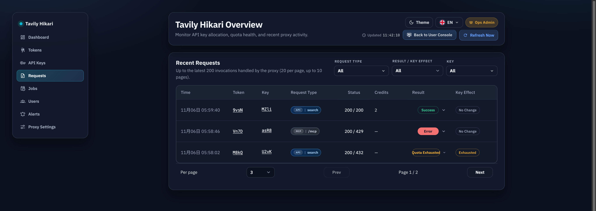
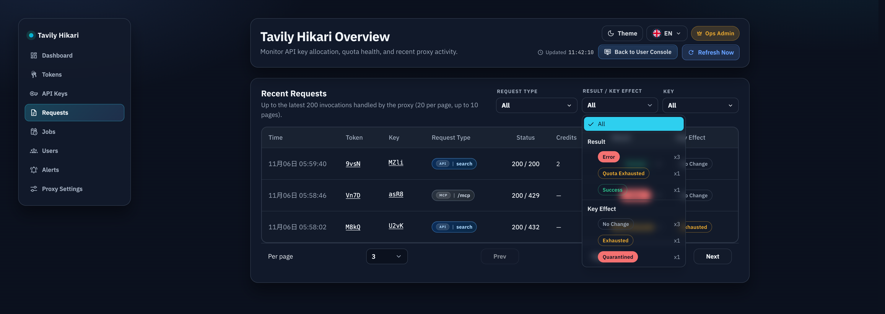
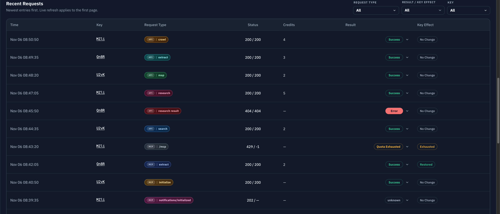

# 管理员近期请求列表全量统一（#wnzdr）

## 状态

- Status: 已实现（待审查）
- Created: 2026-03-20
- Last: 2026-03-22

## 背景 / 问题陈述

- `/admin/requests`、`/admin/keys/:id`、`/admin/tokens/:id` 当前各自维护不同的“近期请求”实现，列结构、筛选方式、分页能力与移动端布局已经分叉。
- token 详情页已经具备最完整的 `Request Type`、`Charged Credits`、展开详情与 request-kind 多选筛选；另外两处仍停留在轻量表格，导致管理员跨页面排障时无法使用同一套心智模型。
- 三处背后并非同一份日志数据：全局请求页与 key 详情使用 `request_logs`，token 详情使用 `auth_token_logs`。目前只有 token 日志持久化了 `request_kind_*` 和 `business_credits`，全局请求页与 key 详情无法真实展示这些列。

## 目标 / 非目标

### Goals

- 统一三处 admin“近期请求列表”为同一个共享组件，默认以 token 详情页的 richest layout 为基准。
- 为 `request_logs` 补齐 `request_kind_*` 与 `business_credits`，让全局请求页与 key 详情拥有和 token 详情一致的数据能力。
- 统一筛选条能力：
  - `Request Type` 多选
  - `结果与影响` 单选分组筛选
  - `Token` 单选 facet
  - `Key` 单选 facet
- 按上下文显隐列与筛选：
  - 全局页显示 `Token` + `Key`
  - token 详情隐藏 `Token`
  - key 详情隐藏 `Key`
- 三处桌面表格摘要单元格全部强制不换行，完整信息统一收敛到 tooltip / 展开详情。

### Non-goals

- 不改 dashboard overview 内嵌的 mini recent requests 卡片。
- 不改 public / user console 日志页。
- 不做历史全量 backfill；迁移后旧 `request_logs` 允许以 `—` 或 legacy fallback 展示缺失字段。
- 不改变计费语义、配额规则或已有 billing subject 归属。

## 范围（Scope）

### In scope

- `src/store/mod.rs`
  - 扩展 `request_logs` / `auth_token_logs` schema、迁移、索引与查询。
  - 为 `request_logs` 增加 `request_kind_key`、`request_kind_label`、`request_kind_detail`、`business_credits`。
  - 为 `auth_token_logs` 增加 `request_log_id`，用于回指同一条 admin request log。
- `src/models.rs`
  - 扩展 `AttemptLog` / `RequestLogRecord` 等模型，让 request log 写入与查询携带 request kind / credits。
- `src/tavily_proxy/mod.rs`
  - 调整 request log 落盘与 token log 结算链路，建立 request-log 与 token-log 的稳定关联。
  - 在 token 计费结算成功后把真实 `business_credits` 回写到对应 `request_logs`。
- `src/server/handlers/admin_resources.rs`
  - 扩展 `/api/logs` 为 facets + 分页过滤接口。
- `src/server/dto.rs`
  - 新增 `/api/keys/:id/logs/page`。
  - 扩展 `/api/tokens/:id/logs/page` 的过滤参数和 facets 负载。
- `web/src/api.ts`
  - 新增统一 request list 分页响应类型、facet 类型与请求函数。
- `web/src/AdminDashboard.tsx`
  - 全局请求页与 key 详情接入共享组件。
- `web/src/pages/TokenDetail.tsx`
  - 从现有 token 请求记录抽出共享组件并接回 token 详情。
- `web/src/components/**`
  - 新增共享 admin recent requests 组件与筛选菜单子组件。
- `web/src/index.css`
  - 统一 no-wrap 表格样式与新增筛选触发器样式。
- `web/src/admin/AdminPages.stories.tsx`
- `web/src/pages/KeyDetailRoute.stories.tsx`
- `web/src/pages/TokenDetail.stories.tsx`
  - 补齐三处故事和 dense layout / facet / fallback 样例。

### Out of scope

- dashboard recent requests 卡片复用共享组件。
- legacy request log 全库补算 request kind / credits。
- 为 `Token` / `Key` 筛选引入自由搜索输入或 URL 状态同步。

## 接口契约（Interfaces & Contracts）

### `request_logs`

- 新增列：
  - `request_kind_key TEXT`
  - `request_kind_label TEXT`
  - `request_kind_detail TEXT`
  - `business_credits INTEGER`

### `auth_token_logs`

- 新增列：
  - `request_log_id INTEGER NULL`
- 语义：
  - 指向同一次管理员请求落盘对应的 `request_logs.id`
  - 用于在 token 结算完成后回写 `request_logs.business_credits`

### `GET /api/logs`

- 支持查询参数：
  - `page`
  - `per_page`
  - `request_kind`（可重复，多选 OR）
  - `result`
  - `key_effect`
  - `auth_token_id`
  - `key_id`
- `result` 与 `key_effect` 同时出现时返回 `400`
- 响应新增：
  - `requestKindOptions`
  - `facets.results`
  - `facets.keyEffects`
  - `facets.tokens`
  - `facets.keys`

### `GET /api/keys/:id/logs/page`

- 返回与共享组件一致的分页与 facets 结构。
- 不返回 `facets.keys`。

### `GET /api/tokens/:id/logs/page`

- 保留现有 `request_kind` 多选能力。
- 新增：
  - `result`
  - `key_effect`
  - `key_id`
  - `facets.keys`
- 不返回 `facets.tokens`。

## 验收标准（Acceptance Criteria）

- Given 管理员分别打开 `/admin/requests`、`/admin/keys/:id`、`/admin/tokens/:id`
  When 近期请求列表渲染完成
  Then 三处都使用同一个共享组件，只通过列配置与 facet 显隐适配上下文。

- Given 管理员打开 `/admin/requests`
  When 查看筛选条
  Then 旧的结果 tabs 已被“结果与影响”分组下拉替换，且一次只能选择 `result` 或 `key_effect` 其中一个值。

- Given 管理员打开 `/admin/requests` 或 `/admin/keys/:id`
  When 日志来自迁移后的新写入记录
  Then 页面能真实显示 `Request Type` 与 `Charged Credits`，不依赖前端推导。

- Given 管理员打开 `/admin/tokens/:id`
  When 使用共享请求列表
  Then 页面继续支持 request-kind 多选，并额外支持 `Key` 单选 facet，同时不显示 `Token` 列。

- Given 管理员打开 `/admin/keys/:id`
  When 使用共享请求列表
  Then 页面显示 `Token` 单选 facet，使用分页接口，不再受固定数组长度限制，同时隐藏 `Key` 列。

- Given 桌面端表格出现长 request type、error 或 entity id
  When 摘要列表渲染
  Then 单元格不换行，超长文本统一截断，完整信息只在 tooltip 或展开详情中查看。

## 测试与证据

- `cargo test`
- `cargo clippy -- -D warnings`
- `cd web && bun test`
- `cd web && bun run build`
- Storybook / 浏览器验证三处页面的列显隐、facet、nowrap 与展开详情。

## Visual Evidence (PR)

- source_type: `storybook_canvas`
  story_id_or_title: `admin-pages--requests`
  target_program: `mock-only`
  capture_scope: `browser-viewport`
  sensitive_exclusion: `N/A`
  submission_gate: `approved`
  state: `shared recent requests list`
  evidence_note: 验证全局请求页已经切换到统一的共享列表，筛选条、列顺序与 no-wrap 桌面表格在 Storybook 中稳定可复查。
  image:
  

- source_type: `storybook_canvas`
  story_id_or_title: `admin-pages--requests`
  target_program: `mock-only`
  capture_scope: `browser-viewport`
  sensitive_exclusion: `N/A`
  submission_gate: `approved`
  state: `result and key effect facet expanded`
  evidence_note: 验证“结果与影响”分组筛选在共享列表中可展开查看，并展示当前可选项与数量。
  image:
  

- source_type: `storybook_canvas`
  story_id_or_title: `admin-pages-tokendetail--dense-request-records`
  target_program: `mock-only`
  capture_scope: `browser-viewport`
  sensitive_exclusion: `N/A`
  submission_gate: `approved`
  state: `token detail shared list`
  evidence_note: 验证 Token 详情页复用同一套近期请求列表，并保持 Key 筛选与上下文列显隐。
  image:
  

## 里程碑

- [x] M1: 新 spec、README 索引与接口合同冻结
- [x] M2: `request_logs` / `auth_token_logs` schema 与关联链路补齐
- [x] M3: `/api/logs`、`/api/keys/:id/logs/page`、`/api/tokens/:id/logs/page` 统一 facets 过滤能力
- [x] M4: 共享 recent requests 组件接入 requests / key detail / token detail
- [ ] M5: stories、测试、review-loop 与 merge-ready 收敛

## Change log

- 2026-03-20: 初始化 spec，冻结“管理员近期请求列表全量统一”的数据对齐、共享组件、facet 过滤与 no-wrap 桌面表格边界。
- 2026-03-22: 共享近期请求列表、日志 facets、Storybook 证据与截图裁剪已落地；规格同步到“已实现（待审查）”，等待 PR 收敛。
