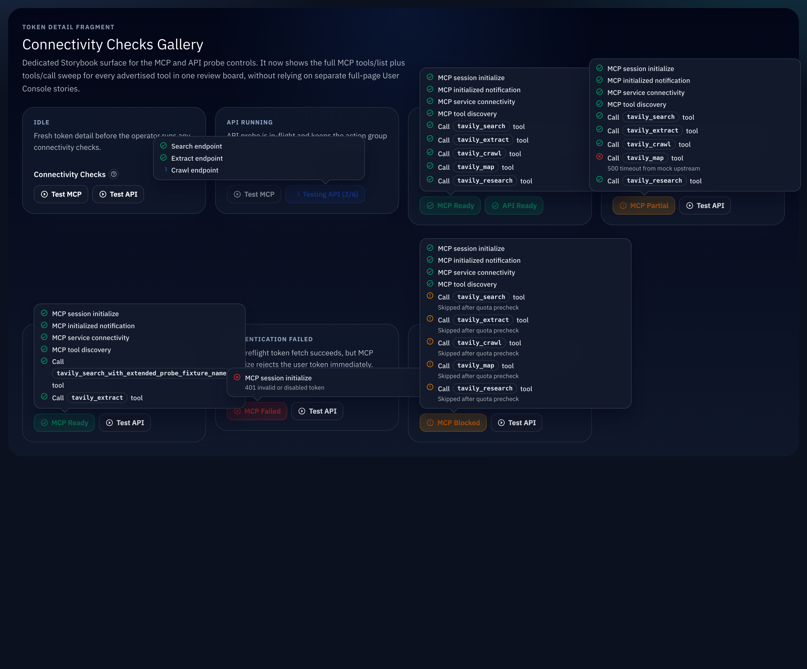

# UserConsole Token Detail MCP 完整握手与高仿真标识（#yc6pp）

## 状态

- Status: 已实现（待审查）
- Created: 2026-03-27
- Last: 2026-03-27

## 背景 / 问题陈述

- 当前 token detail 的 `检测 MCP` 只覆盖 `ping -> tools/list -> tools/call`，没有走 MCP Streamable HTTP 推荐的初始化握手。
- 现有浏览器 probe 使用固定 JSON-RPC `id` 和静态 `probe-id` 风格值，和真实 MCP 客户端流量差距过大，无法稳定暴露协议字段缺失、会话头遗漏与 identifier-like schema 参数问题。
- 代理层已经支持 `initialize` / `notifications/initialized` request kind 与 MCP session headers，但用户控制台 probe 尚未消费这套契约。

## 目标 / 非目标

### Goals

- 将 token detail MCP probe 升级为 `initialize -> notifications/initialized -> ping -> tools/list -> tools/call`。
- 让 `initialize` 固定带上 `protocolVersion=2025-03-26`、`capabilities={}`、`clientInfo={ name, version }`，后续请求复用协商后的 `protocolVersion` 与服务端返回的 `mcp-session-id`。
- 每次 probe run 生成新的 run signature，并为每个 JSON-RPC request id、每个 tool-call item、每个 schema 推导出的 identifier-like 参数生成新的高仿真标识值。
- 补齐前端 helper、UserConsole 运行时、Storybook 画廊与 Rust 合同测试，锁住 notification `202` 空体与 session header forwarding。

### Non-goals

- 不改 HTTP API probe 按钮与 `/api/tavily/*` 请求体。
- 不改业务计费/配额策略；`initialize` / `notifications/initialized` / `ping` / `tools/list` 继续保持 non-billable。
- 不为 fresh probe 伪造 `Last-Event-ID`，也不改动 `/mcp/*` 其它路径行为。

## 范围（Scope）

### In scope

- `web/src/lib/mcpProbe.ts`
  - 增加 metadata-aware request primitive，支持读取响应头/状态并接受 notification-only `202` 空体成功。
- `web/src/api.ts`
  - 新增 `probeMcpInitialize` / `probeMcpInitialized`，并让 `probeMcpPing` / `probeMcpToolsList` / `probeMcpToolsCall` 接收 MCP session context。
- `web/src/UserConsole.tsx`
  - 扩展 probe step 定义、MCP run context、动态 identity generator、identifier-like schema 参数合成与 UI totals。
- `web/src/UserConsole.test.ts`
- `web/src/lib/mcpProbe.test.js`
- `web/src/components/ConnectivityChecksPanel.stories.tsx`
- `web/src/components/ConnectivityChecksPanel.stories.test.ts`
- `src/server/tests.rs`
  - 增加 `initialize -> notifications/initialized (202) -> tools/list` 合同覆盖。
- `docs/specs/README.md`

### Out of scope

- `src/lib.rs` / `src/analysis.rs` 的 request kind / billing 逻辑重写。
- 真实生产 Tavily 上游调用。
- Token detail 之外的其它页面 probe 体验重构。

## 接口契约（Interfaces & Contracts）

### Public / runtime-facing

- MCP POST 继续强制 `Accept: application/json, text/event-stream`。
- `initialize` request body:
  - `jsonrpc: "2.0"`
  - `id: <fresh request id>`
  - `method: "initialize"`
  - `params.protocolVersion = "2025-03-26"`
  - `params.capabilities = {}`
  - `params.clientInfo.name = "Tavily Hikari UserConsole Probe"`
  - `params.clientInfo.version = frontend version || "dev"`
- `notifications/initialized` request body:
  - `jsonrpc: "2.0"`
  - `method: "notifications/initialized"`
  - 无 `id`
- 若 initialize 响应返回 `result.protocolVersion`，后续请求使用该值作为 `Mcp-Protocol-Version`。
- 若 initialize HTTP 响应带 `Mcp-Session-Id`，后续请求都带同一 `Mcp-Session-Id`。

### Identifier synthesis

- 同一 run 内维护单个 `runSignature`。
- 每个 JSON-RPC request id 必须唯一。
- schema 合成时，对 `*id` / `*Id` / `*uuid` / `*request*` / `*session*` / `*trace*` / `*cursor*` 这类 identifier-like string 字段，必须生成 fresh value，不再回退到固定 `probe-id`。
- `uuid` 格式字段生成伪 UUID；其它 identifier-like 字段按语义生成 `req_` / `sess_` / `trace_` / `cursor_` / generic `<slug>_...`。

## 验收标准（Acceptance Criteria）

- Given 用户在 `/console#/tokens/:id` 点击 `检测 MCP`
  When probe 成功执行
  Then UI 依次完成 `initialize -> notifications/initialized -> ping -> tools/list -> tools/call`，并在气泡中先展示 control-plane steps，再展示每个广告工具的 `tools/call`。

- Given initialize 返回 `protocolVersion` 与 `Mcp-Session-Id`
  When probe 继续发送 `notifications/initialized`、`ping`、`tools/list` 与 `tools/call`
  Then 浏览器请求必须带协商后的 `Mcp-Protocol-Version` 与相同的 `Mcp-Session-Id`。

- Given `notifications/initialized` 仅返回 `202 Accepted` 且 body 为空
  When probe helper 处理该响应
  Then 该步判定为成功，而不是误报“空响应失败”。

- Given `tools/list` 广播的 Tavily 工具含有 identifier-like required schema 字段
  When 浏览器合成 `tools/call` 参数
  Then 每个 tool-call item 的 identifier-like 字段都生成新的高仿真值，而不是固定 `probe-id`。

- Given token detail 命中 hour/day/month 任一业务配额阻断
  When 用户执行 MCP probe
  Then `initialize` / `notifications/initialized` / `ping` / `tools/list` 仍继续执行，billable `tools/call` 仍按现有 blocked/partial 语义处理。

## 非功能性验收 / 质量门槛（Quality Gates）

- `cd web && bun test src/lib/mcpProbe.test.js src/UserConsole.test.ts src/components/ConnectivityChecksPanel.test.tsx src/components/ConnectivityChecksPanel.stories.test.ts`
- `cd web && bun run build`
- `cd web && bun run build-storybook`
- `cargo test mcp_`

## 实现里程碑（Milestones / Delivery checklist）

- [x] M1: 前端 MCP transport/helper 支持 initialize、initialized、session metadata 与 `202` 空体
- [x] M2: UserConsole runtime 接入完整握手、动态 identity generator 与新的 step totals
- [x] M3: Storybook 画廊与前端测试同步新 lifecycle / dynamic identifier 行为
- [x] M4: Rust 合同测试覆盖 `initialize -> notifications/initialized -> tools/list`
- [ ] M5: 视觉证据、PR 与 review-loop 收敛到 merge-ready

## Visual Evidence

- source_type: `storybook_canvas`
- target_program: `mock-only`
- capture_scope: `browser-viewport`
- Storybook 入口：`http://127.0.0.1:56006/iframe.html?id=user-console-fragments-connectivity-checks--state-gallery&viewMode=story`
- 该画廊一次性展示 success / partial / auth-failed / quota-blocked 四类 MCP 气泡，并验证 `initialize -> notifications/initialized -> ping -> tools/list -> tools/call` 已在工具调用行之前出现，长工具名仍保持可读。

## 变更记录（Change log）

- 2026-03-27: 创建 follow-up spec，冻结 token detail MCP probe 的完整握手、动态标识与视觉证据范围。
- 2026-03-27: 完成前端 MCP 完整握手、动态 identifier 合成、Storybook 画廊更新、前端请求级测试与 Rust proxy 合同测试，并通过 `cd web && bun test src/lib/mcpProbe.test.js src/UserConsole.test.ts src/components/ConnectivityChecksPanel.test.tsx src/components/ConnectivityChecksPanel.stories.test.ts`、`cd web && bun run build`、`cd web && bun run build-storybook`、`cargo test mcp_`。
