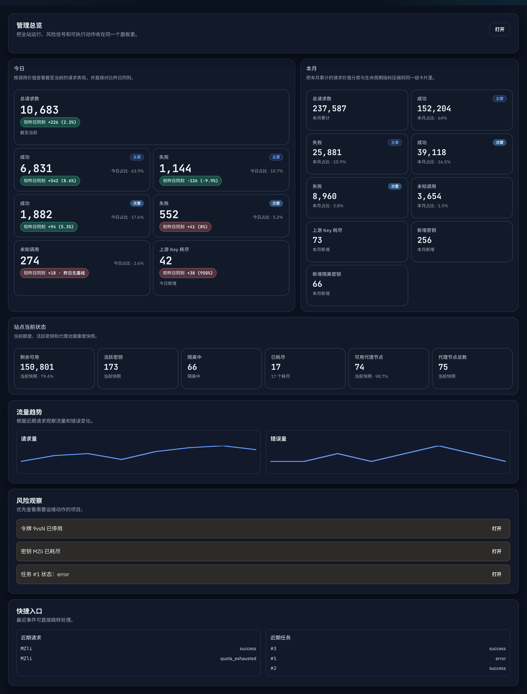
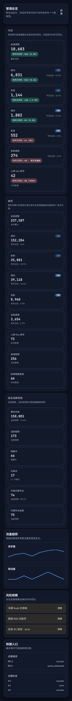

# Admin 仪表盘请求价值分类卡改版（#yqs6v）

## 状态

- Status: 已完成（快车道）
- Created: 2026-03-31
- Last: 2026-04-02

## 背景

- `/admin/dashboard` 的 `今日 / 本月` 仍沿用“成功 / 错误 / 耗尽”混合口径，无法区分真正有业务意义的调用与纯控制面调用。
- `今日` 目前把“较昨日同刻”单独放在卡片外部 comparison tray，中断了读数路径，也让布局在桌面端显得重复。
- 运营想把“有价值 / 其他 / 未知”直接压进首屏摘要：搜索、爬取、研究类请求与初始化、列工具、未知调用要在摘要卡层面立刻分开。
- 当前 `summaryWindows` 只暴露总量、成功、错误、额度耗尽与上游 Key 生命周期指标，无法支持新卡片组合，也无法让 admin SSE 的 snapshot 在分类口径变化时稳定触发刷新。

## Goals

- 将 `今日 + 本月` 的请求摘要口径升级为 `有价值 / 其他 / 未知`，同时保留旧字段兼容。
- `今日` 固定显示 7 张卡：`总请求数 / 有价值成功 / 有价值失败 / 其他成功 / 其他失败 / 未知调用 / 上游 Key 耗尽`。
- `本月` 固定显示 9 张紧凑卡：`总请求数 / 有价值成功 / 有价值失败 / 其他成功 / 其他失败 / 未知调用 / 上游 Key 耗尽 / 新增密钥 / 新增隔离密钥`。
- 把 `较昨日同刻` 直接收进今日卡片本体，移除外部 comparison tray。
- 保持摘要卡区域原有布局与响应式断点，只新增 `总请求数` 独占首行与 `主要 / 次要` 标记这两项已明确授权的视觉改动。
- 扩展 `/api/summary/windows` 与 admin SSE `summaryWindows`，让后端能稳定汇总并返回新分类字段。
- 为该改版补齐 Storybook、视觉证据、规格追踪与回归测试。

## Non-goals

- 不改动 `站点当前状态 / 流量趋势 / 风险看板 / 行动中心` 的统计口径。
- 不改写 `/api/summary` 的即时概览语义。
- 不调整请求日志页、token/key detail 或 request-kind quick filters 的交互设计。
- 不改动任何非 dashboard 的计费、限额、风控判定逻辑。

## 请求价值分类口径

### 分类桶

- `valuable`
  - `api:search`
  - `api:extract`
  - `api:crawl`
  - `api:map`
  - `api:research`
  - `api:research-result`
  - `mcp:search`
  - `mcp:extract`
  - `mcp:crawl`
  - `mcp:map`
  - `mcp:research`
  - 包含任意业务工具调用的 `mcp:batch`
- `other`
  - `api:usage`
  - `mcp:initialize`
  - `mcp:ping`
  - `mcp:tools/list`
  - `mcp:resources/*`
  - `mcp:prompts/*`
  - `mcp:notifications/*`
  - 仅包含 control-plane 调用的 `mcp:batch`
- `unknown`
  - `api:unknown-path`
  - `mcp:unknown-method`
  - `mcp:unknown-payload`
  - `mcp:unsupported-path`
  - `mcp:third-party-tool`
  - 无法稳定解析的 `mcp:batch`

### `mcp:batch` 优先级

- 批量调用的分类优先级固定为 `unknown > valuable > other`。
- 只要 batch 中出现未知调用，整个 batch 视为 `unknown`。
- 在没有未知调用时，只要 batch 中出现任意业务工具调用，整个 batch 视为 `valuable`。
- 仅当 batch 内全部都是 control-plane 调用时，整个 batch 视为 `other`。

### 失败口径

- `valuable_failure_count` 与 `other_failure_count` 统计“调用方可见的失败终态”。
- 至少以下结果必须计入失败：
  - `result_status = error`
  - `result_status = quota_exhausted`
- `unknown_count` 只保留总量，不拆 success/failure。
- `upstream_exhausted_key_count` 继续作为独立生命周期指标保留，不并入请求失败分类卡。

## 数据契约

### `/api/summary/windows`

- 保留现有字段：
  - `total_requests`
  - `success_count`
  - `error_count`
  - `quota_exhausted_count`
  - `upstream_exhausted_key_count`
  - `new_keys`
  - `new_quarantines`
- 在 `today / yesterday / month` 三个窗口下新增：
  - `valuable_success_count`
  - `valuable_failure_count`
  - `other_success_count`
  - `other_failure_count`
  - `unknown_count`

### admin SSE `snapshot.summaryWindows`

- `summaryWindows` 必须对齐 `/api/summary/windows` 的完整字段集合。
- SSE 的签名比较必须覆盖新增 5 个分类字段，避免分类值变化但 snapshot 不刷新。

### 月度汇总持久化

- `api_key_usage_buckets` 需要持久化新增 5 个分类计数字段，保证月度窗口在 `request_logs` 清理后仍可计算。
- 启动迁移必须对旧表做幂等 schema 自愈，并在需要时重建日桶，补齐历史分类字段。

## 展示与交互约束

### 今日

- 卡片总数固定为 7。
- `总请求数` 独占首行。
- 7 张卡依次为：
  - `总请求数`
  - `成功`（有价值）
  - `失败`（有价值）
  - `成功`（其他）
  - `失败`（其他）
  - `未知调用`
  - `上游 Key 耗尽`
- 两组 `成功 / 失败` 必须增加区分标记：
  - `有价值` 显示为 `主要`
  - `其他` 显示为 `次要`
- 底部 comparison tray 必须彻底移除。

### 本月

- 卡片总数固定为 9。
- 延续生命周期卡：
  - `总请求数`
  - `上游 Key 耗尽`
  - `新增密钥`
  - `新增隔离密钥`
- 新增请求价值分类卡：
  - `有价值成功`
  - `有价值失败`
  - `其他成功`
  - `其他失败`
  - `未知调用`
- 本月卡只显示月累计副标题，不显示昨日 delta。

### 布局

- 保持现有摘要区布局骨架：`今日 / 本月 / 当前状态` 的区块排布不变。
- `今日` 延续原有 summary card 响应式网格：窄屏 1 列，平板及桌面 2 列；仅 `总请求数` 跨列独占一行。
- `本月` 延续原有 compact card 响应式网格：窄屏 1 列，平板及桌面 2 列。
- 任意断点下不得引入横向滚动。
- 视觉风格延续现有 dark dashboard，只允许围绕新数据口径、`主要 / 次要` 标记与 total card 独占首行做最小必要调整。

## 验收标准

- `/api/summary/windows` 与 admin SSE `summaryWindows` 在 `today / yesterday / month` 下都返回新增 5 个分类字段，并保持旧字段兼容。
- `search / crawl / research / research-result` 的成功/失败进入 `valuable_*`。
- `initialize / tools/list / notifications/* / usage` 的成功/失败进入 `other_*`。
- `unknown-path / unknown-method / unknown-payload / unsupported-path / third-party-tool` 进入 `unknown_count`。
- 混合 `mcp:batch` 必须按照 `unknown > valuable > other` 分类。
- `quota_exhausted` 若调用方可见，必须计入对应分类的失败计数。
- `/admin/dashboard` 的 `今日` 区块展示 7 张卡，且 `总请求数` 独占一行。
- `/admin/dashboard` 的两组 `成功 / 失败` 卡都带有 `主要 / 次要` 区分标记。
- `/admin/dashboard` 的 `本月` 区块展示 9 张卡，保留生命周期卡，且无 comparison tray。
- Storybook 必须提供稳定的中文暗色验收入口，覆盖：
  - today 7 卡
  - month 9 卡
  - in-card delta
  - comparison tray 已删除

## 当前验证记录

- 2026-03-31：`cargo check` 通过，后端分类字段、summary windows 查询与 admin snapshot 签名已接上。
- 2026-03-31：`cargo test request_value_bucket_classifies_known_kinds_and_batch_precedence -- --nocapture` 通过。
- 2026-03-31：`cargo test summary_windows -- --nocapture` 通过，覆盖窗口拆分与上游 Key 生命周期窗口。
- 2026-03-31：`cargo test admin_dashboard_sse_snapshot_includes_overview_segments -- --nocapture` 通过，确认 snapshot 暴露新分类字段。
- 2026-03-31：`cd web && bun install --frozen-lockfile` 完成。
- 2026-03-31：`cd web && bun test src/admin/dashboardTodayMetrics.test.ts` 通过。
- 2026-03-31：`cd web && bun run build` 通过。
- 2026-03-31：`cd web && bun test` 通过。
- 2026-03-31：`cd web && bun run build-storybook` 通过。
- 2026-03-31：通过 Storybook 静态页 `admin-components-dashboardoverview--zh-dark-evidence` 复核桌面与窄屏布局，确认 `今日` 为 7 卡、`本月` 为 9 卡，且 comparison tray 已移除。
- 2026-04-01：重新拉起后端 `127.0.0.1:58087` 与前端 `127.0.0.1:55173` 后，用 Chrome 复核真实 `/admin` 页面窄屏布局；`documentElement.scrollWidth == clientWidth == 485`，确认无横向滚动。
- 2026-04-01：按主人要求撤回未授权的摘要卡布局调整后，重新执行 `cd web && bun test`、`cd web && bun run build`、`cd web && bun run build-storybook`，并重拍 Storybook 证据图确认保留原有摘要卡布局。
- 2026-04-01：按主人最新要求补回 `总请求数` 独占首行，并为两组 `成功 / 失败` 添加 `主要 / 次要` 标记；随后重新执行 `cd web && bun test`、`cd web && bun run build`、`cd web && bun run build-storybook`，并完成 Storybook + 真实 `/admin` 浏览器复核。
- 2026-04-01：将 `今日占比` 从副标题移到今日卡片数值行右侧，重新执行 `cd web && bun test`、`cd web && bun run build`、`cd web && bun run build-storybook`，并用 Storybook 中文暗色验收图确认卡片高度收紧且窄屏仍无横向滚动。
- 2026-04-02：补充 `startup_preserves_existing_usage_buckets_when_request_value_columns_are_added` 回归测试，并修正启动迁移逻辑：旧库仅补齐 request-value 分类字段，不再因为 schema 自愈而重建整月 `api_key_usage_buckets`，避免在 `request_logs` 已按保留策略裁剪时丢失既有月度累计数据。
- 2026-04-02：补充 `startup_request_value_backfill_preserves_existing_breakdown_for_pruned_buckets` 回归测试，并收紧 v2 回填条件：仅在桶行尚无 request-value 数据或仍可由保留日志完整重建时才覆盖分类计数，避免重跑迁移时抹掉已保留的历史分类统计。

## 风险与开放点

- 月度分类计数依赖 `api_key_usage_buckets` 的 schema 自愈与历史重建，若线上存在非常旧的桶表，需要确保迁移幂等且不会重复污染旧数据。
- `unknown_count` 只展示总量，不拆 success/failure；后续若产品要求继续拆分，应新增字段而不是复用现有口径。
- 2026-04-02 的启动迁移修复仅影响后端持久化与回归测试，不改变已验收的 dashboard 视觉结果；因此现有 Storybook 证据图继续作为最新 `HEAD` 的有效视觉证据。

## Visual Evidence

- source_type: `storybook_canvas`; target_program: `mock-only`; capture_scope: `browser-viewport`; story_id_or_title: `Admin/Components/DashboardOverview/ZhDarkEvidence`; state: `desktop`; evidence_note: 桌面端验证 `总请求数独占首行 / 成功失败卡带主要次要标记 / 今日占比右移到数值行 / 今日 7 卡 / 本月 9 卡 / 无 comparison tray`。
  

- source_type: `storybook_canvas`; target_program: `mock-only`; capture_scope: `browser-viewport`; story_id_or_title: `Admin/Components/DashboardOverview/ZhDarkEvidence`; state: `mobile`; evidence_note: 窄屏验证纵向单列重排稳定，无横向滚动，`今日占比` 保持在数值行右侧，`主要 / 次要` 标记与 delta chip 仍可完整读取。
  
