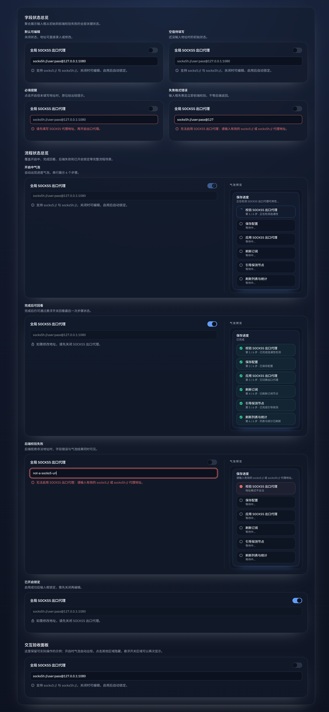

# Forward Proxy 全局 SOCKS5 收敛（#z8wg3）

## 状态

- Status: 已完成（快车道）
- Created: 2026-03-17
- Last: 2026-03-17

## 背景 / 问题陈述

- 现有 forward proxy 池只能“节点直接出站到公网”，无法把所有非直连流量统一收敛到一条受控的上游 SOCKS5。
- 主人需要集中管理网络环境，希望链路固定为：`上游请求 -> 正向代理池 -> 全局 SOCKS5 -> 路由器 -> 公共网络`。
- 当前 `/admin/proxy-settings` 的配置是“即改即存”，不适合承载一个需要预校验、优雅切换、开启后锁定编辑的全局网络出口设置。
- 若继续沿用 `reqwest` 直接为每个节点挂 proxy client，则无法表达“节点代理再套全局 SOCKS5”的链式收敛语义。

## 目标 / 非目标

### Goals

- 为 forward proxy 子系统增加全局 `egressSocks5Enabled` / `egressSocks5Url` 配置，并让所有非直连链路统一经该 SOCKS5 收敛。
- 启用时必须先完成 SOCKS5 连通性校验，失败则保持关闭态，不得把坏配置切到运行面。
- 配置生效必须优雅：进行中的请求继续使用旧配置；新请求在切换完成后才开始使用新配置。
- `/admin/proxy-settings` 新增独立配置卡片，支持草稿编辑、显式应用、阶段进度反馈、启用后锁定 URL 编辑。
- SSE 进度链路扩展到 `validate_egress_socks5`、`apply_egress_socks5`，并保持现有 `save_settings`、`refresh_subscription`、`bootstrap_probe`、`refresh_ui` 收口。

### Non-goals

- 不改动 forward proxy 节点调度、主备 affinity、配额、OAuth 业务语义。
- 不新增第二套代理管理页面，不做 secret vault 或额外加密存储。
- 不让 `Direct` 直连节点、无代理直连请求或 OAuth 直连链路经过全局 SOCKS5。

## 功能与行为规格

### Core flows

- 管理员在 `/admin/proxy-settings` 的 “Global SOCKS5 relay” 卡片中编辑 `egressSocks5Url` 与启用开关，点击 `Apply` 后才触发保存与切换。
- 当 `egressSocks5Enabled=false` 时，URL 可编辑；当 `egressSocks5Enabled=true` 时，URL 进入只读锁定，必须先关闭成功才能重新编辑。
- 启用流程固定为：
  `validate_egress_socks5 -> save_settings -> apply_egress_socks5 -> refresh_subscription -> bootstrap_probe -> refresh_ui`
- 关闭流程固定为：
  `save_settings -> apply_egress_socks5 -> refresh_subscription -> bootstrap_probe -> refresh_ui`
- 全局 SOCKS5 启用后，所有非直连 forward proxy endpoint 都先映射到本地 relay，再由 relay 统一走全局 SOCKS5 出站；`Direct` 仍然保留本地 direct client。

### 非直连范围

- Tavily 实际上游转发：`/mcp`、`/api/tavily/*`、usage/quota sync、管理员 key 校验。
- forward proxy subscription refresh。
- forward proxy manual/subscription validate、revalidate、bootstrap probe。
- trace/geo 探测与 runtime geo metadata 刷新。

### Edge cases / errors

- 启用前 SOCKS5 校验失败时，settings 持久化结果必须保持 `egressSocks5Enabled=false`，并保留用户输入的 `egressSocks5Url` 供继续修正。
- 若 relay 应用阶段失败，旧 relay/旧 client 继续为在途请求服务，新配置不得半切换。
- 当全局 SOCKS5 已启用但后续 subscription refresh 全部失败时，仍遵循现有“保留上一版可用节点”的策略。
- 关闭全局 SOCKS5 不需要再次校验旧 URL；只要保存成功，新请求立即回退为原有非 relay/无 egress path。

## 接口契约

- `ForwardProxySettings`、`ForwardProxySettingsUpdatePayload`、`ForwardProxySettingsResponse` 新增：
  - `egressSocks5Enabled: boolean`
  - `egressSocks5Url: string`
- `PUT /api/settings/forward-proxy` 继续兼容 JSON 与 SSE 双模式。
- 新增进度 phase keys：
  - `validate_egress_socks5`
  - `apply_egress_socks5`
- `ForwardProxySettingsModule` 新增独立的 egress card 草稿状态；不再对全局 SOCKS5 URL 使用“输入即保存”。

## 验收标准

- Given 全局 SOCKS5 关闭
  When 管理员编辑 URL
  Then 输入框可编辑且不会影响当前流量，只有点击 `Apply` 才触发保存。

- Given 管理员启用全局 SOCKS5 且 URL 可达
  When 应用开始
  Then 页面按固定 phase 顺序展示进度，且 `apply_egress_socks5` 完成前新请求不得切换到新出口。

- Given 启用前 SOCKS5 校验失败
  When 应用结束
  Then `egressSocks5Enabled=false` 保持不变，URL 继续可编辑，并保留错误与失败步骤。

- Given 全局 SOCKS5 已启用
  When 页面重新加载
  Then URL 只读、编辑入口不可用、关闭开关可操作；关闭成功后 URL 再次变为可编辑。

- Given 全局 SOCKS5 已启用
  When 发起非直连 forward proxy 请求、订阅刷新、校验、probe、trace
  Then 全部经过全局 SOCKS5；`Direct` 与 OAuth 直连链路不经过它。

## 契约文档

- [contracts/http-apis.md](./contracts/http-apis.md)
- [contracts/db.md](./contracts/db.md)

## Visual Evidence (PR)

- source_type: storybook_canvas
  target_program: mock-only
  capture_scope: browser-viewport
  sensitive_exclusion: N/A
  submission_gate: approved
  story_id_or_title: `Admin/ForwardProxyEgressControl/StateGallery`
  scenario: `aggregate review surface`
  evidence_note: 聚合展示全局 SOCKS5 出口代理控件的字段状态、流程状态与交互验收面板，覆盖空值提醒、失焦校验失败、进行中进度、完成回看、后端失败与已开启锁定。

## 里程碑（Milestones / Delivery checklist）

- [x] M1: 扩展 forward proxy settings 存储、API 类型与 SSE phase contract
- [x] M2: 落地 relay/Xray 收口层，让非直连 endpoint 支持“节点代理 -> 全局 SOCKS5”
- [x] M3: 完成启用前校验、优雅切换、subscription/probe/trace 收敛与后端测试
- [x] M4: 完成 admin 配置卡片、草稿交互、锁定逻辑、Storybook 与前端测试
- [x] M5: 完成 README、验证、PR、checks 与 review-loop 收敛

## 风险 / 假设

- 风险：native `http/https/socks5` 节点需要统一下沉到 Xray relay，否则无法稳定表达链式出口。
- 风险：启用全局 SOCKS5 后，验证与 trace 也会走该出口，测试必须使用 mock/stub，不得误连生产环境。
- 假设：`egressSocks5Url` 使用标准 `socks5://` / `socks5h://` URI，可包含凭据。
- 假设：本次不额外暴露“最后一次 egress 出口 IP/地区”到 UI；若后续需要，作为 follow-up。
